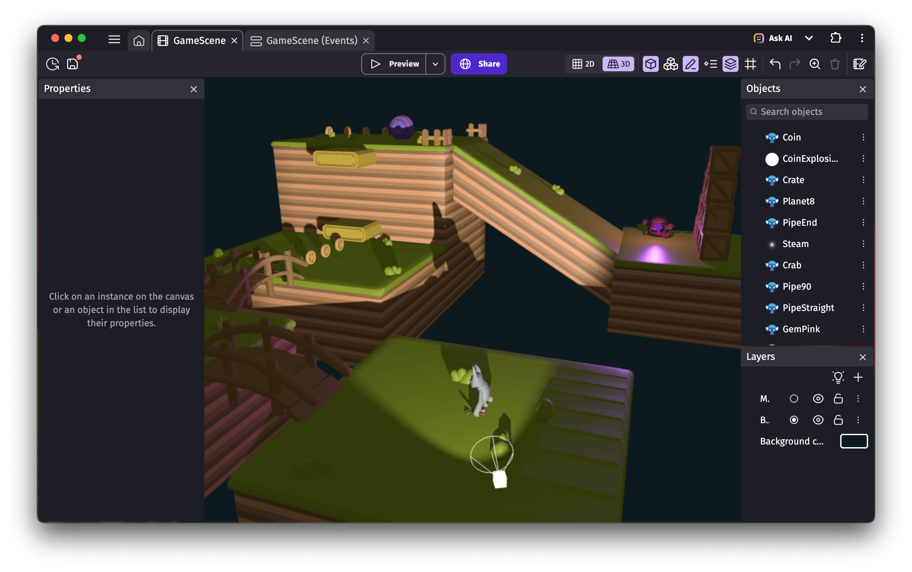

# 3D Lights

3D Light objects can be moved around the scene and emit light from their center. They can also cast shadows for 3D objects.

- A [spot light](/gdevelop5/extensions/light3d/#3d-spot-light) lights up a cone-shaped area, similar to a flashlight.
- A [point light](/gdevelop5/extensions/light3d/#3d-point-light) lights up in all directions, similar to a fire or a light bulb.

## Light layer effects

Light effects are "global lights" configured through [layer effects](/gdevelop5/interface/scene-editor/layer-effects):

- A [directional light](/gdevelop5/all-features/scene3d/reference/#effect-directional-light) acts as a very distant light source, like the sun. It can cast shadows for 3D objects. When used on its own, the unlit side of an object appears completely black, which is why it's commonly paired with a hemisphere light.
- An [ambient light](/gdevelop5/all-features/scene3d/reference/#effect-ambient-light) illuminates objects evenly from every direction. Since it produces no shading, objects can look flat — this is why a hemisphere light is usually preferred.
- A [hemisphere light](/gdevelop5/all-features/scene3d/reference/#effect-hemisphere-light) illuminates objects from every direction using a gradient between two colors. It is often combined with a directional light for more realistic lighting.

Contrary to 3D light objects, light effects don't have a position in the scene, but their direction can be adjusted using two angles.

## Avoiding shadow artifacts

When [3D model objects](/gdevelop5/objects/3d-model/) both cast and receive shadows, you may notice darkened patterns appearing on their surfaces. The **Shadow bias** property of lights can be used to prevent this issue, known as "shadow acne". Choose a value small enough to avoid creating a visible gap between shadows and objects (such as `0.001`), but not so small that it causes shadow glitches at low or medium quality settings.

## Displaying more light objects

Light objects can be demanding on the GPU, especially when they cast shadows. To allow game creators to add many lights to a scene, the engine automatically hides the lights farthest from the camera. By default, the limits are:

- 20 visible light objects
- 4 light objects casting shadows

These limits can be adjusted using the **Max lights count** and **Max lights with shadow count** actions. Be aware that setting values too high can cause games to crash, as WebGL has its own internal limits.
