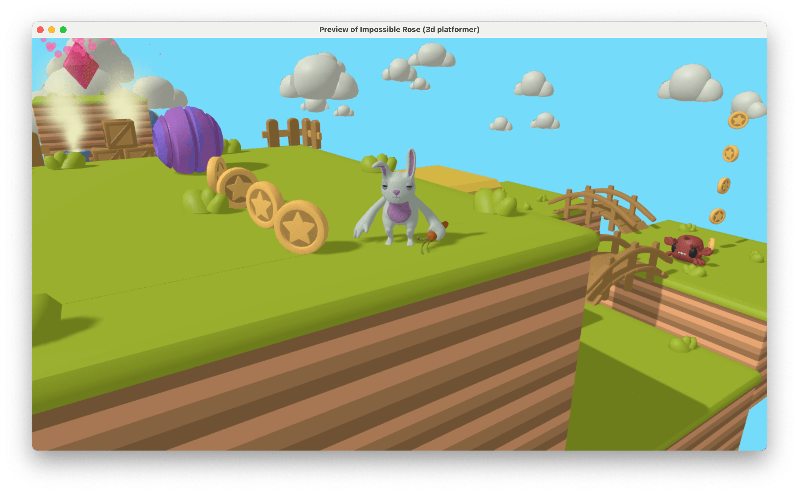

# 3D model

A 3D model displays an object modeled in a 3D modeling software, with one or more animations. Like a [sprite for 2D games](../sprite) (or for interfaces in 3D games), it's a very common object that can be used for players, enemies, backgrounds, projectiles.

If you need to create walls, plane grounds or other rectangular/cubic 3D objects, consider using the [3D box object](../3d-box).

## Animations

3D models can include animations that are embedded in the GLB file. Each model can have multiple animations (walking, running, jumping, idle, etc.), and you can control which animation plays during the game.

### Managing animations

When you add a 3D model object, you can configure its animations in the object properties:

- Each animation has a **name** (how you reference it in events), a **source** (the animation name from the GLB file), and a **loop** setting (whether the animation repeats).
- The first animation in the list plays automatically when the object is created.
- You can switch between animations during gameplay using actions in the events sheet.

### Animation playback control

You can control animation playback using actions and conditions:

- **Switch animations**: Change to a different animation by name or index.
- **Pause and resume**: Stop and restart animation playback without resetting the animation.
- **Animation speed**: Speed up or slow down animations (values greater than 1 make animations faster, values less than 1 make them slower).
- **Animation timing**: Get or set the current playback position within an animation, or check the total animation duration.
- **Crossfade duration**: Set how smoothly animations transition from one to another (default is 0.1 seconds).

### Animation conditions

You can check the animation state in conditions:

- Check if a specific animation is currently playing.
- Check if the animation has finished playing (useful for non-looping animations).
- Check if the animation is paused.

!!! tip

    Use the "Animation finished" condition with non-looping animations to trigger events when an action completes, such as playing an attack animation and then dealing damage when it finishes.

## Material and lighting

Lighting can be set up through [layers effects](../../interface/scene-editor/layer-effects). Ambient and directional light effects allow to configure basic lighting for 3D layers.

The model can be set up to react to lighting in different ways through the **Material type** property:

- **Basic**: No lighting or shadows are applied. The model uses its base colors without any lighting calculations. Use this for stylized looks or UI elements.
- **Standard without metalness**: Lighting is enabled, but metalness properties are removed from the material. This often produces better-looking results for most game assets and is the recommended default.
- **Keep original**: Preserves the original material properties from the GLB file, including metalness and roughness values. Use this if your 3D model was carefully authored with specific material properties.

## Shadows

3D models can cast and receive shadows. To display shadows:

- Ensure the layer has a **Directional Light** effect. New layers in new games include this effect along with an Ambient Light by default.
- Set the object's material to **Standard without metalness** or **Keep original** (not **Basic**, which ignores lighting).
- Enable **Shadow casting** and **Shadow receiving** in the object's properties (both enabled by default for new assets from the store).

Shadows are computed around the camera with a range suitable for most games. You can adjust the light intensity, shadow quality and range by editing the Directional Light effect in the layer's effects.

!!! note

    Shadow casting and shadow receiving can be controlled independently. For example, you might want a flying object to cast shadows on the ground but not receive shadows from other objects.

## Origin and center points

The 3D model object has two important configuration points that affect how it's positioned and rotated:

### Origin location

The **origin location** determines where the object's position (X, Y, Z coordinates) is anchored. This affects where the object appears when you set its position in events or place it in the scene editor. You can choose from:

- **Model origin**: Uses the origin point defined in the 3D modeling software (default for models from the asset store).
- **Object center**: Centers the position at the middle of the object's bounding box.
- **Bottom center (Z)**: Places the origin at the bottom center of the object, useful for characters standing on the ground.
- **Bottom center (Y)**: Places the origin at the bottom center using the Y axis, useful for certain camera angles.
- **Top-left**: Places the origin at the top-left corner of the bounding box.

### Center location

The **center location** determines the point around which the object rotates and scales. This is separate from the position anchor and affects rotation behavior. You can choose from:

- **Model origin**: Uses the origin point from the 3D model file.
- **Object center**: Rotates around the middle of the object's bounding box.
- **Bottom center (Z)**: Rotates around the bottom center, useful for objects that should pivot at their base.
- **Bottom center (Y)**: Rotates around the bottom center using the Y axis.

!!! tip

    For characters, setting the origin to "Bottom center (Z)" makes it easy to place them on the ground, as the object's Z position will represent the ground level where the character stands.

## File format

GDevelop supports 3D models saved in the **GLB (.glb) format**. It is a standardized file format used to share 3D data. Notably, it includes the 3D mesh of the object, as well as its textures, material specifications, and animations. This format is also sometimes called **GLTF**, for "GL Transmission Format". You can sometimes find .gltf files, but only the **.glb** files are supported by GDevelop, as they can embed the textures and animations whereas .gltf files require separate files.

## Performance considerations

Large 3D models can impact your game as they will have:

- A larger size, making your game bigger and slower to download (especially on mobile phones or without broadband),
- A larger impact on the loading time (which will be slower, especially on low end devices),
- A negative impact on game performance, as the player device graphics card will need to spend more time rendering all the triangles composing the 3D model.

!!! tip

    We recommend you start building a game using *"low-poly"* 3D models.

## How to find or create 3D models?

!!! tip

    The GDevelop asset store will soon contain 3D models, so that it will be faster and easier to build your games. If you want to sell your assets (2D images, 3D models, audio or ready-to-use objects/extensions), [read more here](../../community/sell-asset-pack-store).

This section will be enhanced with various solutions to build your 3D models.

You can find free or premium 3D models suitable for your games on some website like:

- [Kenney.nl](https://www.kenney.nl/assets/category:3D).
- [Quaternius.com](https://quaternius.com/index.html).
