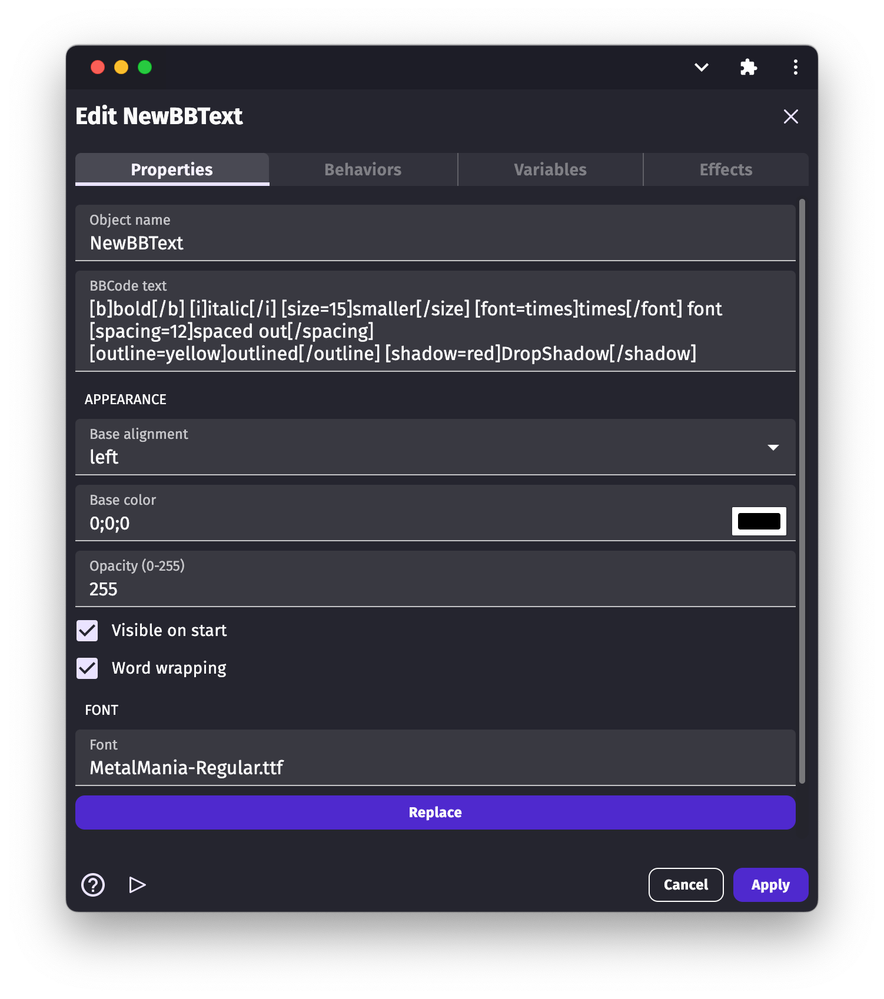

# BBText

**BBText** object displays rich "multi-style" text on the screen. You can customize style properties (for example, size and color) of different parts of the text by using "BBCode" style tags. You can also modify the BBText object properties during gameplay using events.

!!! warning

    This is not to be confused with the [Text object](/gdevelop5/objects/text), which is another type of object showing a text that can have a single custom font and size (without any formatting tags like this one). If you don't need any advanced formatting, it is recommended to first look at using the [Text object](/gdevelop5/objects/text) as it's more performant and simpler.

## Supported BBCode tags

The BBText object supports the following common tags:

  * `[b]bold text[/b]`
  * `[i]italic text[/i]`
  * `[color=#hexColor]colored text[/color]`
  * `[font=times]text with a custom font family[/font]`
  * `[size=23]my text with 23px size[/size]`

There are a few additional styles that are supported in GDevelop too:

  * `[outline=#hexColor]text with an outline in a specified color[/outline]`
  * `[shadow=#hexColor]text with a dropshadow with a specified color[/shadow]`
  * `[spacing=12] text with extra spacing between the letters[/spacing]`
  * `[align=center]text that is centered (you can also use left and right)[/align]`

`#hexColor` means a color in the hexadecimal notation, like: #000000 for black, #FFFFFF for white. You can easily [find a color picker online](https://htmlcolorcodes.com/).

!!! note

    Under the hood, the extension uses a patched version of [pixi-multistyle-text](https://github.com/tleunen/pixi-multistyle-text/) to support BBCode. If you're interested in the technical details, the supported styling features are [listed here](https://pixijs.download/dev/docs/PIXI.TextStyle.html).

## Default styling

You can set the default style of the text displayed on the screen. Tags are then adding styling to the text on top of this default style.

  * Base color (default is black).
  * Base opacity: from 0 to 255, 0 being is completely transparent.
  * Base font size: the overall font size. The default is 24px.
  * Base font family: default is Arial.
  * Text alignment: default is left. This can be "left", "right" or "center"
  * BBCode formatted text: the text to be displayed. The default is a demo of how to use the tags.
  * Word wrap: if enabled, break the text into multilines according to the object width.
  * Visible on start: by unchecking this option, the object will be hidden at the beginning of the scene. Use events to show it on.

All these properties can be modified using the actions and conditions of the object in the events sheet.

## Examples

!!! tip

        **See it in action!** 🎮

    Open these examples online.

[Open example in GDevelop](https://editor.gdevelop.io/?project=example://bbtext-object-demo){ .md-button .md-button--primary }

## Reference

All actions, conditions and expressions are listed in [the BBCode text object reference page](/gdevelop5/all-features/bbtext/reference/).