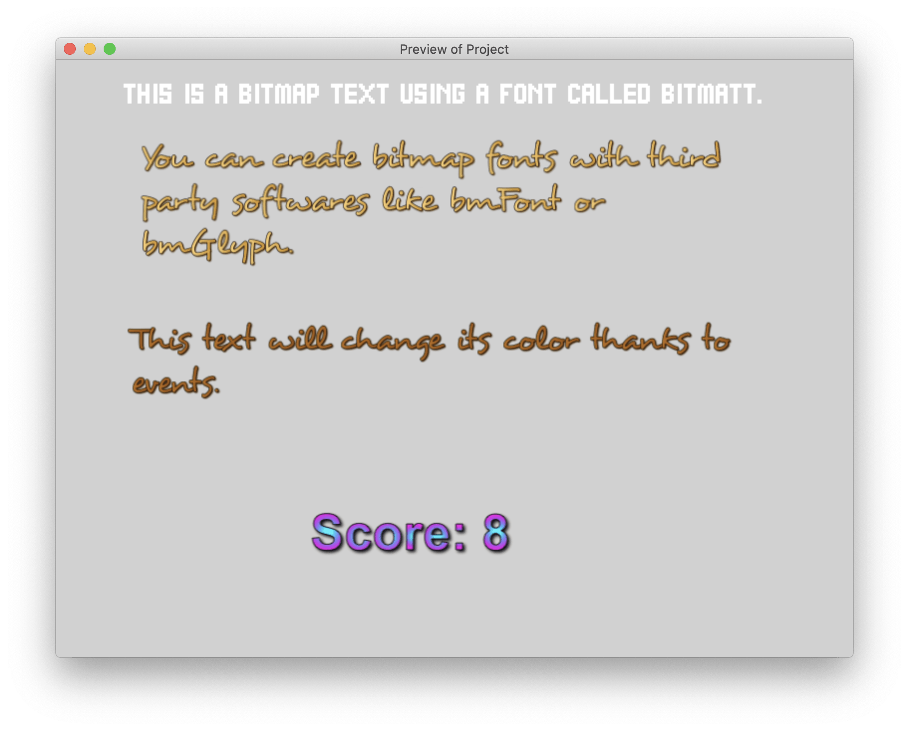

# Bitmap Text

A Bitmap Text displays a text using a "Bitmap Font" (an image representing characters). This is more performant than a traditional Text object and it allows for complete control on the characters aesthetic.

It's especially useful for scores, titles, button labels, pixel-art games...

!!! note

        As all characters are designed in an external editor, and a texture is generated with these characters, a Bitmap Text is more performant to render but also way less flexible, in particular if you want to display a text entered by a user in any language. If that's the case, take a look at the [Text object](/gdevelop5/objects/text) or at the [BBtext object](/gdevelop5/objects/bbtext).

## Creating "Bitmap Font" files

A font is represented by two files:

  - **Bitmap Atlas image** : This file is the image which contains all characters that can be drawn. File format must be PNG.
  - **Bitmap Font** : This file contains the data related to characters that can be draw, the engine use these data for knowing which characters render on screen. File format must be FNT or XML.

These two files can be created with an external editor to generate bitmap fonts, for example:

  * **[snowb](https://snowb.org/)** (Web) Export with  **.fnt (BMFont TEXT)**

  * **[bmFont](https://www.angelcode.com/products/bmfont/)** (Windows)
  * **[bmGlyph](https://www.bmglyph.com/)** (macOS)

  * **[Hiero](https://github.com/libgdx/libgdx/wiki/Hiero)** (Windows/Linux/OS X)

## Font size and scale

Because the characters are pre-rendered, the font size can't be changed in GDevelop. But the object still has a scale property that can be used to make your text bigger or smaller. Note that the rendering quality can be affected, because the font generated is not designed to be rescaled. Bold and pixel art style fonts often work bests when scaled up or down by even number intervals.

## Font color and tint

As characters are pre-rendered, the font color can also not be changed. Though GDevelop does still allows you to change the tint applied to the rendered characters.

If you generate a Bitmap Font with white characters, and you use the tint action to tint the object blue, the text will be displayed with this blue color. If your Bitmap Font is grey, and the tint blue, the colours will be mixed with each other.

## Reference

All actions, conditions and expressions are listed in [the bitmap text object reference page](/gdevelop5/all-features/bitmap-text/reference/).