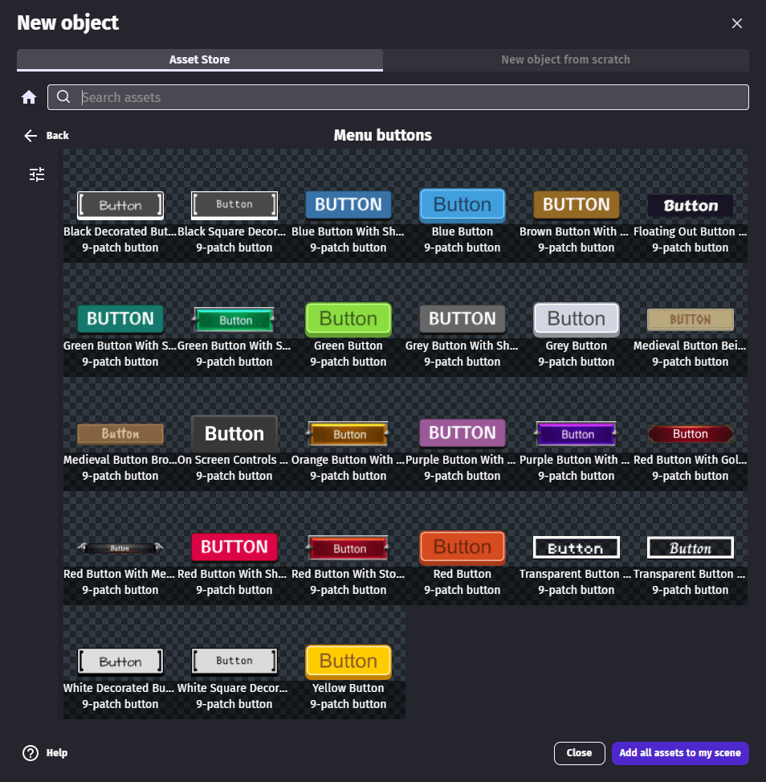

# Button

Buttons are an essential part of many games: they are used in menus, in the game and can be part of the gameplay. Buttons can be constructed in different ways in GDevelop. You can build your own with a mix of Sprite, Tiled Sprite, Shape Painter and Text objects.
Often, it's easier to go with a ready-to-use button available in the Asset Store.

  <iframe src="https://www.youtube.com/embed/plkHd4uPI4U" frameborder="0" allowfullscreen></iframe>

## Add a button from the Asset Store to a game

The [Buttons asset pack](https://gdevelop.io/asset-store/free/menu-buttons-menu-buttons) from the Asset Store contains free and read-to-use buttons.

## Advanced: create a button from scratch

When creating a button from scratch, 3 images are usually needed, one for each state of the button:

- Idle
- Hovered
- Pressed

The object automatically shows the right image according to taps on a touchscreen or the mouse cursor.

!!! tip

    The same image can be used for the 3 states. The button won't be animated but it will still work.

### Handle clicks or taps on the button

Button clicks/taps can be checked with a condition in events:

Other conditions can be used to check the button state. For instance, it allows to apply [an effect](/gdevelop5/objects/effects) to make a button appear brighter when it's pressed.

### Button states

Buttons have three distinct states that determine which image is displayed:

- **Idle**: The default state when the button is not being interacted with
- **Hovered**: When the mouse cursor is over the button (on desktop/web) or when a touch is held on the button (on mobile)
- **Pressed**: When the button is actively being clicked or tapped

You can check these states in events to create visual feedback or trigger different behaviors.

### Tips for button design

- Use consistent button sizes across your UI for a professional look
- Make sure button images have enough contrast so text on them is readable
- Add sound effects when buttons are clicked to improve user experience
