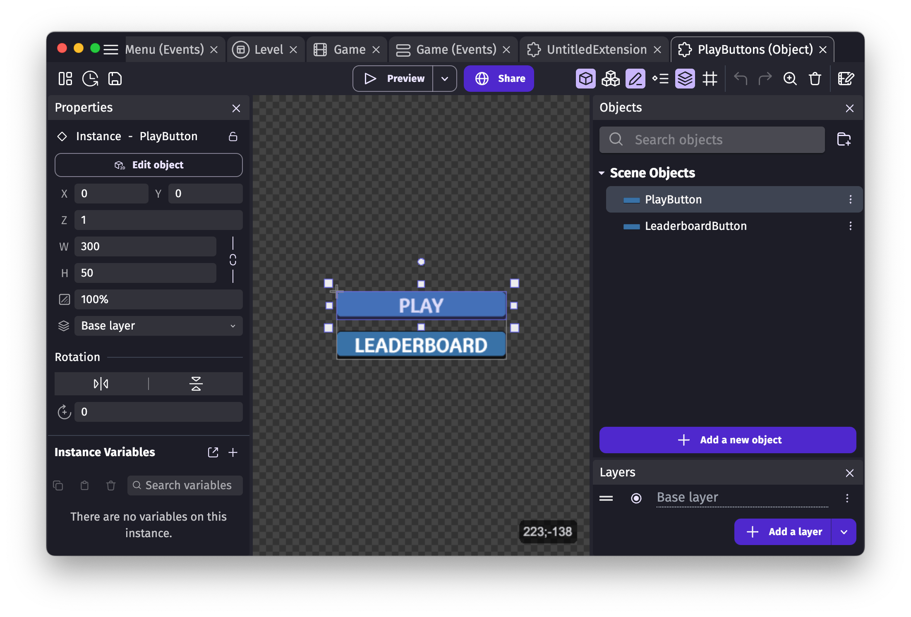
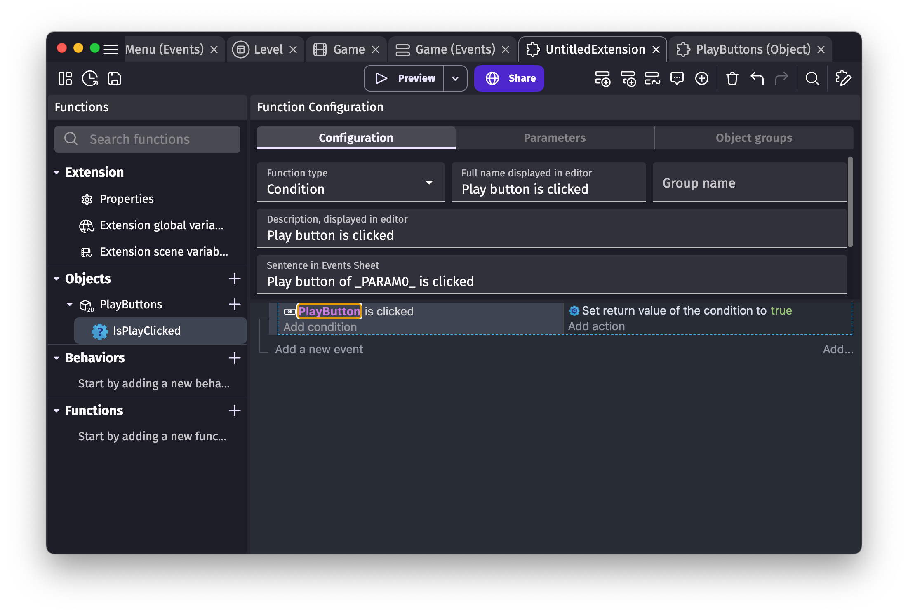
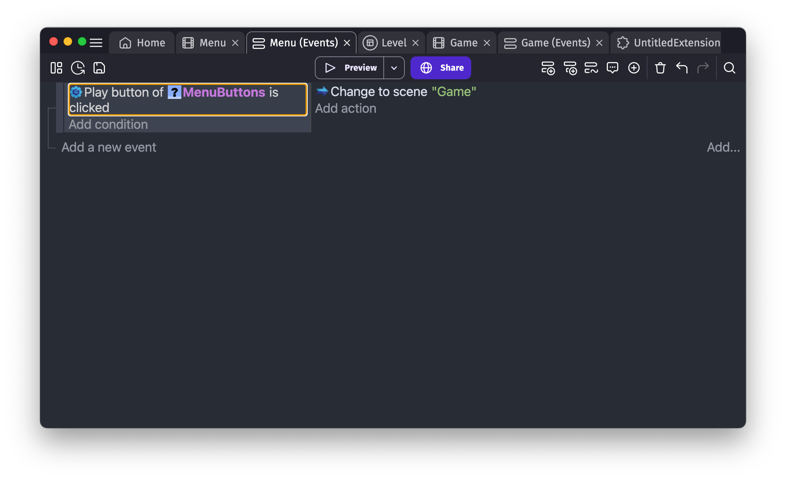

# Custom Objects ("prefabs")

**Custom objects** are containers, composed of one or more other objects and having custom logic (made with events, like in a traditional scene) inside them.

!!! tip

    "Custom objects" are also called **"Prefabs"** or "Templates" in some game engines.

They allow to speed-up development and make games more modular by having an object that can be reused in different scenes.

For example, you can build:

- A **dialog**, composed of a background, some text, some buttons. This allows to do all the logic related to this dialog inside the custom object events, without cluttering the scene events.
- A character or some other game objects that is composed of **multiple parts**. For example, a player with a moving arm.

!!! note

    The **[multitouch joysticks](/gdevelop5/objects/multitouch-joystick), [buttons](/gdevelop5/objects/button), [sliders](/gdevelop5/objects/slider)** and other user interface objects that you can find in the list of objects are “custom objects” built with other objects.

The objects contained inside a custom object are called "children" or "child objects".

## Create a new custom object

Custom objects are grouped into "extensions". Extensions are composed of functions, behaviors or custom objects powered by events. You can see the list of all the extensions the game has in the [Project Manager](/gdevelop5/interface/project-manager).

To create a new custom object, the easiest way is to add a few objects on the scene, then put an instance of each on the scene editor. Select then these instances, right click/long touch the selection and choose "Extract" > **"Extract as a custom object"**.

Choose an extension name, custom object name and validate. This will open a new editor containing the objects you've selected along with the instances from the scene. In the scene, the instances you've selected are replaced by a unique custom object, that acts as a container for all of them.

!!! note

    At the moment, you can't mix 2D and 3D objects in a custom object.

If you started creating events using these objects, you must rework them. Indeed, the objects are now hidden inside the new custom object (they are called "children"). In most cases, you want to add 2 type of "functions" to your custom object:

- A **doStepPostEvents** function that are events launched at every frame - much like scene events. They can do logic on the child objects. For example, it could rotate them, animate them or something else.
- One or more **action** or **condition**. If your scene wants to manipulate a child, or use a condition on it, it's a good sign that you need to "expose" this through a custom **action** or **condition**.

This is an example of a condition made inside a custom object:

Of course, this example is pretty simple and just check if the button is clicked. But similar conditions and actions could be added to manipulate the custom object, and any logic you add here will work across all the scenes using the custom object.

The condition can be then used in the scene:

By doing this for more complex needs, you can break down game menus or even gameplay objects (like a player character, complex obstacles, enemies, etc...) into custom object that can be edited independently. Your scene stays simple and only focused on the high level details of your game.

## Change the default size of a custom object

The grey rectangle on the scene is the custom object default size. Your can change this size by clicking on the button on the top right corner.

## Custom object variants

**Variants** allow you to create different visual styles or configurations of the same custom object. Each variant can have its own set of layers, child object configurations (like different images, fonts, or colors), and initial instance placements, while sharing the same events and logic.

For example, you can create a "Button" custom object with multiple variants:

- A "Primary" variant with a blue background
- A "Secondary" variant with a grey background
- A "Danger" variant with a red background

All these variants will share the same button logic (hover effects, click handling, etc.), but each can have different visual appearances.

To create a new variant:

1. Open the custom object editor
2. Click on the **Duplicate** button below the **Variant** title to duplicate the current variant
3. Give your variant a name
4. Click on the **Edit** button to open the variant editor in a new tab
5. Customize the child objects and their instances as needed

When you use the custom object in a scene, you can select which variant to use from the object properties.

!!! tip

    For more details on migrating existing custom objects to use variants, see [Migrate custom objects to variants](/gdevelop5/objects/custom-objects-prefab-template/migrate-to-variants).

### Child objects are shared across all variants

An important thing to understand is that **all variants of a custom object share the same set of child objects**. This is because all variants use the same events, and the events reference child objects by name. If a child object exists in one variant, it must exist in all variants.

In practice, this means:

- You cannot add new child objects to a specific variant only
- You cannot remove child objects from a specific variant
- The main (default) variant of your custom object should contain **all the possible child objects** that any variant might need

However, variants can differ in how they use these child objects:

- A variant can choose to **not place any instances** of a child object if it doesn't need it
- Each variant can configure child objects differently (different images, sizes, colors, etc.)
- Each variant can position the instances of child objects differently

For example, if you have a dialog custom object with an optional "icon" child object, you should add the icon object in the main variant. Then, variants that need an icon can include an instance of it, while variants that don't need an icon simply don't place any instance of it.
