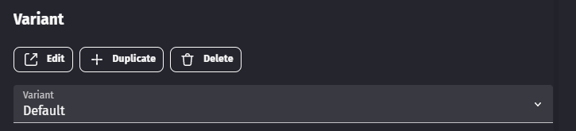

# Migrate custom objects to variants

The migration to variants is recommended but not mandatory. You can keep using your current extension version the same way as before, but you won't get any new feature or bug fix for the custom objects.

!!! warning

    Make sure to backup your project before migrating to variants.

## Migrate custom objects from the asset-store

The assets of the store are now using variants. If your custom object comes from the asset-store, you only have to follow a few steps:

- Find back your assets in the store
- Install them in your project
- Accept the extension update
- Choose the new variant on your objects

## Migrate custom objects with your own assets

Custom object variants use a graphical editor to place the instances. Properties that once fit this role has been removed in the new extensions. It means that after the extension update the custom objects will look deformed. You can fix this by adjusting the instances positions inside the custom object with the graphical editor.

!!! note

    A good way to start is to read the [custom objects](/gdevelop5/objects/custom-objects-prefab-template) page to learn about the general concepts.

The following sections give specific instructions for each custom object.

### Migrate buttons

After upgrading the button extension, you will notice that the label of all buttons disappeared.

- Copy and paste the text from **Initial text to display** to the **Label** property.

- Apply the changes. The label came back but it's probably misaligned.
- Go back in the object editor and duplicate the default variant by clicking on the **Duplicate** button below the **Variant** title.
- Choose a name for your new button style.
- To edit the new variant, click on the **Edit** button, close the dialog and select the new opened tab.

You should see something like this:

- Report your configuration on the **Object's children** on the left. For convenience, you may want to open your project backup in a second instance of GDevelop.
- Adapt the [default size](/gdevelop5/objects/custom-objects-prefab-template#change-the-default-size-of-a-custom-object) to your image resources.

The **Top margin**, **Bottom margin**, **Right margin** and **Bottom margin** properties no longer exist. You can adjust the label position directly with the graphical editor.

For the other buttons in your project, you can choose the new variant you created and only copy the label value.

### Migrate sliders

After upgrading the button extension, you will notice that the slider is deformed.

- Open the object editor and duplicate the default variant by clicking on the **Duplicate** button below the **Variant** title.
- Choose a name for your new slider style.
- To edit the new variant, click on the **Edit** button, close the dialog and select the new opened tab.

You should see something like this:

- Report your configuration on the **Object's children** on the left. For convenience, you may want to open your project backup in a second instance of GDevelop.
- Adapt the [default size](/gdevelop5/objects/custom-objects-prefab-template#change-the-default-size-of-a-custom-object) to your image resources.

The **Bar top margin**, **Bar bottom margin**, **Bar right margin** and **Bar bottom margin** properties no longer exist. You can adjust the bar position directly with the graphical editor.

For the other sliders in your project, you can choose the new variant you created, no additional change is required.

### Migrate toggle switches

After upgrading the button extension, you will notice that the toggle switch is deformed.

- Open the object editor and duplicate the default variant by clicking on the **Duplicate** button below the **Variant** title.
- Choose a name for your new toggle switch style.
- To edit the new variant, click on the **Edit** button, close the dialog and select the new opened tab.
- Report your configuration on the **Object's children** on the left. For convenience, you may want to open your project backup in a second instance of GDevelop.
- Adapt the [default size](/gdevelop5/objects/custom-objects-prefab-template#change-the-default-size-of-a-custom-object) to your image resources.

For the other toggle switch in your project, you can choose the new variant you created, no additional change is required.

### Migrate resource bars (continuous)

After upgrading the button extension, you will notice that the slider is deformed.

- Open the object editor and duplicate the default variant by clicking on the **Duplicate** button below the **Variant** title.
- Choose a name for your new resource bar style.
- To edit the new variant, click on the **Edit** button, close the dialog and select the new opened tab.

You should see something like this:

- Report your configuration on the **Object's children** on the left. For convenience, you may want to open your project backup in a second instance of GDevelop.
- Adapt the [default size](/gdevelop5/objects/custom-objects-prefab-template#change-the-default-size-of-a-custom-object) to your image resources.

The **Bar top margin**, **Bar bottom margin**, **Bar right margin** and **Bar bottom margin** properties no longer exist. You can adjust the bar position directly with the graphical editor.

For the other resource bars in your project, you can choose the new variant you created, no additional change is required.

### Migrate Resource bars (separated units)

After upgrading the button extension, you will notice that the slider is deformed.

- Open the object editor and duplicate the default variant by clicking on the **Duplicate** button below the **Variant** title.
- Choose a name for your new resource bar style.
- To edit the new variant, click on the **Edit** button, close the dialog and select the new opened tab.

You should see something like this:

- Report your configuration on the **Object's children** on the left. For convenience, you may want to open your project backup in a second instance of GDevelop.
- Adapt the [default size](/gdevelop5/objects/custom-objects-prefab-template#change-the-default-size-of-a-custom-object) to your image resources.

The **Bar right margin** and **Bar bottom margin** properties no longer exist. You can adjust the bar position directly with the graphical editor.

For the other resource bars in your project, you can choose the new variant you created, no additional change is required.
