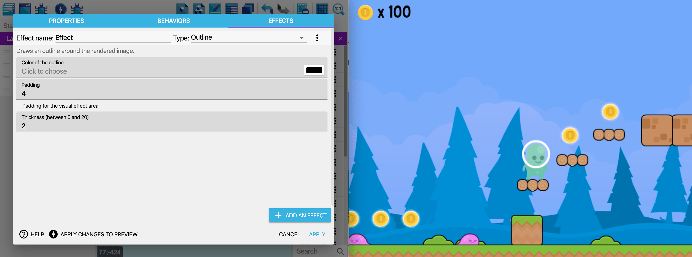

# Object effects

You can add extra [visual effects](/gdevelop5/interface/scene-editor/layer-effects) to objects. For example, you could use the "Outline" effect to make an object to pick up or to use more visible. You can also use more advanced visual effects that change the shape of the object or create interesting visual results.

This game screenshot shows multiple objects with a *Outline* effect (giving the level a cartoon aesthetic), and the coins with a *Glow* effect.

## Add an effect to an object

Double click on an instance of an object on the scene editor (or in the list of objects) to edit it. Choose the **Effects** tab.

Click **Add an effect**. A new effect called “Effect” is created. This name will be useful later for modifying the parameters of the effect during the game.

Choose the type of the effect. Click on the selector and choose one.

The window now shows the parameters for the effect - these parameters depends on the effect type that was chosen.

You can let the default parameters or change them now.

## Try the game with the effect

Launch a preview to see the effect applied. The effect is applied on all the instances of the object you edited.

When a preview is running, you can see **the changes you've made in real time** by clicking on **Apply changes to preview**. Read more about [Live Previews here](/gdevelop5/interface/preview).

## Change effect parameters during the game

Using events, you can manipulate the parameters during the game. It can be useful for different situations, for example animating or activating an effect only when an object is hit, firing bullets, moving, etc...

First, check out the name of the effect and the name of the parameter to change in the **Effects** tab. For this, activate the display of parameter names:

In this example, the Dark Night effect is called "Effect" and has two parameters "opacity" and "intensity":

You can then add an event with an action called "Effect Parameter":

  * Enter first the layer name (don't forget the quotes). For the base layer, enter an empty string (`""`).
  * Enter the name of the effect, for example `"Effect"`.
  * Enter the name of the parameter, for example `"opacity"` or `"intensity"`.
  * Finally, enter the new value to be set for this parameter.

!!! danger

    All of these names are case sensitive. In particular the parameter names are lowercased. Be sure to double check the name of your effect and parameters.