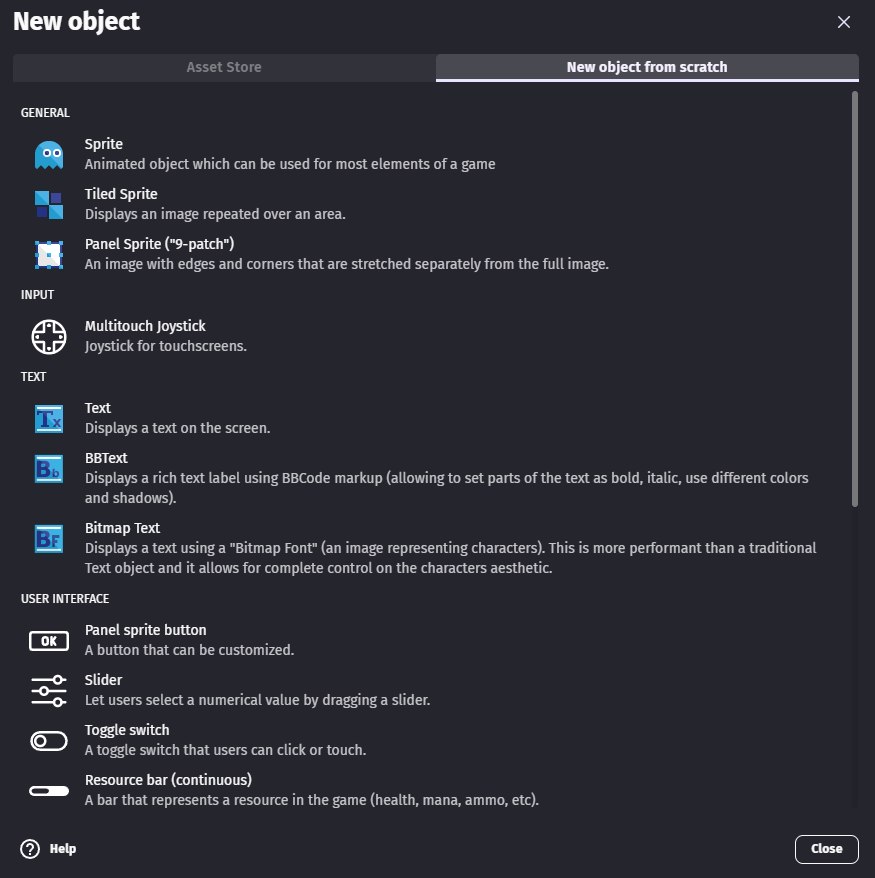
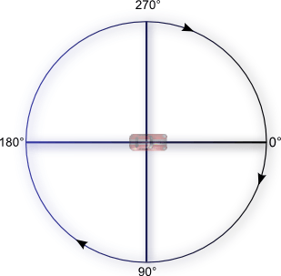
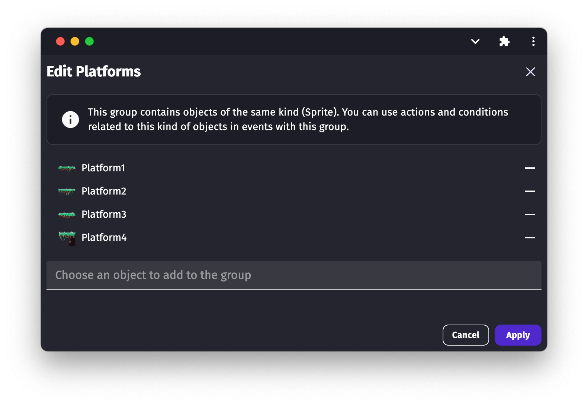

# Objects

In GDevelop, everything on the screen is an _object_. This includes — but is not limited to — the playable character, enemies, and parts of the environment.

You can create different types of objects for different purposes. For example, [Sprite](/gdevelop5/objects/sprite) objects add animated graphics to a game, while [Text](/gdevelop5/objects/text) objects add text to a game.

Objects can have [behaviors](/gdevelop5/behaviors) attached to them, adding to objects some pre-defined functionalities. You can use [events](/gdevelop5/events) to manipulate an object during the game (change its position, rotate it, change its animation, add an effect, etc...).

## List of objects

This section lists the different types of objects, each of which serves a unique purpose.

- General:
    - [Sprite](/gdevelop5/objects/sprite)
    - [Tiled sprite](/gdevelop5/objects/tiled_sprite)
    - [Panel Sprite ("9-patch")](/gdevelop5/objects/panel_sprite)
- Display a text (score, name, explanation):
    - [Text](/gdevelop5/objects/text)
    - [Bitmap text](/gdevelop5/objects/bitmap_text)
    - [BBText](/gdevelop5/objects/bbtext)
- Build user interfaces:
    - [Text input](/gdevelop5/objects/text_input)
    - [Button](/gdevelop5/objects/button)
    - [Multi-touch joystick](/gdevelop5/objects/multitouch-joystick)
    - [Slider](/gdevelop5/objects/slider)
    - [Toggle switch](/gdevelop5/objects/toggle-switch)
    - [Resource bar](/gdevelop5/objects/resource-bar)
    - [Video](/gdevelop5/objects/video)
- Make visual effects:
    - [Particles emitter](/gdevelop5/objects/particles_emitter)
    - [Light](/gdevelop5/objects/light)
    - [Shape painter](/gdevelop5/objects/shape_painter)
- Advanced effects or rendering:
    - [Tilemap](/gdevelop5/objects/tilemap)

## Learn about some objects with this video tutorial

## Adding an object to your game

1. Open the [Scene editor](/gdevelop5/interface/scene-editor). This is the default view after creating a new project.
2. In the **Objects** panel, select **Click to add an object**.
3. In the **Add a new object** dialog, select a type of object.
4. Configure the object. The available settings depend on the type of object.
5. Select **Apply**.

## Choosing a name for your object

Objects are given a default name when they are created. You can change this from the object editor or using the context menu on the object in the objects list.

Note that there are limitations on how you name your object: you can only use alphanumeric characters and no spaces. You can use an underscore if you want to make a separation between words (though usually, games are using casing to separate words. For example: `EnemyBullet`).
This is to make sure your object will be recognized properly when used in [expressions](/gdevelop5/all-features/expressions).

Some good examples of names are: `Player`, `RedEnemy`, `Red_Enemy`, `Car1`, `FinalBoss`, `Final_Boss`, `Wall`... Giving a descriptive name is useful to make sure you can quickly identify objects in the events.

## Adding an instance of an object to a scene

After creating an object, GDevelop doesn't immediately add it to a scene. You need to add the object to the scene via the **Objects** panel. You can add as many copies of the object to the scene as you like.

Each copy of an object in a scene is referred to as an _instance_ of the object. All instances of an object share the same underlying behavior as the original object, but you can customize them independently of one another. For example, each instance of an object may have a different position in the scene.

## Modifying an instance of an object

If you select one or more instances of an object, the **Properties** panel appears on the left side of the screen. This panel displays information about the selected instance(s).

You can customize the following properties of an object's instance:

### Position

All objects have coordinates. These coordinates correspond to the horizontal position (X-axis) and the vertical position (Y-axis) on the [Cartesian plane](https://en.wikipedia.org/wiki/Cartesian_coordinate_system). The X-coordinate decreases as you go to the left and increases as you go to the right. The Y-coordinate increases as you go down and decreases as you go up.

### Angle

The **Angle** option defines the rotation of an object in degrees. The following illustration demonstrates how GDevelop understands the angle of rotation:

!!! warning

    If you use trigonometric functions like the sine or the cosine, you need to express the angles in radians. (1 radian = 180/PI degrees and 1 degree = PI/180 radians. PI is the number which is approximately equal to 3.14159). You can use expressions `ToRad` and `ToDeg` in events to convert between degrees and radians.

!!! tip

    Also see more details about [How to rotate objects](/gdevelop5/objects/how-to-rotate-objects).

### Z Order

When objects on the same layer overlap, the **Z Order** of the object determines whether the objects appear in front or behind one another. For example, an object with a **Z Order** of `2` appears in front of an object with a **Z Order** of `1`.

In the following image, the Z order of the bush on left is `2`, the Z order of the coin is `1`, and the Z order of the bush on the right is `0`:

The value of the **Z Order** field can be any integer, including negative numbers and zero.

### Layer

All objects exist on a layer. Objects are then drawn onto the screen layer-by-layer, from bottom to top. This means an object on the top layer will always appear in front of objects on the bottom layer (even if the objects in the bottom layer have a higher **Z Order** value).

Typically, background objects, interactive objects (such as the playable character), and UI objects exist on different layers, but there are no strict requirements.

### Lock position/angle in the editor

Sometimes, a scene has a lot of objects and it's difficult to select a specific instance. If you enable the **Lock position/angle in the editor** option, you can no longer select the instance, which makes it easier to select the instance you _do_ want to select.

### Instance variables

An instance variable is a [variable](/gdevelop5/all-features/variables) that's specific to an instance of an object. The **Instance variables** table lets you define the variables attached to the instance and the values of those variables.

For more information, refer to [Object variables](/gdevelop5/all-features/variables/object-variables).

### Custom size

If enabled, you can change the height and width of the object instance. This height and width is distinct from the dimensions of the original object.

### Instance timers

Each instance of an object living on the scene can have timers set during the game with events. [See the page about timers](/gdevelop5/all-features/timers) to learn more about these.

### Visibility

By default, object instances are all marked as visible, meaning that they are displayed on the screen. Using events, you can **hide** any instance during the game. An hidden object instance won't be displayed anymore, but will still live on the scene (reacting to collisions, and following all other events as usual).

!!! tip

    Some objects, like Sprite or Text objects, can also have an **opacity**. The opacity, between 0 and 255, defines how transparent an object is (0 being fully transparent, 255 is the fully opaque and is the default). This can be changed independently from the visibility.

## Adding effects to objects

You can add extra visual effects to objects. For example, you could use the "Outline" effect to make an object to pick up or to use more visible. You can also use more advanced visual effects that change the shape of the object or create interesting visual results.

Read [this page to learn more about adding effects to your objects](/gdevelop5/objects/effects).

!!! note

    You can also add visual effects to a layer of the scene - useful for example to animate a background or change the atmosphere of the whole level at once. Read more about [adding effects to layers here](/gdevelop5/interface/scene-editor/layer-effects).

## In the events editor

You can change and manipulate the properties of an instance of an object, or of multiple instances, using events during the game. This is even what game making is all about in GDevelop: to manipulate objects in real-time as we play the game. As the events and events editor are out of the scope of this page, refer to [the basic game making concepts](/gdevelop5/tutorials/basic-game-making-concepts) page to get started.

* All objects share the **same common features** (like position, angle and everything that is written on this page), and there are a lot of conditions and actions that you can use for all objects.
* Objects can also provides you with specific feature. For example, [Sprite objects](/gdevelop5/objects/sprite) can have animations, and the animation being played can be changed using an action. Find more information in the page of each specific object.

### Organizing objects into groups for events

You can organize objects into _groups_ and then refer to all of the objects in that group by a single name.

This makes it possible to create events that applies to lots of objects without repeating events multiple times, increasing performance of your game, maintainability, and readability of your events.

To organize objects into groups:

1. In the toolbar, select the **Groups** icon.
2. Select **Click to add a group**.
3. Select the group.
4. In the **Edit group** dialog, select the objects to add the group.
5. Select **Apply**.

## Advanced: create custom objects (aka "prefabs" or "templates")

Thanks to its modular extension system, you can create custom objects, which are reusable objects containing one or more other objects. ["Custom objects" are also called "Prefabs" or "templates"](/gdevelop5/objects/custom-objects-prefab-template) in some game engines.

For example, the [multitouch joysticks](/gdevelop5/objects/multitouch-joystick), buttons, sliders and other user interface objects that you can find in the list of objects are "custom objects" built with other objects.

## Reference

All actions, conditions and expressions are listed in [the object reference page](/gdevelop5/all-features/object/reference)
