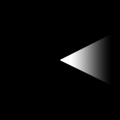
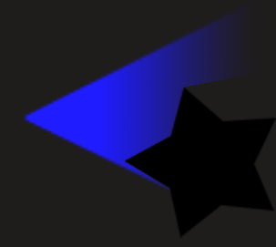

# Light

A light object is an object that simulates a light source in 2D and cast shadow using other objects.
The light object has several properties that can be customized, such as the color, the radius of the light, and a texture to give a shape to the light.

## How does it work?

By default, the light object's rays are cast around the light object and interact with the edges of other objects using the Light Obstacle behaviour.

Light rays will take into account the custom collisions masks on the objects with the Light Obstacle behavior.

### Using the light texture

The light texture property allow to create a custom shape for the light.

An example of a texture that illuminates in a cone shape, like it can be done for a flashlight:

<figure markdown>
  
  <figcaption>The light texture used in the object.</figcaption>
</figure>

<figure markdown>
  
  <figcaption>The result in game.</figcaption>
</figure>

!!! tip

    For example a light texture can be used to make a headlight bulbs for a car or a flashlight that illuminate only in one direction.
    Open the following example to see how light custom shapes can be used.

    

## Examples

[Open example in GDevelop](https://editor.gdevelop.io/?project=example://lights){ .md-button .md-button--primary }

## References

You can browse all the actions, conditions and expressions related to [the light object on this reference page](/gdevelop5/all-features/lighting/reference/)