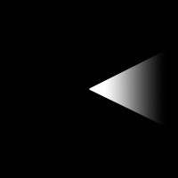
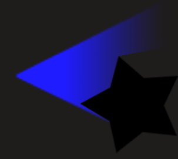

# Light

Light objects simulate light sources in 2D and cast shadows on other objects. They create atmospheric and realistic lighting effects by simulating how light spreads and is blocked by obstacles.

Light objects can be customized with several properties:

- **Light color**: Set the color of the light using RGB values (for example, warm orange for fire, cool blue for moonlight)
- **Light radius**: Control how far the light spreads from its source (in pixels)
- **Light texture**: An optional image to give a specific shape to the light (such as a cone for flashlights or spotlights)
- **Debug mode**: An advanced option that displays the lines used to render the light, useful for understanding the rendering

## How does it work?

By default, light rays are cast from light objects and are blocked by other object edges using the **Light Obstacle behavior**.

To make an object block light:

1. Select the object that should cast a shadow
2. Add the "Light Obstacle Behavior" to it
3. The light will now be stopped by this object's edges

Light rays will take into account the custom collision masks on objects with the Light Obstacle behavior. This means you can control exactly which parts of an object block the light by editing its collision mask.

!!! note

    Light objects only work in 2D games. They do not affect 3D objects. For 3D lighting, use the built-in 3D lighting features.

### Using the light texture

The light texture property allows you to create a custom shape for the light. Without a texture, light is rendered as a circular gradient that fades from bright at the center to dark at the edges.

By providing a texture image, you can control the shape and pattern of the light. For instance, a flashlight effect can be achieved by using a cone-shaped texture.

|  |  |
|---|---|
| The light texture used in the object. | The result in game. |

!!! tip

    For example, a light texture can be used to make a headlight bulbs for a car or a flashlight that illuminate only in one direction.

    Open the following example to see how light custom shapes can be used.

    

## Examples

[Open example in GDevelop](https://editor.gdevelop.io/?project=example://lights){ .md-button .md-button--primary }

## References

You can browse all the actions, conditions and expressions related to [the light object on this reference page](/gdevelop5/all-features/lighting/reference/)