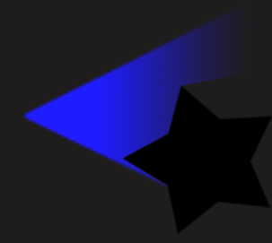

# Light

Light objects simulate light sources in 2D and cast shadows on other objects.
Light objects can be customized with several properties:

  - a light color
  - a light radius
  - a texture to give a shape to the light

## How does it work?

By default, light rays are cast from light objects and are blocked by other objects edges using the Light Obstacle behavior.

Light rays will take into account the custom collisions masks on the objects with the Light Obstacle behavior.

### Using the light texture

The light texture property allows to create a custom shape for the light.

For instance, a flashlight effect can be achieved by using a cone-shaped texture.

|  |  |
|---|---|
| The light texture used in the object. | The result in game. |

!!! tip

    For example, a light texture can be used to make a headlight bulbs for a car or a flashlight that illuminate only in one direction.

    Open the following example to see how light custom shapes can be used.

## Examples

[Open example in GDevelop](https://editor.gdevelop.io/?project=example://lights){ .md-button .md-button--primary }

## References

You can browse all the actions, conditions and expressions related to [the light object on this reference page](/gdevelop5/all-features/lighting/reference/)