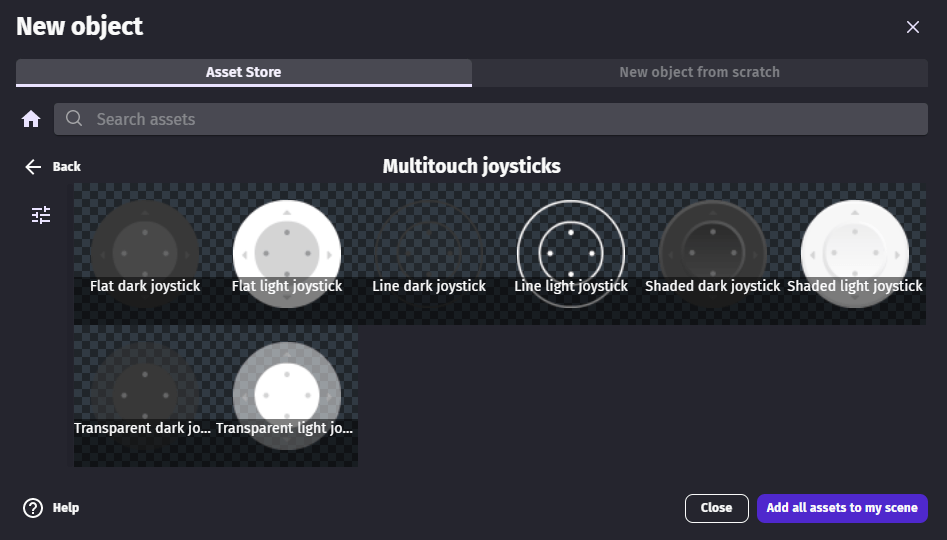
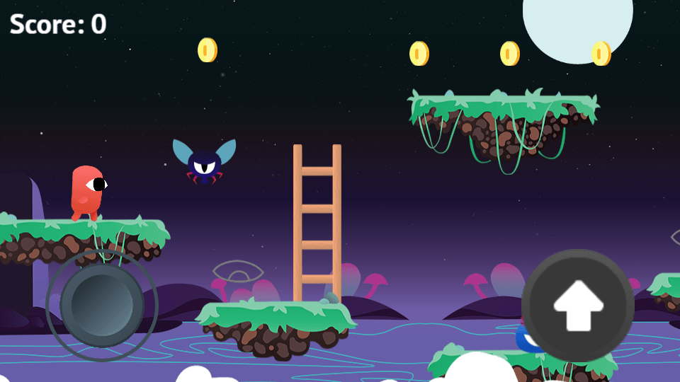
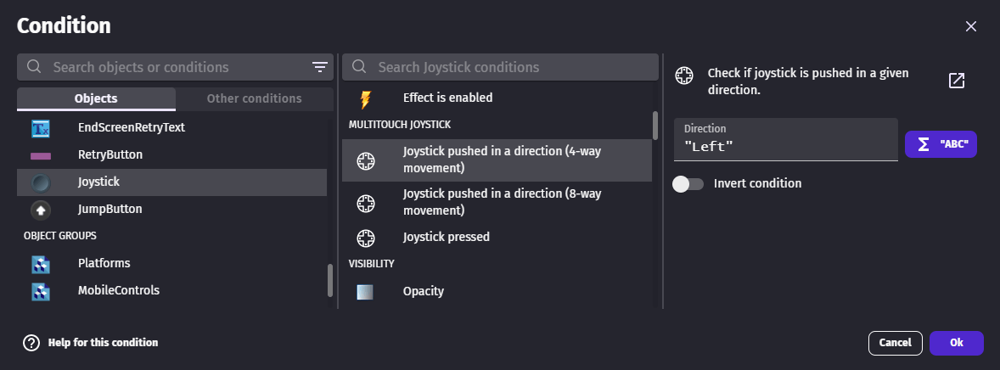
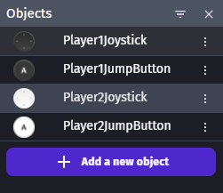

# Multitouch Joystick

Virtual joysticks are used in mobile games to give players similar controls than real gamepads.

While a virtual joystick could be created manually with a mix of objects and events, it's often simpler to use a virtual joystick offered in the Asset Store. They also come with behaviors that allow developers to easily move an object with it.

## Add a joystick from the Asset Store to a game

The [Multitouch Joysticks asset pack](https://gdevelop.io/asset-store/free/multitouch-joysticks-multitouch-joysticks) in the asset store contains free and read-to-use joysticks.

## Create a joystick from scratch

A joystick object can also be created from scratch. It needs an image for the border and another one for the part that follows the player's finger.

## Move a character

While events can be used to check if a joystick is pressed and in which direction, it's often simpler to use a behavior that will directly read the joystick value and move the object in the appropriate direction.

The behavior to use depends on which movement and type of game you're creating.

### Move a top-down character

The "Top-down multitouch controller mapper" behavior can be added to the character to make the character move according to player touches automatically. The default configuration will work without any change for single player games.

!!! note

    Learn more about the [Top-Down Movement behavior](/gdevelop5/behaviors/topdown).

[Open example in GDevelop](https://editor.gdevelop.io/?project=example://top-down-rpg){ .md-button .md-button--primary }

### Move a platformer character

The "Platformer multitouch controller mapper" behavior can be added to the character to make the character move according to player touches automatically.

#### Add a button for the jump

A multitouch controller button can be created in a few steps:

  - Create a sprite object - Attach a "Multitouch button" behavior to it

The multitouch button behavior allows the developer to choose a button name. The same name must also be set in the mapper behavior for the jump.

!!! note

     Learn more about the [Platform Character behavior](/gdevelop5/behaviors/platformer).

[Open example in GDevelop](https://editor.gdevelop.io/?project=example://platformer){ .md-button .md-button--primary }

### Move a character with a custom movement

Joysticks and buttons can be used to create controls similar to a real gamepad. Interactions of each player can be checked with the conditions in the following screenshot.

Similar conditions can also be used with the joystick object and button directly.

!!! note

    The [Gamepad extension](/gdevelop5/all-features/gamepad) can be used with this extension to handle both touch screens and physical gamepads.

## Handle several players on the same device

One joystick object can be created for each player. This allows the developer to choose a different player number and eventually a different color for the joystick to help players tell them apart.

