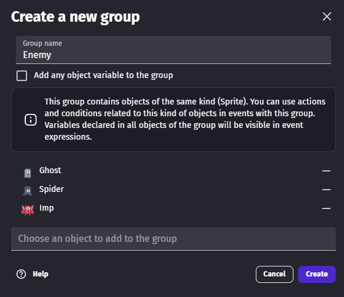
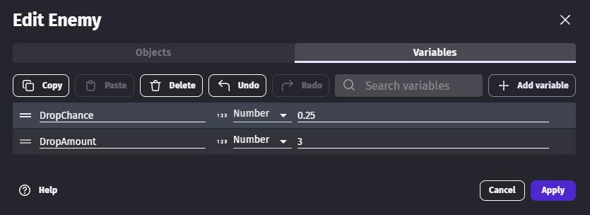
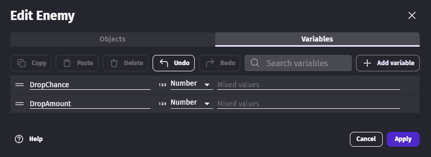

# Object groups

You can organize objects into _groups_ and then refer to all of the objects in that group by a single name.

This makes it possible to create events that applies to lots of objects without repeating events multiple times, increasing performance of your game, maintainability, and readability of your events.

When you use a group in an event, it behaves like a single object that has:

- The same **type** (like Sprite, Text, etc.) as all the objects in the group. If the objects are different types, only the features they all share can be used.
- Only the **behaviors** that all objects in the group have in common.
- Only the **variables** that all objects in the group have in common.

## Create a new group of objects

To organize objects into a group:

1. In the toolbar, select the **Groups** icon.
2. Click on **Add a new group**.
4. In the **Create a new group** dialog, select the objects to add the group.
5. Click on **Create** when you're done.

You can now use this group of objects in events.

## Add variables to an object group

A group of object does not have variables by itself. Rather, the variables of a group are displayed by finding all the common variables contained in all the objects of the group.
You can modify the variables using the same editor as [Object variables](/gdevelop5/all-features/variables/object-variables), when editing a group.

### Changing the value of a variable for one object only

When you add variables to a group, they are duplicated on every object of the group. It means that you can then edit each object individually if you want to customize a value. After modifying variables values on the object, you will see **Mixed values** in place of the value in the group editor:

If you want to reset all objects to use the same value, enter the new value in the group variables and apply the changes.
