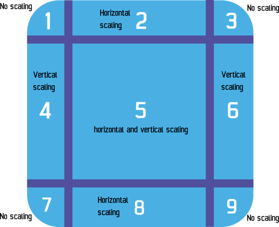
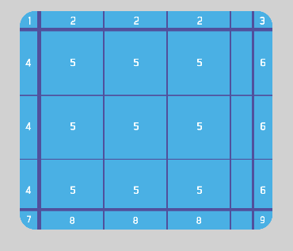

# Panel Sprite ("9 patch")

Panel sprite is an [object](/gdevelop5/objects) where its image is split into 9 pieces or slices and each slice is scaled separately. This can be helpful where you would need the object to keep it's proportions even after it is scaled. It can be useful for making the frames of a menu interface, as tiles (land, water, etc..) in top down games, as platforms in platformer games, used in health bars, etc.

!!! note

    The 9 patch sprite ("9 patch") objects do not support points, custom hitboxes or animations.

## How does it work?

Here is a representation of how a 9 patch panel sprite's image is split and scaled.

The texture is split into 9 segments, 1 to 9. Each of those segments will be scaled separately. Segments 1, 3, 7, and 9 keep their size and are not scaled, while segments 2 and 8 get scaled only horizontally, 4 and 6 get scaled only vertically, and segment 5 gets scaled both horizontally and vertically. Segments 2, 4, 5, 6, and 8 may repeat instead of scaling based on the panel sprite's object properties settings.

### How a 9 patch sprite is scaled compared to a normal sprite

While the normal sprite object's image is scaled uniformly, the 9 patch sprite object's image is scaled as different segments, maintaining their proportion and the image's quality.

### Using a Panel sprite

To use the Panel Sprite, create a new object from the Objects panel on the right. Once you've created the object, you can set the size of the margins for each border around the object. Margins are the top, left, right, and bottom lines that separate each segment. The default width and height in the object properties should represent the size of the total image used, in pixels.

You can also toggle whether the borders and center segments of the panel sprite stretch or repeat from this properties window.

The margins used in your object properties should represent the center of your image, the portion that will either scale or be repeated as the object's scale is changed.

If the top margin is set to 100, the margin would be 100 pixels from the top and if the bottom margin is set to 100, the margin would be 100 pixels from the bottom.

If "repeat borders and center texture" is enabled, segments 2, 4, 5, 6, 8 will be repeated instead of stretched. This will scale the object in a way that's similar to the tiled sprite object.

## Reference

All actions, conditions and expressions are listed in [the panel sprite (9-patch) object reference page](/gdevelop5/all-features/panel-sprite-object/reference/).