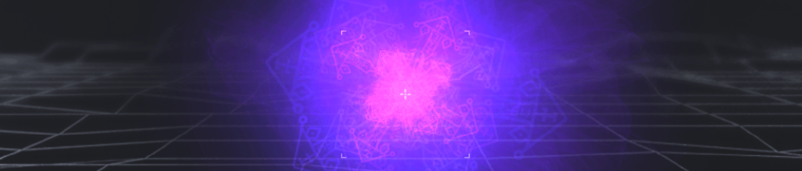

# Particles emitters

Particle emitters can be used to display a large number of small particles. They can be used to simulate effects in a game. A few examples of particle emitters are fire, explosions, smoke, and dust.

The Particles Emitter object parameters can be configured in multiple different ways to create a specific desired effect.

  <video controls>
    <source src="ParticleEmitterWishforgeVideo.mp4">
  </video>

## Particle types

There are 3 rendering modes available for Particle Emitters: Circles, Lines and Images.

  * Circle mode, will display circles with the specified size.
  * Line mode,  will display lines with the specified length and thickness.
  * Image mode, will display an image of the specified size.

## Colors

You can choose a starting color for particles, and a color to fade to. You can also choose a starting and final value for the object's opacity.

## Direction of emission

Particles will be emitted in the direction represented by the angle of the emitters on the scene. You can change the angle of *the spray cone*, which is also represented in the scene editor as two lines: a large value for this "spray cone" will result in an emission of particles in a larger number of directions. A value of 0 will emit particles only in a single direction.

  * Particles appear in a circle around the position of the emitter object. You can change the radius of the circle.
  * Gravity can be applied on particles on X and Y axis. For example, a negative value on the Y-axis will cause the particles to go up in the air.
  * Rotation can be applied to particles, particles will rotate at a value between the minimum and maximum values set.

## Lifetime

  * Each particle has a limited lifetime that is chosen randomly between two values. These two values can be changed.
  * The number of particles contained in the emitter ("tank") can be unlimited or fixed to a number. If the emitter is fixed to a number, the emitter will stop emitting after reaching the set number of particles.
  * The flow is the number of particles created every second. You can enter -1 to fire all particles at once.

You can also change the maximum number of particles rendered by the object on the screen. Note that this number changes the memory taken by the emitter. **If this number is too big, it can cause the game to crash.**

## Examples

!!! tip

        **See it in action!** 🎮
    Open these examples online.

[Open example in GDevelop](https://editor.gdevelop.io/?project=example://particles-explosions){ .md-button .md-button--primary }

[Open example in GDevelop](https://editor.gdevelop.io/?project=https://resources.gdevelop-app.com/examples/particle-effects-demo/particle-effects-demo.json){ .md-button .md-button--primary }

## Reference

All actions, conditions and expressions are listed in [the particle system reference page](/gdevelop5/all-features/particle-system/reference/).
