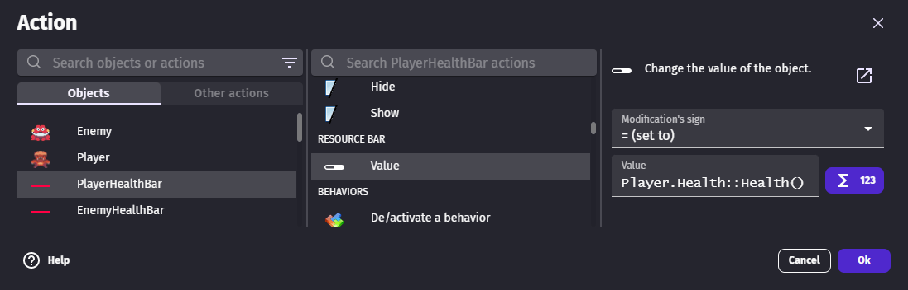

# Resource bar

## Learn about UI objects with this video tutorial

## Add a resource bar to a game

The [Resource Bars asset pack](https://gdevelop.io/asset-store/free/resource-bars-resource-bars) from the asset store contains free and ready-to-use resource bars.

## Create a resource bar from scratch

A resource bar can also be created from scratch. There are 2 kinds of resource bars:

  - one with icons that are repeated
  - one that fills with a texture

## Create a bar with icons

Bars with icons need 3 images:

  - a filled icon
  - an empty icon
  - a background (optional)

This is an example with a background:

and without a background:

Make sure to fill the "Unit width" with the dimension of the icon plus the margin (if any).

[Open example in GDevelop](https://editor.gdevelop.io/?project=example://space-asteroids){ .md-button .md-button--primary }

## Create a continuous bar

Bars with icons need 3 images for:

  - a filled bar
  - a buffer bar (optional)
  - a background

The buffer keeps the old value until no damage happens. This is useful to catch the attention of players and let them know they are losing a lot of heath. It's common on versus fighting games.

This is an example with a buffer:

and without a buffer:

[Open example in GDevelop](https://editor.gdevelop.io/?project=example://top-down-rpg){ .md-button .md-button--primary }

## Update a bar according to a character life

The "Value" action allows to change the value displayed by the bar. Here, the bar value is set to the player health using the [Health behavior](/gdevelop5/extensions/health/reference).

