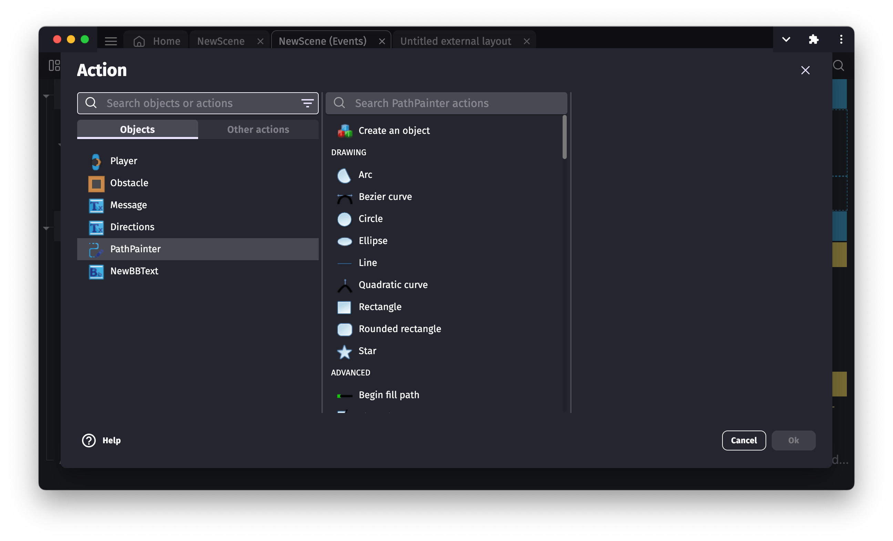
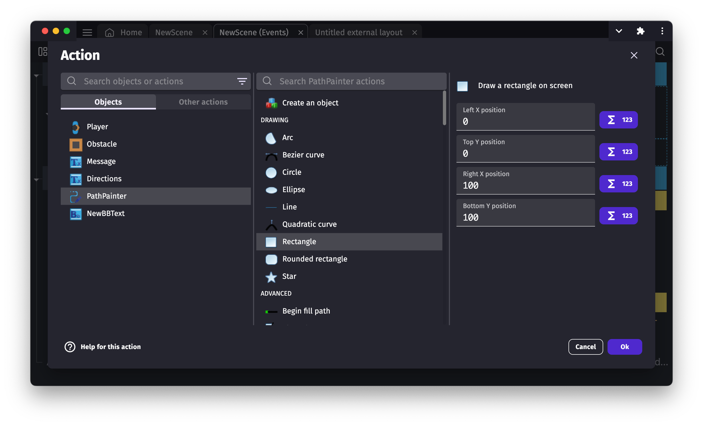
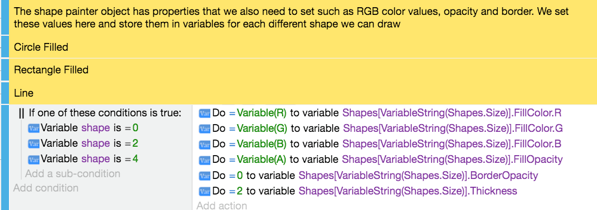

# Shape painter

The shape painter object allows us to draw shapes in our game. It can be useful for making simple User Interface (UI) elements, to create a selection box, indicator lines, and more.

## Setting up properties

The shape painter object has many properties that allow us to define how the shapes will be drawn on screen:

### Change the colour and opacity

The Shape Painter object properties allow us to change the outline colour/color of the object, the fill colour/color of the object, the opacity of each colour/color, and the outline size of our object.

### Draw relative to the object position

By default, the position of the shapes that we draw on the screen is relative to the "Shape painter" object.

In the case of a relative position, when you draw the shapes on the screen using events, the position you specify in actions are using the object position as origin. If your object is at position `150;100` on screen, and you display a rectangle using an action, the position `0;0` will correspond to the position `150;100` on the screen.

When the box is unticked/unchecked, the position 0 on the X and Y axis is going to be at the top left corner of our scene regardless where the object is located.

### Draw a shape using events

After adding a Shape Painter object into the scene, you won't see anything if you run the preview. The Shape painter object is just an empty, invisible object that allows us to display shapes drawn using events.

When you add an action to an event, select a Shape Painter object to display a list of shapes that can be drawn:

#### Available shape types

The Shape Painter can draw many different types of shapes:

**Basic shapes:**
- **Rectangle** - Draw a standard rectangle between two points
- **Rounded rectangle** - Draw a rectangle with rounded corners (specify corner radius)
- **Fillet rectangle** - Draw a rectangle with filleted corners
- **Chamfer rectangle** - Draw a rectangle with chamfered (beveled) corners
- **Circle** - Draw a circle with a specified radius
- **Ellipse** - Draw an ellipse with separate width and height

**Advanced shapes:**
- **Regular polygon** - Draw polygons with any number of sides (triangle, pentagon, hexagon, etc.) with optional rotation
- **Star** - Draw stars with a specified number of points, outer radius, inner radius, and rotation
- **Arc** - Draw circular arcs with start/end angles, optionally closed or anticlockwise
- **Torus** - Draw a torus (ring/donut shape) with inner and outer radii and optional arc angles
- **Line** - Draw straight lines with customizable thickness
- **Bezier curve** - Draw smooth cubic bezier curves using two control points
- **Quadratic curve** - Draw quadratic curves using a single control point

#### Example: Drawing a rectangle

As an example, we are going to draw a rectangle on the screen. Select the Rectangle in the actions.
For the top left position enter 0 for both X and Y. For the bottom right position enter 100 for both X and Y.

Now, if we launch a scene preview, a rectangle will be drawn in the scene/screen that is 100 pixels wide and 100 pixels high.

If we left the relative position enabled, you may notice that our rectangle is in the same position as the shape painter object even though its origin point is 0. Now if we disable that option and launch the preview again, you going to see our object is drawn in the top left corner of our scene.

Using events we can also change any properties of a shape on the fly:

#### Advanced path drawing

For complex custom shapes, you can use the advanced path drawing actions:
- **Begin fill path** - Start drawing a custom path
- **Move path drawing position** - Move the drawing cursor without drawing
- **Path line** - Add a line segment to the path
- **Path bezier curve** - Add a bezier curve segment to the path
- **Path arc** - Add an arc segment to the path
- **End fill path** - Complete and fill the custom path

These actions allow you to create complex, multi-segment shapes by combining different path elements.

### Collisions with a shape painter

Like most objects, collisions can be detected by the shape painter object.  Shape painter objects are unique in that the collision mask is based on what the shape painter has drawn.  The collision mask of a shape painter is the smallest rectangle that can be drawn around all points that the shape painter has drawn (also called the AABB, axis-aligned bounding-box).

## Examples

!!! tip

        **See it in action!** 🎮
    Open these examples online.

[{ width="320" }](https://editor.gdevelop.io/?project=example://advanced-shape-based-painter)

[Open example in GDevelop](https://editor.gdevelop.io/?project=example://advanced-shape-based-painter){ .md-button .md-button--primary }

## Reference

All actions, conditions and expressions are listed in [the shape painter reference page](/gdevelop5/all-features/primitive-drawing/reference/).

