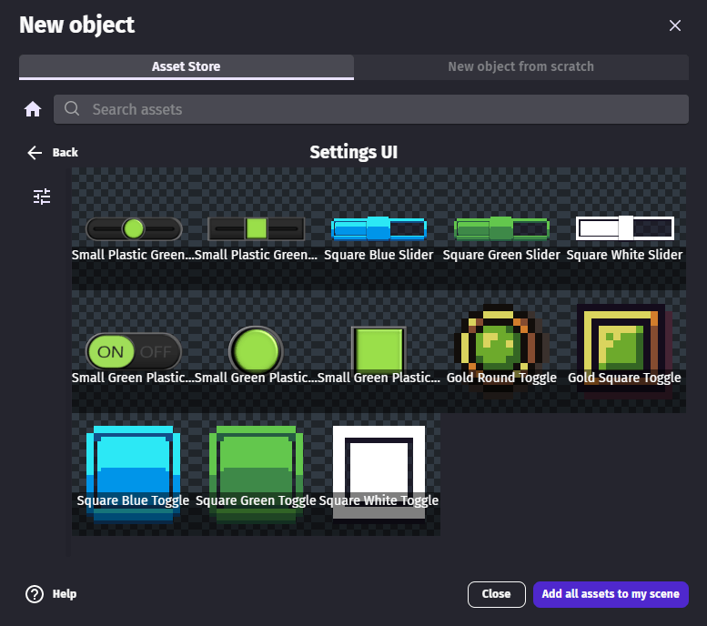

# Slider

Sliders allow the player to pick a value between a maximum and a minimum range. This can be useful to change the music or sound effect volume, set the power of an attack, modify the speed of a car.

While sliders could be constructed manually using other objects, it's often simpler to use ready-to-use sliders available in the Asset Store.

## Add a slider from the Asset Store to a game

The [Settings UI asset pack](https://gdevelop.io/asset-store/free/settings-ui-settings-ui) from the asset store contains free and read-to-use sliders.

!!! tip

    This pack also contains [toggle switches](/gdevelop5/objects/toggle-switch).

## Advanced: create a slider from scratch

Sliders need 3 images:

  - the thumb, that is dragged by user on the bar,
  - the filled part of the bar,
  - the background or frame of the bar,

When the slider is made larger in the editor, the thumb remains the same size. The default size of the thumb must be changed if necessary.

When a slider is added into the scene, it takes the default size set for the slider background.

!!! tip

    Every part of the slider is a [Panel Sprite ("9-patch")](/gdevelop5/objects/panel_sprite).

## Read the value of a slider

A slider would be useless if the game can't react when its value is changed.

Slider values can be read with the `Value()` expression. It's can be used to store this as a variable or use it to change a property of an object.

Sliders and toggle switches can be useful to make a settings panel. As the settings panel and the game may be in different scene, the value can be stored in a global variable to use it in other game scenes.