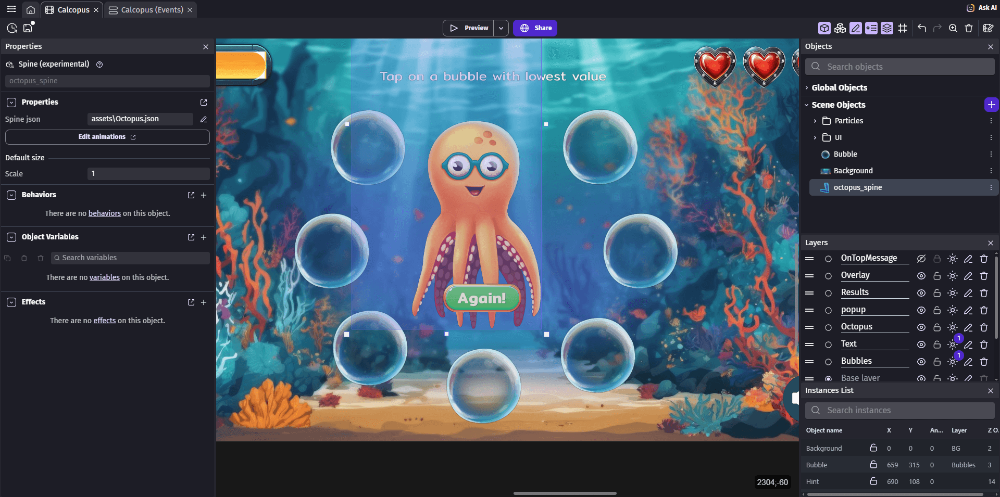

# Spine (Experimental)

The **Spine** object allows you to display and smoothly animate 2D skeletal animations created with [**Spine editor**](https://esotericsoftware.com/spine).

!!! warning
    This object is currently experimental — please share your feedback on the forum so we can improve it in future versions of GDevelop.

The Spine object is ideal for animating complex 2D characters with bones and meshes.
It supports smooth transitions between animations, as well as access to points and attachments defined in Spine.

You can:

- Load and display Spine animations exported from the Spine editor.
- Control animation playback, pausing, and speed.
- Configure smooth blending between animations with adjustable mixing duration.
- Retrieve the position, rotation, and scale of specific **point attachments** defined in your Spine skeleton (both in local and world coordinates).
- Apply different **skins** to change the character's appearance at runtime.
- Use multiple animations with smooth transitions between them.

It uses files exported from Spine (`.json`, `.atlas`, and image files) to render and animate characters or elements with smooth, interpolated bone-based movement.

!!! tip
    To ensure proper compatibility with GDevelop, use **Spine version 4.1** when exporting your animations. You can select the Spine version in the **Spine launcher** before exporting your files.

!!! note
    If you use Spine, you need to have a license, [read more on here](https://esotericsoftware.com/spine-purchase).

    
## Properties

In the object editor, you can configure:

| Property            | Description                                                                                               |
| ------------------- | --------------------------------------------------------------------------------------------------------- |
| **Spine JSON file** | The main file describing bones, animations, and attachments.                                              |
| **Scale**           | The overall display scale of the skeleton. Default value is **1**. This scale is applied to the base size of the skeleton. |
| **Skin name**       | The default skin to apply when the object is created. Leave empty to use the "default" skin defined in Spine. |
| **Animations list** | List of available animations. Click **Scan** to automatically generate the list from the Spine JSON file. Each animation can be set to loop or play once. |

## Key features

### Animation control

The Spine object provides full control over animation playback:

- **Play animations by name or index**: Switch between different animations defined in your Spine skeleton.
- **Animation speed scale**: Speed up or slow down animations by adjusting the speed scale (e.g., 0.5 for half speed, 2.0 for double speed).
- **Pause and resume**: Pause the animation at any frame and resume playback later.
- **Check animation completion**: Detect when a non-looping animation has finished playing.
- **Animation mixing duration**: Set the duration (in seconds) for smooth transitions between animations. A value of 0 means instant switching, while higher values create smooth blending.

### Point attachments

Point attachments are invisible reference points defined in your Spine skeleton. You can use them to:

- Position objects at specific bones (e.g., place a weapon in a character's hand).
- Track the position of any part of the skeleton during animation.
- Get both **local coordinates** (relative to the skeleton) and **world coordinates** (absolute position on the scene).
- Retrieve position, rotation, and scale information for each point attachment.

When accessing point attachments, you specify the **attachment name** and optionally the **slot name**. If the attachment and slot have the same name, you can leave the slot name empty.

### Skins

Skins allow you to change the appearance of your Spine character without changing the skeleton structure or animations:

- Switch between different character outfits or appearances at runtime.
- Each skin can have different images attached to the same bones.
- The default skin is named "default" unless you specify otherwise in Spine.

### Flipping and scaling

The Spine object supports standard transformations:

- **Flip horizontally or vertically**: Mirror the skeleton on the X or Y axis.
- **Independent scale on X and Y**: Stretch or compress the skeleton in either direction.
- **Resize**: Change the width and height of the skeleton, which adjusts the scale accordingly.

## Examples

You can explore example(s) to see how a Spine object is integrated in a GDevelop project:

[Open the Calcopus Spine Demo](https://gdevelop.io/game-example/free/calcopus-spine-demo){ .md-button .md-button--primary }

## References

You can browse all the actions, conditions and expressions related to [the Spine object on this reference page](/gdevelop5/all-features/spine-object/reference/)
