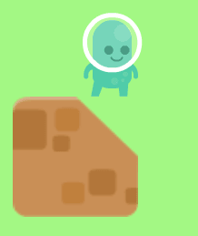
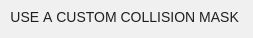
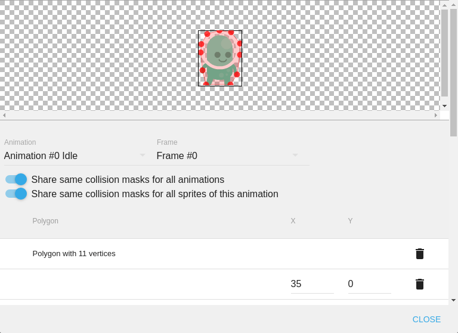
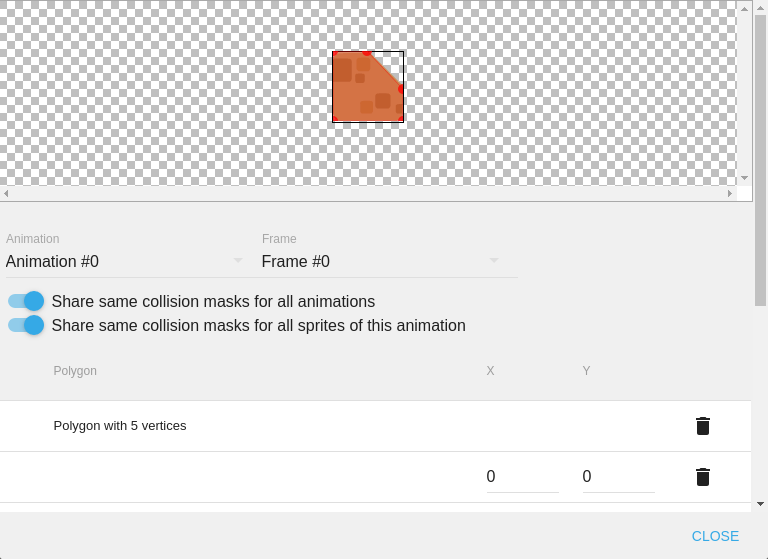
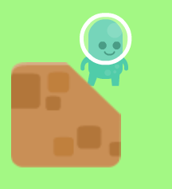

# Collision Masks (for Sprite objects)

In a Sprite editor, below all the animations, we find the **Edit Hitboxes** button.

Clicking on this button takes us to a new dialog that talks more about something known as collision masks. Collision mask, in simple terms, is nothing but the area of the sprite, that is in consideration while in a collision, to avoid situations, similar to the one shown below.

## Default collision masks

By default, a Sprite uses an **automatic collision mask**: GDevelop computes a mask that matches the shape of the image, and updates it when you change the frame. This is the best choice for most objects and requires no configuration.

Alternatively, a Sprite can use a **full image collision mask**: a rectangle as large as the whole frame. This is faster to check and useful when a rectangular hitbox is enough (for example, a platform tile or a UI element).

If you need a more precise or a simpler shape than the automatic one, you can draw your own polygons with a **custom collision mask**, as described below.

## Add a custom collision mask

To add your own custom collision mask, click on the **Use a custom collision mask** option.

Click on the + sign at the bottom right of the screen to start adding your custom collision mask.

This will take you to the screen where you can enter/drag the outline of your collision mask. To add more points, click on the + sign below all the coordinates of your points. My final sprite collision masks look as shown below.

!!! note

    Please make sure that the polygon is convex, i.e. there are no vertices that have an angle greater than 180º

After adding the mask click on Close and then Apply.

The collision masks we used for our above example give better results in the same condition.

To add unique collision masks for different animations of the same sprite, disable the **Share same collision masks for all animations** option.

To add unique collision masks for different instances of the same sprite, disable the **Share same collision mask for sprites of this animation** option.

