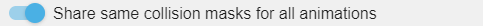
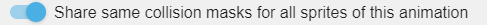

# Collision Masks (for Sprite objects)

In a Sprite editor, below all the animations, we find the **Edit Hitboxes** button.

Clicking on this button takes us to a new dialog that talks more about something known as collision masks. A collision mask (also called a hitbox) is the area of the sprite that is used for collision detection. Properly configured collision masks avoid situations where collisions are detected incorrectly, similar to the one shown below.

## Collision mask modes

There are two modes for collision masks:

- **Full Image Collision Mask** (default): Uses the entire image bounding box as the collision area. This is simple but less accurate for non-rectangular sprites.
- **Custom Collision Mask**: Uses manually defined polygons for precise collision detection. This is more accurate but requires manual setup.

To add your own custom collision mask, click on the **Use a custom collision mask** option.

Click on the + sign at the bottom right of the screen to start adding your custom collision mask.

This will take you to the screen where you can enter/drag the outline of your collision mask. To add more points, click on the + sign below all the coordinates of your points. My final sprite collision masks look as shown below.

!!! warning

    **Collision masks MUST be convex polygons**

    Collision detection in GDevelop uses the Separating Axis Theorem (SAT) algorithm, which requires convex polygons to work correctly. A convex polygon has no vertices with an angle greater than 180º - all interior angles must be less than 180º.

    If you create a non-convex (concave) polygon, collision detection will produce incorrect results. For complex shapes, split them into multiple convex polygons or use a simplified convex shape that approximates the sprite.

After adding the mask click on Close and then Apply.

The collision masks we used for our above example give better results in the same condition.

To add unique collision masks for different animations of the same sprite, disable the **Share same collision masks for all animations** option.

To add unique collision masks for different instances of the same sprite, disable the **Share same collision mask for sprites of this animation** option.

## How collision masks work with different object types

Different object types in GDevelop handle collision masks differently:

- **Sprite objects**: Can use either full image collision masks or custom polygons as described above
- **Shape Painter, Panel Sprite, Tiled Sprite, and Text objects**: Use their rendered shape/bounds as collision masks
- **Tilemap objects**: Use spatial indexing for optimized collision detection with large numbers of tiles
- **3D objects (3D Box, 3D Model)**: Use their 3D bounding volumes for collision detection

## Performance considerations

Collision masks are cached and only recalculated when an object changes:
- When the object moves, rotates, or scales
- When the sprite animation frame changes
- When collision mask settings are modified

This caching ensures good performance even with many objects. However, avoid creating overly complex collision polygons with many vertices, as these take longer to process during collision detection.