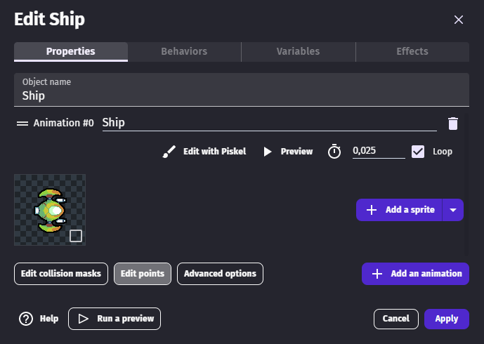
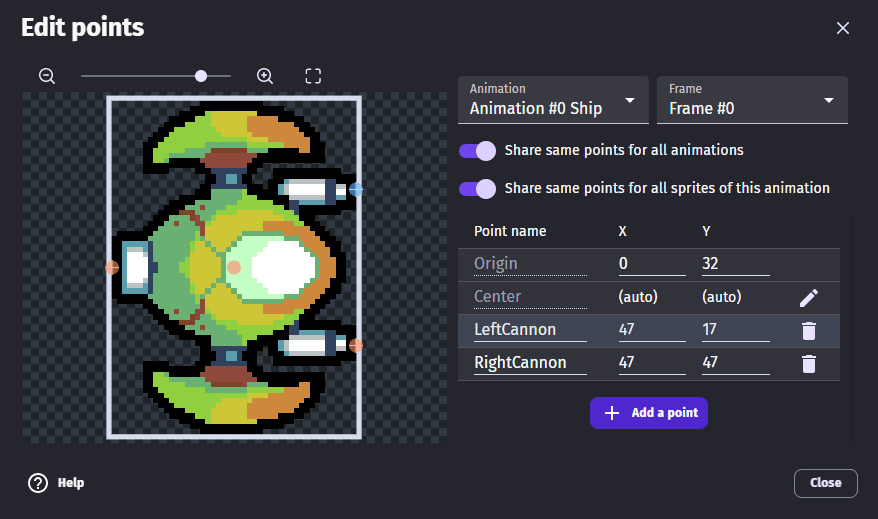
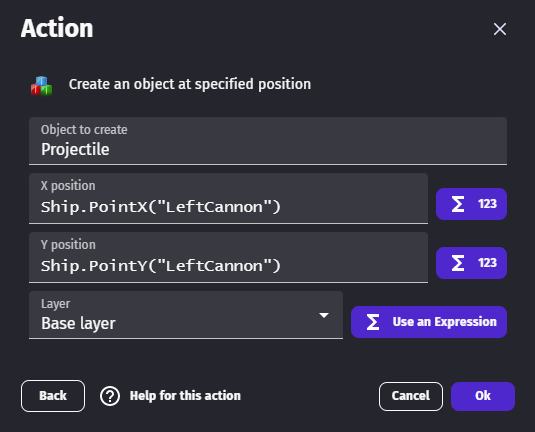

# Edit Points

Points are reference locations that refer to a specific location around a sprite.  Every sprite starts with two default points, named "**Origin**" and "**Center**".  Each of these points can be moved from their default locations.

  * **Origin** point is created at the top-left corner of the sprite image. This point is used to position the image of the sprite object on the scene.
  * **Center** point is created at the halves of the dimensions of the image. The **Center** point, also called "anchor" or "pivot" in other game engines, is the point around which the image is rotated or flipped.

!!! tip

    For example, if a sprite image is 100 x 100 pixels in dimensions, the origin of the image will lie at (0, 0) of the image, i.e. in the top-left corner of the image. The center, with respect to the origin of the image, will lie at (50, 50), i.e. (100/2, 100/2).

## Add custom points to a sprite

The point editor can be opened with the **Edit points** button.

{ .align-center }

Custom points can be moved directly on the animation frame on the left and coordinates adjusted on the right.  

The **Share same points for all animations** switch can be unchecked to set different positions for each animation of the sprite.

The **Share same points for all sprites of this animation** switch can be unchecked to set deferent positions for each frame of the animation.

{ .align-center }

## Use custom points in events

Custom points can be used in events with the `PointX` and `PointY` [expressions](/gdevelop5/all-features/expressions/). Custom point names must be surrounded by double quotation marks.

{ .align-center }

## Editing the default origin and center points

If the sprite images are not centered, or the image should rotate around a specific position, you can change the position of the **Origin** and **Center** point. By default, the center point position is automatically computed. If you want to change its position, click on the Pen icon next to it:

!!! tip

    If a sprite is rotated or flipped, the points will automatically move to stay in the same relative location on the sprite.