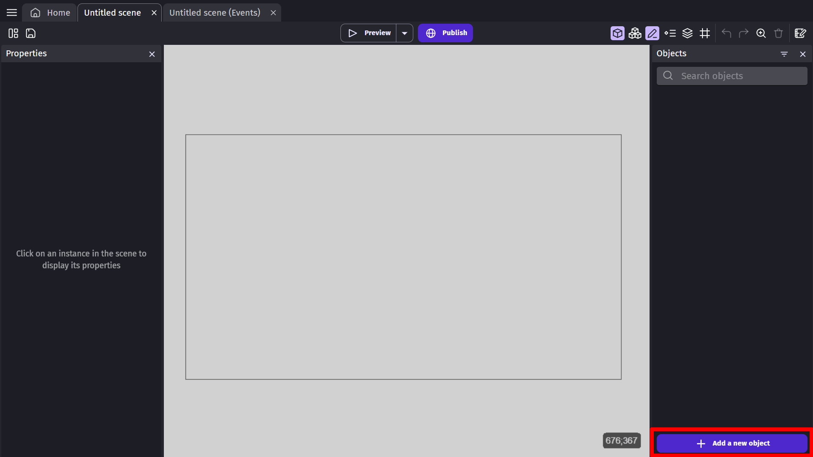
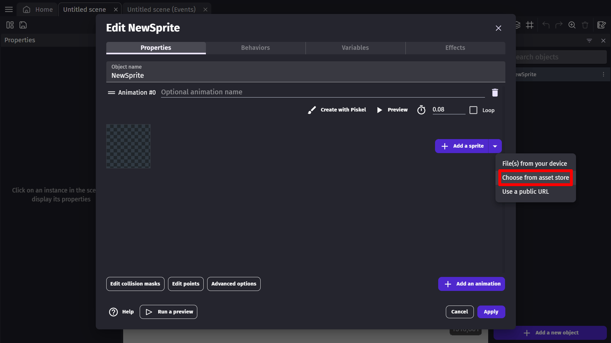
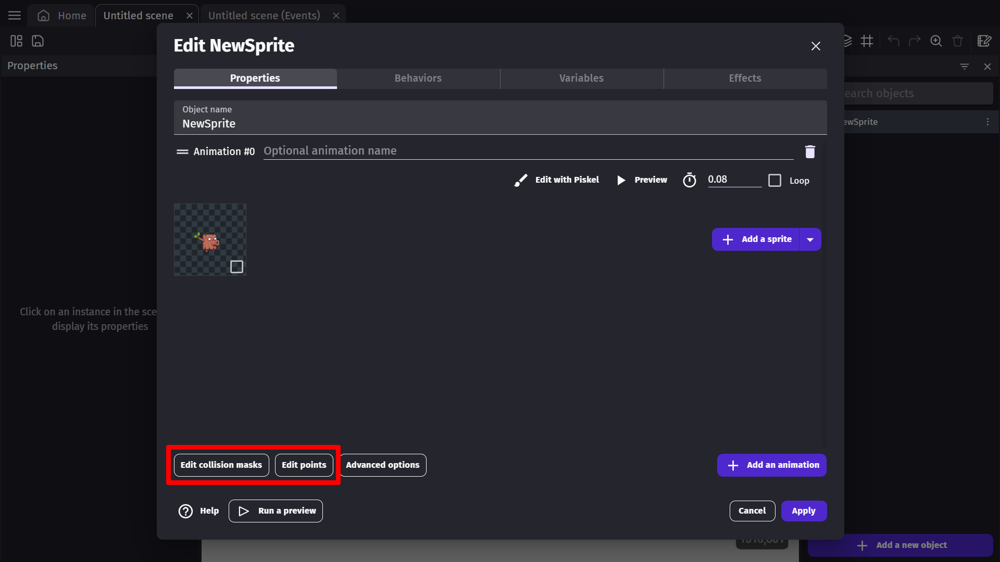
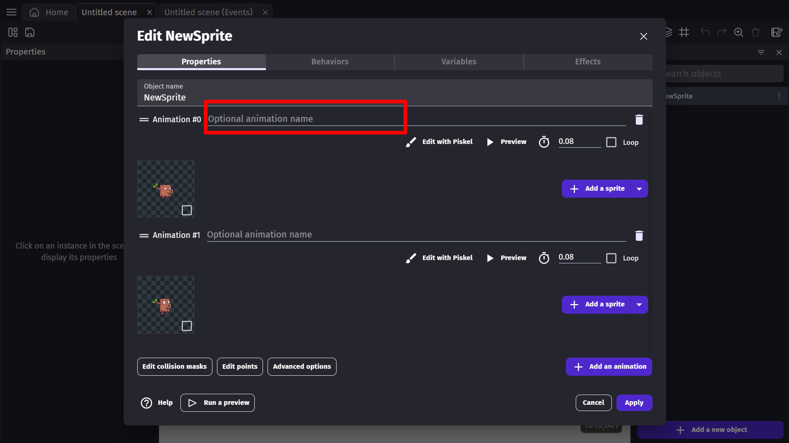
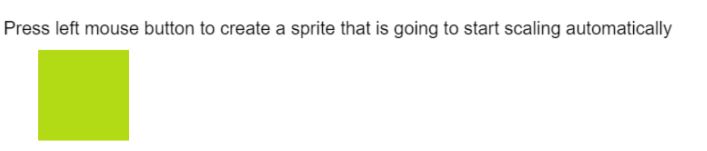
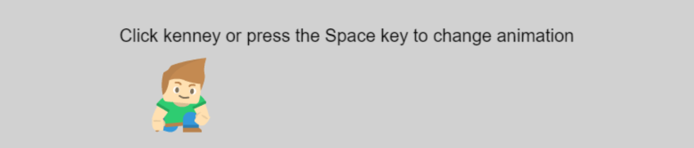

# Sprite

Sprite objects are the most commonly used [objects](/gdevelop5/objects) in GDevelop.

A sprite object allows us to display an image or play a series of images as an animation. It can be used for many things in our games, like buttons, characters, or platforms. Anything that can be represented with an image can be a sprite object.

  <iframe src="https://www.youtube.com/embed/2eOhvUIL4vg" frameborder="0" allowfullscreen></iframe>

## Creating a sprite object

To add a sprite to your scene, select the "Click to add an object" option located on the right at the bottom of the objects panel.

A new window will open that will show the different types of objects available in GDevelop.

From the **New object from scratch** tab in the new window, choose "Sprite" from the list to create a new sprite object in your game scene.

This selection will open up the sprite object properties window. In this window, you will see a few properties of the sprite object.

## Adding an animation

An animation allows you to add an image or series of images to the sprite object. To add an animation, click the **Add an animation** button.

This will expand the current window and show you a variety of options you can change.

### Adding an image to the animation

We can add images to the animation of our object by clicking **Add a Sprite**.

This will open the file explorer to browse through the files and choose a suitable image for your animation. After choosing the image, you will see the image being displayed in the window.

If you'd rather get your assets from the asset store, you can click on the arrow beside the **Add a Sprite** button to open a drop down menu, where you'll be able to select **choose from asset store**.

### Collision and points

You can customize your sprite's collision area using the Edit Collision Masks button at the bottom of the window; you can set the area that will be taken into consideration during a collision. [Read more about collision masks here.](/gdevelop5/objects/sprite/collision-mask)

Beside the Edit Collision Masks option, you will find the Edit Points option at the bottom of the sprite properties window. This option allows us edit and add additional reference points for an object. These reference points can be used in events when needed. [Read more about points in sprites here.](/gdevelop5/objects/sprite/edit-points)

### Adding multiple animations

Objects often require more than one animation. To add animations, click the "Add animation" button again.

Later, we can switch between the animations using events.

### Naming the animation

Above each animation in this window, you will see a field to the right of "Animation #" with grayed out "Optional animation name" written in it. To enter a name for your animation, click in to the field and type in a name.

!!! tip

        For objects with multiple animations, you may find it difficult to differentiate between animations without names. It is generally a good practice to use animation names for objects with multiple animations.

    If we don't enter a name, you can still use the animation number to refer to this animation in events.

### Adding multiple images in an animation

To add multiple images to an animation, you can select all the images from the explorer and add them to the animation. You can also add more images to an existing animation by pressing **Add a sprite** for the animation you'd like to add images to. Images will be played in the same order as displayed.

### Repeating the animation

By default, every animation plays only once, which means that the animation stops as soon as its last frame finishes. To repeat the animation, we can "loop" the animation; set the animation to "loop" by clicking the loop toggle button. Once an animation is set to loop, it will play continuously.

### Setting animation speed

The speed of the animation can be set by changing the value to the right of the clock icon. The value entered in the field is the time elapsed between two consecutive frames. The default value is 0.08 seconds. For faster playback, use lower animation time while, for slower playback, use high animation time.

## Naming the object

At the top of the window, you can see the name of the object in the "Object Name" field. The name of the object should be changed to describe the object which will make it easier to distinguish from other objects.

## Adding object to the scene

After editing your object, be sure to click on **Apply** to confirm changes.

Now to add a new "instance" of this sprite object in to your game scene, click on the new sprite in the Object list and drag it to where you'd like to place the object. You will now see your sprite added to the scene. You can add multiple instances of your sprite to your game screen.

## Using multiple animations with events

After creating multiple animations, each with their own unique set of images, you can use events to switch between animations.

!!! note

       _Do not use negative values for animation speed._

When you have set multiple animations for an object with unique animation names, you can control those animations with events in the events tab with the action "Change the animation (by name)." It will allow you to change animations based on the names that were given to them when the conditions of your related events are true.

You can also change animations using the number associated with that animation using the action "Change the animation", where you can change the number of the animation being played with the modification symbol.

You can use the current animation of a sprite object as the condition for an event, either with its animation name or number, as well as a particular frame of the animation.

When using an animation's name, write the name between quotation marks. For examples: "Animation" 

For more practice with events, follow the [tutorials here](http://wiki.compilgames.net/doku.php/gdevelop5/tutorials).

## Changing the color/tint

You can tint a sprite with a color using the **"Change color"** action. The color is specified in `R;G;B` format, where each component ranges from 0 to 255. For example, `"255;0;0"` applies a red tint. Setting the color back to `"255;255;255"` removes the tint (white = no color change).

This is useful for feedback effects: flash an enemy red when hit, tint a collectible gold, or indicate power-up states.

## Flipping a sprite

You can mirror a sprite horizontally or vertically using the **"Flip the sprite"** actions (flip on X axis or flip on Y axis). This avoids having to create separate animations for left/right movement — just flip the sprite as the character changes direction.

!!! tip

    Checking whether a sprite is currently flipped (using the "Is flipped" conditions) is useful when you need to aim projectiles or spawn effects in the direction the character is facing.

## Blend modes

Sprites support four blend modes that control how a sprite is composited on top of the background:

- **Normal** (0) – Default rendering; the sprite is drawn as-is over the background.
- **Add** (1) – The sprite's colors are added to the background, creating a bright glow effect. Useful for fire, lasers, and light sources.
- **Multiply** (2) – The sprite's colors are multiplied with the background, darkening it. Useful for shadows or color overlays.
- **Screen** (3) – The inverse of Multiply; creates a brightening effect. Useful for light leaks and soft glow.

Use the **"Change the blend mode"** action to switch blend modes at runtime.

## Controlling animation timing

The **animation speed** set in the object editor is the time in seconds between two consecutive frames. A value of `0.08` seconds (the default) plays at about 12 frames per second. Decrease this value for faster animations and increase it for slower ones.

You can also control animation timing at runtime:

- **Animation speed scale** – A multiplier applied on top of the frame time. A value of `2` plays the animation twice as fast; `0.5` plays it at half speed. This is useful for slow-motion effects or tying animation speed to a character's movement speed.
- **Animation elapsed time** – You can read or set the current elapsed time within the animation. This allows you to synchronize animations precisely, or jump to a specific point in an animation.

## Advanced options

Currently, the **Advanced options** button opens a window that allows you to toggle whether this object plays its animations while off screen. This option should only ever be toggled off for specific use cases, because having multiple objects play their animations when not on screen is bad for performance.

## Examples

**See it in action!** 🎮
Click on the images to open the examples online.

----

----

----

## Reference

All actions, conditions and expressions are listed in [the Sprite object reference page](/gdevelop5/all-features/sprite/reference)