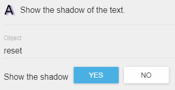
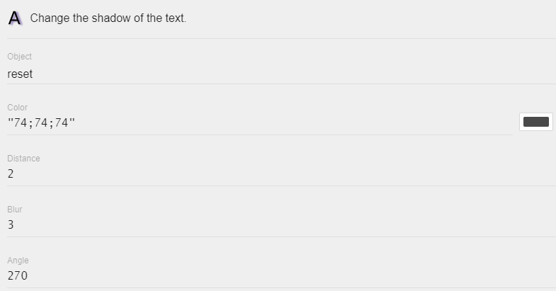

# Text

Text objects are used to display text on screen. You can customize the properties of a text object (for example, font size or colour) when you create the object. You can also modify the properties of a text object during gameplay using events.

### Default text

You can set the default text, displayed by the text [object](/gdevelop5/objects), using the central text field. Default text is what will be displayed when the text object is first displayed or created in a scene, but the text displayed by a text object can be modified during gameplay using events.

### Size

Use the size text field to set the default font size of the text.

### Color

The color of the text can be changed by clicking on the palette color square, located on the right side of font size text field.

### Font and text style

You can choose from bold and italic, as well as choosing a custom font for the text. A custom font will require a font file, for which the file format must be TTF or OTF.
 

### Additional effects

* You can create **gradients** using the action "gradient". You can choose available gradient types from the provided list and select up to four colors to use.

* You can set a **Shadow** using the action "text shadow/show shadow". When changing the shadow, you can choose the color, distance, blur, and angle.  This can also be used to create a glow effect with bright colors.

* **Opacity** of the object can be changed.

* **Scaling** of the object can be changed. There are three options: "Scale" (constrains proportions to scale on both X and Y axis), "Scale on X axis" (width), and "Scale on Y axis" (height).

### Other styles

Using events, you can modify all properties of the text object, such as:

  * **Text Displayed**: Change the actual text content
  * **Bold**: Make text bold or remove bold styling
  * **Italic**: Make text italic or remove italic styling
  * **Padding**: Add space around the text (useful when using backgrounds or borders)
  * **Alignment**: Align text to left, center, or right
  * **Wrapping**: Enable or disable automatic line wrapping
  * **Wrapping Width**: Set the maximum width before text wraps to a new line
  * **Font Size**: Change the size of the text dynamically

### Text object performance

Text objects are efficient for displaying text, but keep these performance tips in mind:

- Avoid changing text content every frame if the text doesn't actually change
- When displaying many numbers that update frequently (like scores), consider using [Bitmap Text](/gdevelop5/objects/bitmap_text) objects for better performance
- For styled text with multiple colors or fonts in one block, consider using [BBText](/gdevelop5/objects/bbtext) objects

## Examples

!!! tip

        **See it in action!** 🎮
    Open these examples online.

Manipulate a Text Object

[{ width="320" }](https://editor.gdevelop.io/?project=example://manipulate-text-object)

[Open example in GDevelop](https://editor.gdevelop.io/?project=example://manipulate-text-object){ .md-button .md-button--primary }

Typewriter effect from extension

[{ width="320" }](https://editor.gdevelop.io/?project=example://type-on-text-effect)

[Open example in GDevelop](https://editor.gdevelop.io/?project=example://type-on-text-effect){ .md-button .md-button--primary }

## Reference

All actions, conditions and expressions are listed in [the text object reference page](/gdevelop5/all-features/text-object/reference/).
