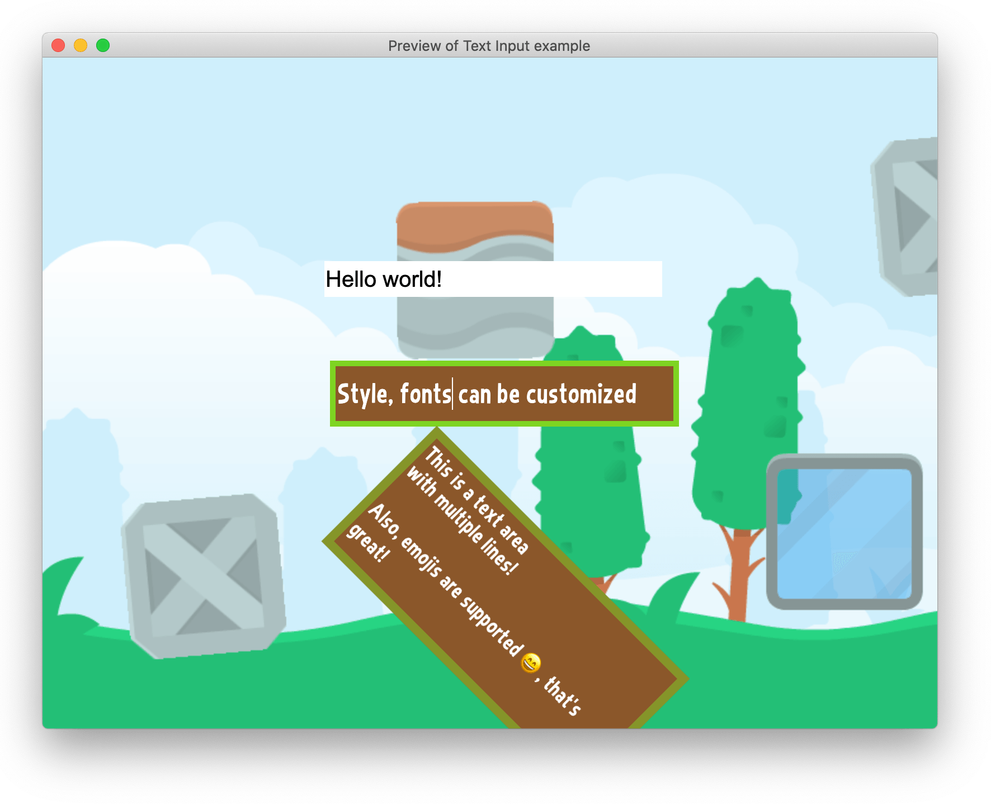
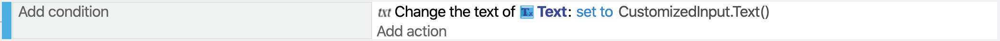

# Text Input

The Text Input object displays a text field where the player can enter text. This can be used to ask for the player name, get their email, create a search bar, enter a password, etc...

Text Input objects are customizable, and they use the native platform user interface to be rendered on top of the game. Depending on the device being used, the text input object will be treated differently. On touch devices (Android, iOS), a keyboard will be shown on screen, reducing the size available for the game. The player can use the keyboard as they normally would (as well as select the text, copy, paste, insert emojis, etc.).

## Note about the rendering of this object

!!! warning

    Read this part carefully to understand the limitations of the object.

Because the object is not rendered by the same hardware accelerated renderer as the rest of the game, the object has some limitations. It is rendered on top of the game using the user interface toolkit of the platform the game is running on (the browser, itself using the operating system of the device).

This means:

- You can't change the **Z order** of the object.
- You can't use **effects** with the object.
- Be careful if you use the object in a scene with a moving camera or if you rotate/move the object. It might be slightly desynchronized from the rest of the rendered game. This can create a weird effect for the player.

In general, prefer to use the object on **a static screen** and ensure that the keyboard on mobile devices won't hide critical information.

## Input type

The field can be:

* A **single line** text input (default)
* A **multiline** text input (also called a "text area")
* Or a special single line text input: *password, email, search field, number, phone number, url*.

According to the type, some devices might display visual aids or **a different keyboard** to the user (especially on mobile). Password inputs will also hide the character that the user is writing.

## Placeholder and maximum length

A **placeholder** can be set (in the object properties or with an action) to display a hint inside the field while it's empty — for example "Enter your name". The placeholder disappears as soon as the player starts typing.

A **maximum length** can also be set to limit how many characters the player can enter. A value of 0 means there is no limit.

## Reading the text entered by the player

After adding a Text Input object, put an instance on the scene. You can then use the expression `Text` on the object in the events to read the text. For example, this event copies the content of the field into a [Text object](/gdevelop5/objects/text) (to display it somewhere else on the screen):

## Detecting when the input is submitted

Use the **"Input is submitted"** condition to react when the player validates the field, which usually happens when the *Enter* key is pressed on a keyboard, or a specific button is used on mobile virtual keyboards. This is convenient to confirm a search bar or move to the next field of a form without adding a separate button.

## Focusing the field

You can check if a field currently has focus (the cursor is in it and the player can type) with the **"Focused"** condition, and give it focus from events with the **"Focus"** action — as if the player had touched or clicked it. This is useful to automatically select the first field of a form when a scene starts.

## Read-only and disabled fields

You can set, either from the object properties or using actions, the field as :

* Read-only. Text can still be selected and usually the appearance of the field does not change, but the text can't be modified.
* Disabled. Text usually can't be selected, nor modified, and some devices or platforms will gray the input.

## Customizing the appearance

The field can be styled both from the object properties and with actions, so it can match the look of your game:

* The **font**, **font size** and **text color** of the entered text and placeholder.
* The **text alignment** (left, center or right).
* The **fill color** and its opacity, used for the background of the field.
* The **border color**, opacity and width.

You can also disable **spell check** to avoid the red underline some platforms add under words.
