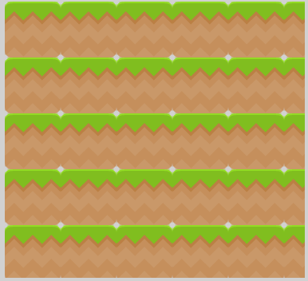
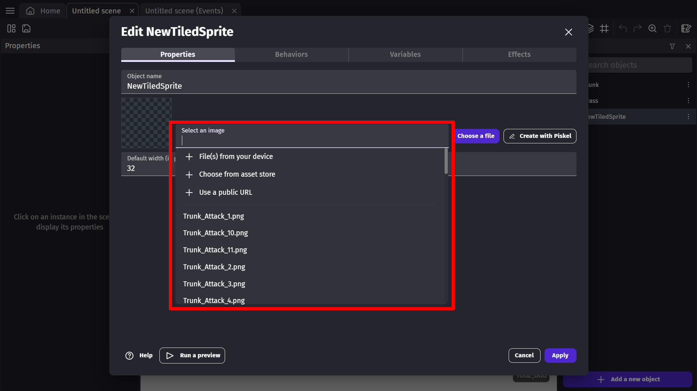
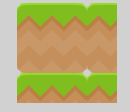

# Tiled Sprite

A tiled sprite [object](/gdevelop5/objects) allows us to use repeating images in our games. increasing the width or height of the object will cause it repeat it's image, rather than stretching the image like a normal sprite object.

A tiled sprite object can be used to create platforms in a platform game, health bars, status bars, repeating wall tiles, repeating backgrounds, etc.

#### Add a tiled sprite object

To create a new Tiled Sprite object, click the "Add a new object" button at the bottom of the Objects list, and select  "Tiled Sprite" from the window that opens. Alternatively, you can search through the asset store to add an already made tiled sprite object to the scene.

#### Open object properties

After creating the object or adding it to your game from the asset store, you can examine the object's properties.To open the newly created object's properties, right-click on the object and selecting "Edit object" from the popup list that appears, or double click on the object.

#### Add an image

With the object's properties window open, you can add an image to the object by clicking in to the "Select an image" text field. From the drop down menu that appears you can chose where the image will come from. Chose the source of the image, and select the image you want to add. The selected image will be displayed in the preview window on the left.

#### Change default size

We can change the default size of the tiled sprite object by changing the Default width and Default height value in the object's properties window. This size will determine the size, in pixels, that the object will appear in game when placed.

This will not scale or alter the original image in any way, just the default size of the object when it's placed in to the scene. This size should be the height and width of the image used in pixels.

#### Scale the object

The size of the tiled sprite effects how much of your image is going to be visible in your game. If the image used in the tiled sprite object is larger than the size it's scaled to in scene, only a portion of the image will be visible.

If the object is scaled to be larger in pixels than the image used, then the object will repeat the image to fill in the excess space.

You can use events to manipulate the scale and positioning of tiled sprite object, but there are actions unique to tiled sprites. Offsets, which allow a user to scroll through a tiled sprite image without changing it's position. This is often used for scrolling backgrounds, and similar effects.

## Examples

!!! tip

        **See it in action!** 🎮
    Open this example online.

[Open example in GDevelop](https://editor.gdevelop.io/?project=example://old-platformer){ .md-button .md-button--primary }

## Reference

All actions, conditions and expressions are listed in [tiled sprite object reference page](/gdevelop5/all-features/tiled-sprite-object/reference/).