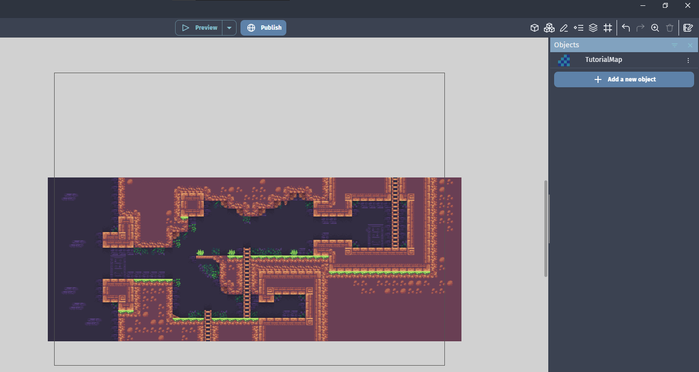
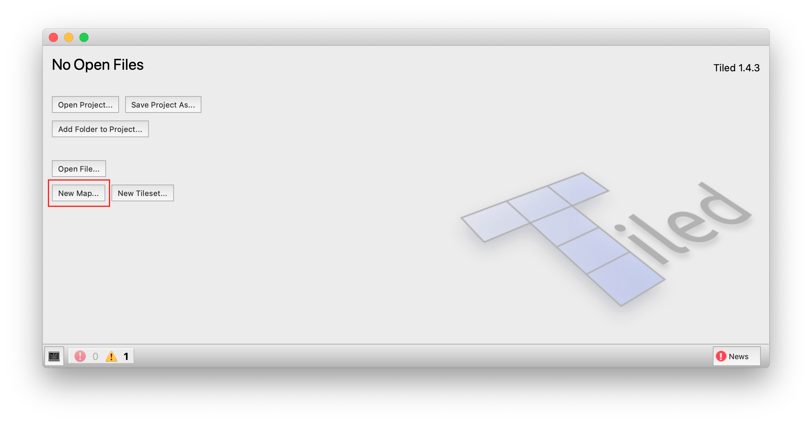
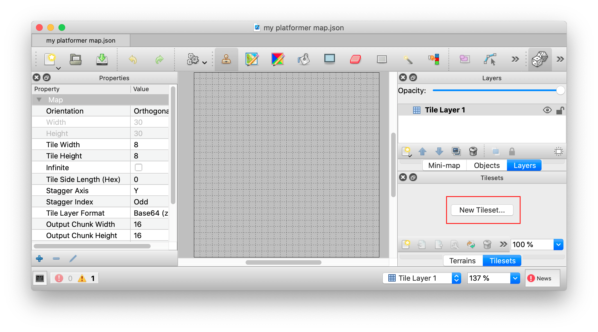
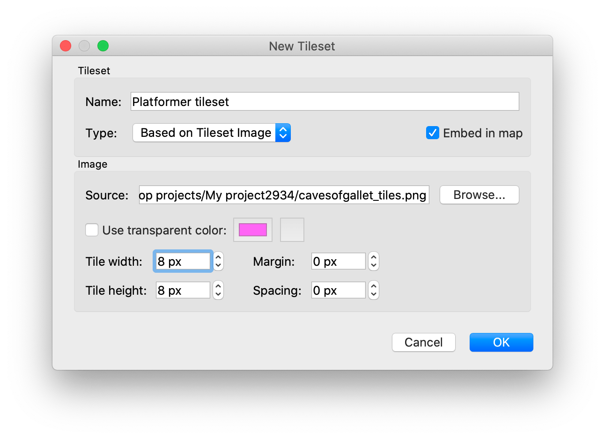
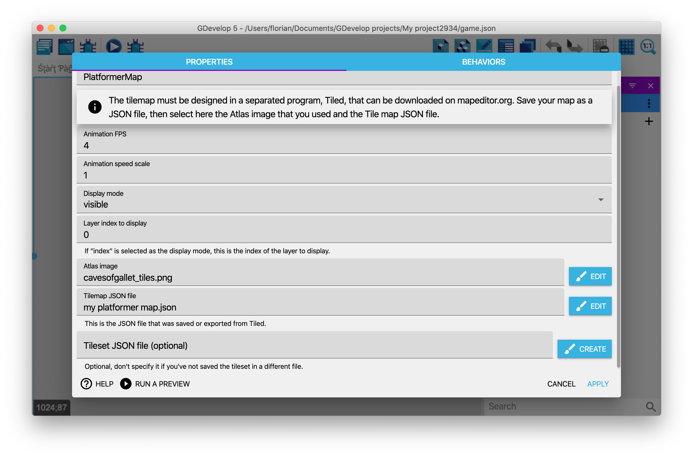
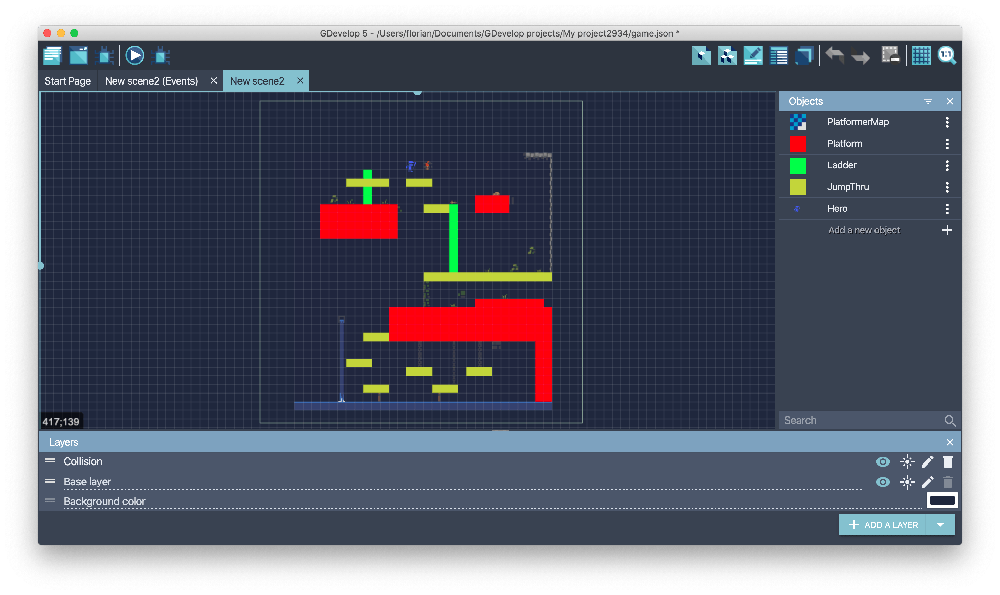
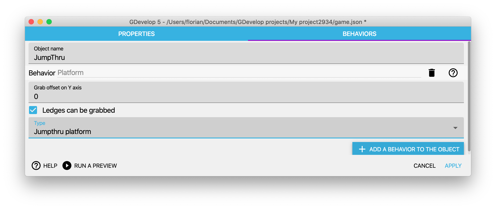
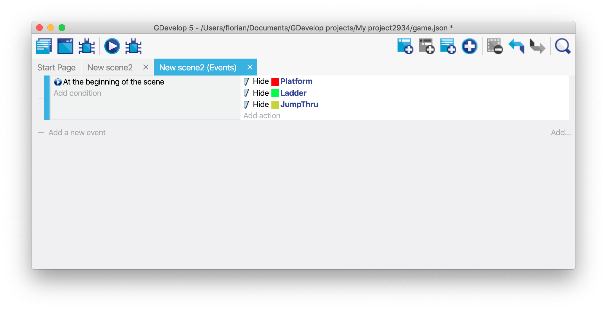
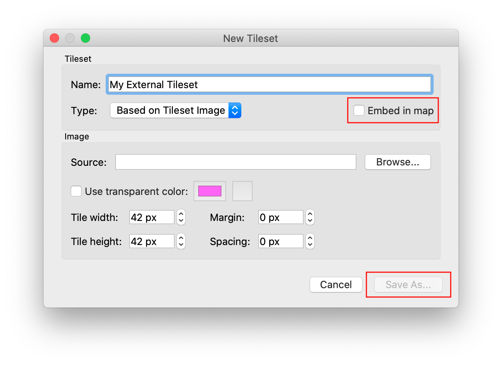
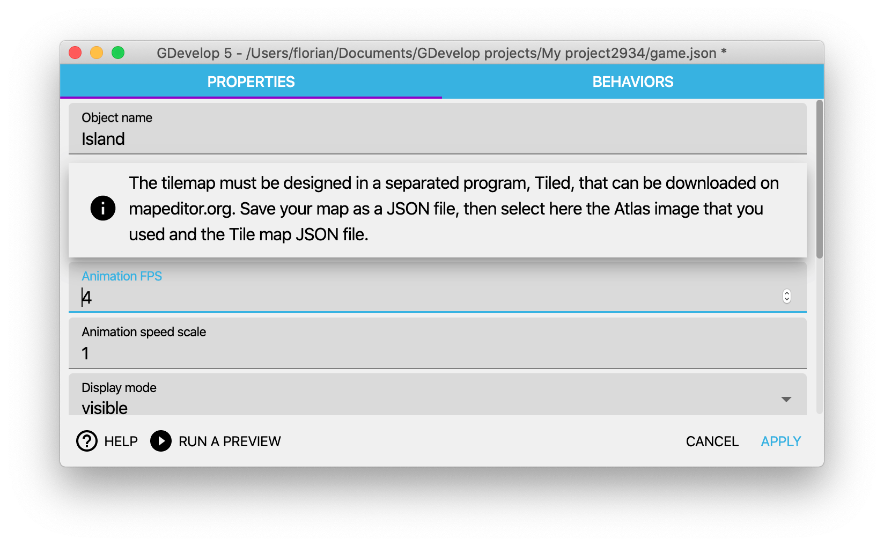

# Tilemap

The Tilemap object can be used to display tile-based objects. It's a good way to create **maps** for RPG, strategy games or create objects by **assembling tiles**, useful for platformer, retro-looking games, etc...

If you want to directly dive into it, 3 examples are using tile maps:

* a platformer with ladders and jumpthrus ([open the project online](https://editor.gdevelop.io/?project=example://platformer-with-tilemap))
* a more advanced platformer ([open the project online](https://editor.gdevelop.io/?project=example://not-a-vania))
* various tile maps ([open the project online](https://editor.gdevelop.io/?project=example://tilemaps-made-with-tiled-editor))

For now, this object is meant for advanced users as it requires Tilemaps to be authored in an **external editor**:  [LDtk (Level Designer Toolkit)](https://ldtk.io/) or [Tiled](https://www.mapeditor.org/).

!!! note

    For now, collisions are supported only with maps exported for Tiled.

## Know limitations

This object is still experimental and will be improved in the future

* An external tool is needed to edit tile maps.
* Maps must be saved as **JSON files** (.json) with Tiled or LDtk.
* Only **orthogonal** tilemaps are supported - **isometric tilemaps** are not for now.
* Tiled Map Maker specific limitations:
    * Maps made in tiled **must** have a fixed size. Tilemaps set to "Infinite" will not function.
    * Only collisions from Tiled are supported - for LDtk you will need to manually create them as separate invisible objects in GDevelop.
    * **Tilemaps made with Tiled Map Maker using more than one tilesets** are not supported. One tileset per Tiled tilemap is supported for now. LDtk tilemaps support multiple tilesets per map, but do not support swapping out Tileset atlases.

!!! tip

    Don't resize your atlas (image file) after you've started making a tilemap in Tiled: GDevelop won't render it, because its texture size and the one that is set in the Tiled file are different. If you need to resize your tileset, **create a new map** in Tiled (where you can copy your existing map).

## LDtk: Create a new tilemap step by step

!!! danger

    Please note that at this time, LDtk maps cannot be imported into Cloud projects or the web-app, as the tileset resources will not upload along with them.

### Create the map file

- Launch LDtk.
- Click **New**.
- Browse to the location to save the map, and give it a title. A new empty map is created.

### Create the tileset

- Click the **Tilesets** button or press **T** on the keyboard. The **Project Tilesets** window will display.
- Click the plus **+** button to add a new tileset. A file browser will popup.
- Navigate to the tileset image file.
- Select the desired image, then click **Open**. The tileset will be displayed.
- Modify the **Tiles layout** section as needed for the respective tile size (e.g. 16x16, 32x32, etc) and any needed spacing.

### Create the tile layer

- Click the **Layers** button or press **L** on the keyboard. The **Project Layers** window will display.
- Click the plus **+** button to add a new layer. A selection menu will display.
    * While there are many layer types, this tutorial will only cover the standard Tiles layer. Entities are not imported at this time, while IntGrid and Auto-Layers are much more advanced and should be learned about at [ldtk.io](https://ldtk.io)
- Click the **Tiles** option.
- Within the **Layer identifier** field, type a name.
- Select the desired tileset from the dropdown list.
- For the **Grid size** field, this should normally be the same size as your tiles, or at least a multiple of it.
- For most use cases, all other settings can be left default.
- When you close the layers window, the various tiles from the tilemap will display on the left, and the tilemap can be painted.

### Export the Tilemap

- Once the map is complete, click the **Project Settings** button, or press **P** on the keyboard.
- Ensure **Use .ldtk extension** is checked.
- Leave all other settings as default.
- Click **Save as**. A file browser will display.
- Browse to somewhere to save the map.
- Name the map file and click **Save**.
    * Note, while the main ldtk project file can be used as a map file in GDevelop, it is safer to save a copy separately so the map can keep revisions, especially if a version control system like Github is being used.

### Importing into GDevelop

- Within the GDevelop Project, add a new object.
- Ensure the **New object from scratch** tab is currently selected.
- Select the **Tilemap** object from the list.
- Within the **Object Name** field, name the map object.
- Within the **LDtk and Tiled: Tilemap** field, click **Choose a file**.
- Select **Choose a file** if using the desktop client, or **File(s) on your device** If using the web app and then **Choose file**, A file browser will display.
- Browse to the .ldtk tilemap file created above.
- Click open. If using the web app, click **Add selected file**.
- All other settings can be left at default.
- Click **Apply**. The tilemap object is now created, and can be dragged to the scene.

## Tiled tutorial: Create a new tilemap step by step

Start by finding or creating your tileset and save it in a PNG file. For this example, we'll use the *Cavernas* public domain tileset that can be [downloaded here](https://adamatomic.itch.io/cavernas). Save the file in your project folder.

Download Tiled on [mapeditor.org](https://www.mapeditor.org/) and launch it. Choose to create a **New map...**:

Choose CSV, Base 64 or Base 64 (zlib compressed) for the tile layer format (Zstandard compressed is not supported). Choose the size of the tilemap and the size of the tiles. Using infinite map mode is not supported:

Choose a file where to save the map, as a JSON file. It's recommended that you save the JSON file in your project folder.

In Tiled, choose then to create a new tileset:

Enter a name, and choose the image file (also called the "Atlas") that you saved in your project folder:

You can choose **Embed in map** so that the tileset data is stored inside the Tilemap JSON file. If you don't, you'll be asked where to save the Tileset JSON file, and you'll need to select this file in GDevelop too when setting up the tilemap. See the section "Choosing between a bundled or external tileset".

Draw your map in Tiled:

Finally, to display the map in GDevelop, choose to create a new **Tilemap** object. Then configure it by choosing your Atlas image (the image containing the tiles) and the **Tilemap JSON file**:

You can then click **Apply** and drag'n'drop the object on the scene if it's not there already:

## Handle collisions

A platformer game often needs different kind of objects like platforms, jumpthru or ladders. One collision mask should be created for each kind. The example in the following screenshots can be opened in the online editor ([open the project](https://editor.gdevelop.io/?project=example://platformer-with-tilemap)).

### Generating tilemap collision masks automatically

!!! warning

    Automatic collision masks were introduced with GDevelop 5.0.139. Jump to **Define a collision mask manually with objects** if you are using an older version.

#### Create a tilemap collision mask object

The **Tilemap collision mask** object type will build collision masks according to data from Tiled JSON files.

#### Configure tilemap collision masks

The configuration is very similar to the tilemap objects. One important difference is the "Class filter" property. It allows to have several collision mask objects for the same tilemap. In the above configuration, only the platforms are kept. This property value must be the same as the one defined in Tiled with the "Class" field.

!!! warning

    Don't forget to add the platform behavior on the object if needed.

#### Define tiles collision mask

As explained in the previous section, collision masks can be split in several parts to handle platforms, ladder etc. In order to do this, the "Class" field must be set on tiles with Tiled.

When the whole tile must be part of the mask, there is no need to define a square on it. GDevelop will create it automatically.

!!! tip

    In case, a tile contains 2 kinds of objects, for instance a platform and some lava, the "Class" field can be set on each shape independently instead of the tile.

### Define a collision mask manually with objects

Objects can be created manually to act as invisible obstacle or platforms. Here is an example when using the platformer behavior:

Create objects with placeholder images (probably just a colored rectangle), then add to them the Platform behavior:

Hide the invisible obstacles/platforms at the start of the scene using events:

You can also put these objects on a separate layer in GDevelop and hide the layer.

## Choose between a bundled or external tileset

Tiled allows to embed the tileset data in the Tilemap JSON file. This is done by default when **Embed in map** is checked when creating a new tileset in Tiled, when editing a map. This is well supported by GDevelop, which will detect that there is a tileset in the Tilemap JSON file and load it.

If your intention is to have **different maps share a tileset**, it is recommended to instead save the tileset as a separate tileset JSON file. That will give you a small optimization, as the tileset is now being parsed only once by GDevelop. It is also more manageable for big projects.

To do so, uncheck "Embed in map" when creating a tileset in Tiled. Choose then **Save As...** and select the file where to store the tileset:

Finally, choose the tileset file in GDevelop, in addition to choosing the atlas image and the tilemap JSON file:

Internally, GDevelop will work as follow:

* If you set a tileset JSON file in the object, this tileset will be used. Note that if at the same time, another tileset is bundled in your Tilemap JSON file, the external tileset JSON file will still be used by the object: the bundled tileset will be ignored.
* If you do not provide a tileset JSON file, the object will look for a tileset inside the Tilemap JSON and load it if present.

## Animate tiles

If you have **animated tiles**, they will need to be arranged in the right order in a single row on the atlas to work.

!!! danger

    Tiled will let you put tile frames from any places of the atlas and repeat some frames - but the GDevelop object will not be able to properly interpret the animation if you do that.

Tiled also lets you put a different duration for each frame - this extension only supports uniform duration for all frames. You can configure how fast the animation is played, but you can't go granular on a per frame basis.

In GDevelop, you can choose the speed of the animation(s) of the Tilemap, which is by default 4 FPS (4 images per second, which means 1000/4 = 250ms between each image):

## Reference

All actions, conditions and expressions are listed in [the tilemap reference page](/gdevelop5/all-features/tilemap/reference/).