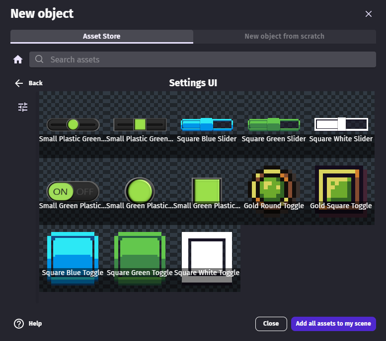
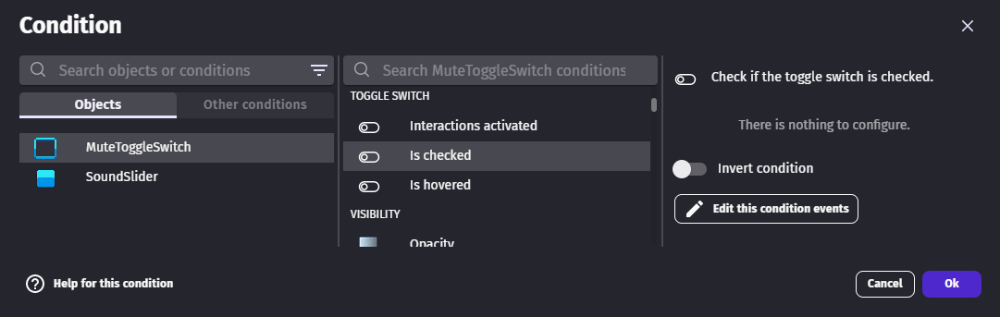

# Toggle Switch

## Learn about UI objects with this video tutorial

### Add a toggle switch to a game

#### Get a toggle switch from asset store

The [Settings UI asset pack](https://gdevelop.io/asset-store/free/settings-ui-settings-ui) from the asset store contains free and read-to-use toggle switches.

!!! tip

    This pack also contains [sliders](/gdevelop5/objects/slider).

#### Create a toggle switch from scratch

Toggle switches need one image for each state: checked or unchecked.

!!! tip

    The states transition can be animated. It works the same way as [Sprites](/gdevelop5/objects/sprite).

### Get toggle switch states

Toggle switch states can be checked with the "Is checked" condition.

Sliders and toggle switches can be useful to make a settings panel. As the settings panel and the game may be in different scene, the value can be stored in a global variable to use it in other game scenes.