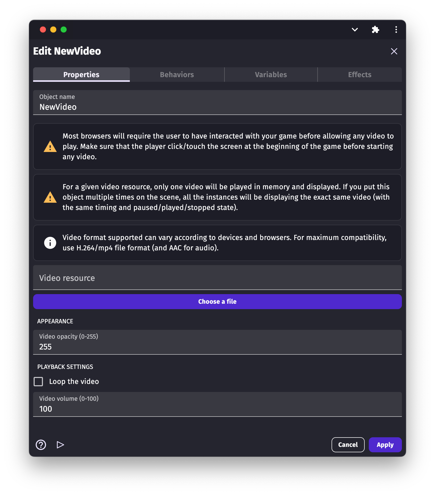

# Video

A video object displays a video on the screen. It's perfect for cut-scenes in a game.
Videos can be controlled using events: timing, state (play/paused), audio volume, etc.

!!! warning

    Video files can be very heavy, even for short videos, making your game take longer to download and launch. Make sure to use good compression and limit the length of the video as much as possible.

!!! warning

    Before a video can be played, you have to ensure that the player interacted first with your game (a simple click/touch on the screen is ok to allow to play videos). If you just add the condition "At the beginning of the scene" nothing will work.

Support for videos can vary according to the device or browser running the game. It's recommended for a broad compatibility that the file is in  **.mp4** format, encoded as:

* **H264** for the video,
* **AAC** for the audio.

## Set up a video

The video object has several objects:

## Choose a video file

Click on the field "Video resource", and then "Choose a new video file". For compatibility with most browsers, follow these pieces of advice for the video format:

!!! warning

        To ensure good compatibility, use the  **.mp4** format encoded as:

      * **H264** for the video,
      * **AAC** for the audio.

You can also choose:

* **Loop the video**: If video is looped when it reaches the end.
* **Opacity** : From 0 (fully transparent) to 255 (opaque - default).
* **Volume** : From 0 (silent) to 100 (maximum volume - default)

!!! note

    All the following conditions and actions refer to the conditions and actions in `Video` category.

## Duration of video

The `Duration` condition tests the length of the video with the value entered depending upon the `Sign of the test` used.

## End of video

To perform an action when the video has reached its end, the `Is ended` condition is used. This condition might be used to switch from the video to gameplay or something similar.

## Time of video

When a video is played during gameplay, there might be instances when the current time of the video has to be checked for actions like enabling 'Skip the video' or popping a 'Save the game' dialog. This can be achieved using the `Current time` test condition.

You can also skip to a time in the video using the `Set time` action. Whenever the condition corresponding to the action is true, the video will skip to time depending upon the time entered and the `Modification's sign`.

## Opacity of video

Opacity is the measure of the transparency of a video. If the `Opacity` condition returns 255 it implies that the video is not transparent at all and if it returns 0, it is fully transparent. The default opacity of a video is 255.

We can set the opacity of a video using the `Set opacity` action. For maximum, you can set it to 255 while for fully transparent, you can set it to 0.

## Playback speed of the video

The playback speed of the video is the ratio of the current speed of the video to the original speed of the video. If the `Playback speed` condition returns a value greater than 1, the video is playing at a rate faster than than the original video. If the condition returns a value less than 1, it is playing at a rate slower than the original video. The default value for playback speed is 1.

To set the playback speed of a video, use the `Set playback speed` action. To play the video at a faster rate than the default rate, set a value greater than 1 and to play it at a slower rate, set playback speed to a value less than 1. For default, set it to 1.

## Looping a video

When a video is looped, it repeats itself from the beginning after reaching the end. To check if a video is looped or not, use the `Is looped` condition. If the video is looped, the corresponding action(s) will be performed.

You can also make a video to loop in GDevelop using the `Loop a video` action and choosing "Yes" for `Activate loop`. By default, a video is not looped.

## Muting a video

When a video is muted, there will be no audio audible from the game. To check if a video is muted, use the `Is muted` condition. If the video is muted, the corresponding action(s) will be performed.

You can mute a video using the `Mute a video` action and choosing "Yes" for `Activate mute`. By default, the video is unmuted.

## Pausing a video

To check if a video is paused, use the `Is paused` condition. If the video is paused, the corresponding action(s) will be performed.

You can pause a video using the `Pause a video` action. By default, the video is paused.

## Playing a video

To see the video, you need to first play the video. To check if the video is playing, use the `Is played` condition. If the video is playing, the corresponding action(s) will be performed.

To start a video or resume the video after pausing it, you can use the `Play a video` action. By default, the video is not playing and needs this action to play.

## Volume of a video

You can also set the volume of a video using GDevelop. To compare the volume of a video, use the `Volume` condition. The maximum volume for a video is 100 and the minimum volume is 0 (muted).

To set the volume of a video, use the `Set volume` condition. You can set it to any number between 0 to 100. The default volume is set to 100.

## Example

## Reference

All actions, conditions and expressions are listed in [the video reference page](/gdevelop5/all-features/video/reference/).