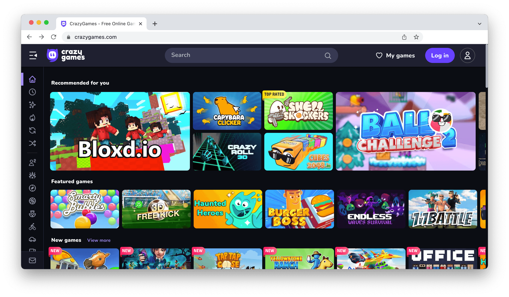

# Publish your GDevelop game on CrazyGames

Games made with GDevelop can be published on [CrazyGames](https://crazygames.com/). With over **[15 million monthly users](https://gdevelop.io/page/crazy-games)**, it's a perfect place to find a great audience. Read more about it on [GDevelop website](https://gdevelop.io/page/crazy-games).

Some games made with GDevelop that have been published on CrazyGames:

  - [Ball Challenge 2](https://gd.games/andre_holtz/ball-challenge-2)

!!! tip

    You're welcome to contribute by adding a step-by-step explanation of the process.
