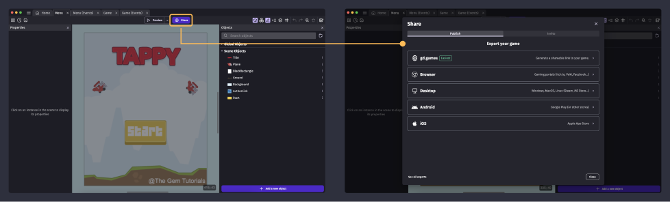

---DD
title: Publishing games
---
# Publishing games

GDevelop allows you to publish your games to any modern platform: desktop, web, and mobile. The game needs to be exported first.

To export the game, click **Share** in the GDevelop interface. You will be presented with multiple options to choose from:

  <iframe src="https://www.youtube.com/embed/p97ah8i-aY4" frameborder="0" allowfullscreen></iframe>

## Publish and share on GDevelop's free service gd.games

**[gd.games](https://gd.games)** is the gaming platform hosted by GDevelop, dedicated to games powered by GDevelop.
It's a great place to publish your game and gather feedback from players or friends. Hosting is free, and you can redirect your audience to the game page.

You can customize the link to your game, activate feedback, and benefit from the GDevelop community of players and creators.

[Click here for more information on publishing your game with gd.games.](/gdevelop5/publishing/web)

## Publish your game

### Publish on stores and other platforms

  * **[Web (for web gaming platforms)](/gdevelop5/publishing/html5_game_in_a_local_folder):** This option allows you to export your game to a folder and upload it manually. This is perfect for sharing your game on [Poki](./poki), [Crazy Games](./crazy-games), Newgrounds, [Game Jolt](/gdevelop5/publishing/publishing-to-gamejolt-store), [Itch.io](/gdevelop5/publishing/publishing-to-itch-io), or other web-based gaming platforms.
  * **[Mobile (iOS, Android...)](/gdevelop5/publishing/android_and_ios):** This prepares your game for Android (iOS support is coming soon). Once ready, you get a link to play it on Android and [publish it to the Play Store](/gdevelop5/publishing/android_and_ios/play-store) (or App Store later for iOS) or on the [Amazon App Store](/gdevelop5/publishing/publishing-to-amazon-app-store).
  * **[Desktop (standalone executable, Steam...)](/gdevelop5/publishing/windows-macos-linux)**: This option bundles your game as a Windows, macOS, or Linux application, perfect for [Steam](/gdevelop5/publishing/publish-to-steam) or other stores.
 * **[Facebook Instant Games (Messenger)](/gdevelop5/publishing/publishing-to-facebook-instant-games):** This prepares your game so that it can be uploaded on Facebook Instant Games and played on Messenger, shared with your friends, and then published worldwide.

### Publish manually

These export options will require some manual work on your part and are intended for advanced users:

 * **[Web](/gdevelop5/publishing/html5_game_in_a_local_folder):** This option is the same as in the prior category.
 * **[Mobile](/gdevelop5/publishing/android_and_ios_with_cordova):** This option exports your game ready to be used as a Cordova project. You can then use Cordova command line tools to build your game for Android and iOS.
 * **[Desktop](/gdevelop5/publishing/windows-macos-linux-with-electron):** This option exports your game ready to be used as an Electron project. You can then use command line tools to build your game for Windows, macOS, or Linux.
