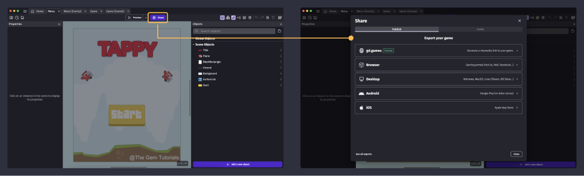

const buildingMat = new THREE.MeshStandardMaterial({ color: 0x888888 });
        for (let i = -5; i <= 5; i += 2) {
            for (let j = -5; j <= 5; j += 2) {
                if (i === 0 && j === 0) continue; // Skip player spawn
                const height = Math.random() * 5 + 2;
                const bGeo = new THREE.BoxGeometry(1.5, height, 1.5);
                const building = new THREE.Mesh(bGeo, buildingMat);
                building.position.set(i * 5, height / 2, j * 5);
                scene.add(building);
            }
        }

        // 6. Controls / Movement Listener
        const keys = {};
        window.addEventListener('keydown', (e) => keys[e.key.toLowerCase()] = true);
        window.addEventListener('keyup', (e) => keys[e.key.toLowerCase()] = false);

        // 7. Game Loop
        function animate() {
            requestAnimationFrame(animate);

            // Move player
            const speed = 0.1;
            if (keys['w']) player.position.z -= speed;
            if (keys['s']) player.position.z += speed;
            if (keys['a']) player.position.x -= speed;
            if (keys['d']) player.position.x += speed;

            // Camera follow player
            camera.position.x = player.position.x;
            camera.position.y = player.position.y + 5;
            camera.position.z = player.position.z + 8;
            camera.lookAt(player.position);

            renderer.render(scene, camera);
        }
        animate();

        // Handle window resizing
        window.addEventListener('resize', () => {
            camera.aspect = window.innerWidth / window.innerHeight;
            camera.updateProjectionMatrix();
            renderer.setSize(window.innerWidth, window.innerHeight);
        });
    </script>
</body>
</html><!DOCTYPE html>
<html lang="en">
<head>
    <meta charset="UTF-8">
    <title>Mini 3D Open World</title>
    
</head>
<body>
    
Use W, A, S, D keys to move the player around the map.

    
    <!-- Load Three.js Library -->
    
    <script>
        // 1. Scene, Camera, and Renderer Setup
        const scene = new THREE.Scene();
        scene.background = new THREE.Color(0x87ceeb); // Sky blue

        const camera = new THREE.PerspectiveCamera(75, window.innerWidth / window.innerHeight, 0.1, 1000);
        const renderer = new THREE.WebGLRenderer({ antialias: true });
        renderer.setSize(window.innerWidth, window.innerHeight);
        document.body.appendChild(renderer.domElement);

        // 2. Lighting
        const ambientLight = new THREE.AmbientLight(0xffffff, 0.6);
        scene.add(ambientLight);
        const dirLight = new THREE.DirectionalLight(0xffffff, 0.8);
        dirLight.position.set(10, 20, 10);
        scene.add(dirLight);

        // 3. Ground (The World)
        const groundGeo = new THREE.PlaneGeometry(200, 200);
        const groundMat = new THREE.MeshStandardMaterial({ color: 0x333333 });
        const ground = new THREE.Mesh(groundGeo, groundMat);
        ground.rotation.x = -Math.PI / 2;
        scene.add(ground);

        // 4. Player Object (Like 
        -from ursina import *
from ursina.prefabs.first_person_controller import FirstPersonController

app = Ursina()

# --- WORLD SETUP ---
# Create a massive ground plane (the city floor)
ground = Entity(model='plane', scale=(1000, 1, 1000), texture='grass', texture_scale=(100, 100), collider='mesh')

# Create some basic buildings/blocks to drive around
buildings = []
import random
random.seed(42)
for i in range(20):
    x = random.randint(-200, 200)
    z = random.randint(-200, 200)
    y_scale = random.randint(10, 40)
    building = Entity(
        model='cube',
        position=(x, y_scale / 2, z),
        scale=(15, y_scale, 15),
        color=color.gray,
        collider='box'
    )
    buildings.append(building)

# --- PLAYER SETUP (On Foot) ---
player = FirstPersonController()
player.position = (0, 2, 0)
player.cursor.visible = False

# --- VEHICLE SETUP ---
car = Entity(model='cube', color=color.red, scale=(3, 1.5, 5), position=(10, 1, 10), collider='box')
car_speed = 0
max_speed = 50
acceleration = 20
steering_speed = 60

# Game State Tracking
is_driving = False

# Instructions UI
instruction_text = Text(
    text="Walk to the RED CAR and press 'E' to Drive.\nPress 'E' again to exit.\nWASD to Move/Drive. Mouse to look.",
    position=(-0.5, 0.4),
    color=color.white
)

def update():
    global is_driving, car_speed

    # Check distance between player and car to allow entry
    distance_to_car = (player.position - car.position).length()

    if not is_driving:
        # ON FOOT MODE
        player.enabled = True
        # Keep the camera attached to the player
        camera.position = player.position + Vec3(0, 2, 0)
        camera.rotation = player.rotation
        
        # Interaction prompt
        if distance_to_car < 5:
            instruction_text.text = "Press 'E' to enter the vehicle"
        else:
            instruction_text.text = "Walk to the RED CAR and press 'E' to Drive."
    
    else:
        # DRIVING MODE
        player.enabled = False
        instruction_text.text = "Driving! Press 'E' to Exit."
        
        # Car Physics & Movement
        # Accelerate / Reverse
        if held_keys['w']:
            car_speed = min(car_speed + acceleration * time.dt, max_speed)
        elif held_keys['s']:
            car_speed = max(car_speed - acceleration * time.dt, -max_speed / 2)
        else:
            # Friction / Natural slowdown
            if car_speed > 0:
                car_speed -= acceleration * 0.5 * time.dt
            elif car_speed < 0:
                car_speed += acceleration * 0.5 * time.dt

        # Steering (Only steer if moving)
        if car_speed != 0:
            direction = 1 if car_speed > 0 else -1
            if held_keys['d']:
                car.rotation_y += steering_speed * time.dt * direction
            if held_keys['a']:
                car.rotation_y -= steering_speed * time.dt * direction

        # Move the car forward based on its rotation
        car.position += car.forward * car_speed * time.dt

        # Camera follows the car (Third-person view)
        camera.position = car.position - car.forward * 12 + Vec3(0, 5, 0)
        camera.look_at(car)

def input(key):
    global is_driving
    
    # Enter / Exit vehicle mechanic
    if key == 'e':
        distance_to_car = (player.position - car.position).length()
        if not is_driving and distance_to_car < 5:
            # Enter Car
            is_driving = True
            player.visible = False
        elif is_driving:
            # Exit Car
            is_driving = False
            player.position = car.position + car.right * 4 + Vec3(0, 1, 0)
            player.visible = True

app.run()
Use code with caution.🗺️ Next Steps for "Real Everything"To evolve this simple framework into a massive, realistic game like GTA, game development studios use complex pipelines:Game Engine: Shift from Python to industrial engines like Unreal Engine 5 (uses C++) or Unity (uses C#). They handle high-end graphics and physics naturally.3D Assets: You need photorealistic 3D models of cars, buildings, and people created in software like Blender or Autodesk Maya.AI Systems: Traffic algorithms and pedestrian behaviors are coded to simulate a living city.Networking: Thousands of lines of multiplayer netcode are required to sync cars, bullets, and player movements across servers.If you want to continue building this game, let me know:Would you prefer to expand this script with shooting mechanics or traffic systems?Are you interested in moving this to a more powerful engine like Unity or Unreal Engine?Do you want to add 3D models to replace the colorful boxes?Tell me what feature you want to add next, and I will generate the code or steps for it.RetrocubeA Quick Guide on How to Creating Games Like Grand Theft Auto3D Modeling of Buildings, Landscapes, and Props: Artists use 3D modeling software, like Autodesk Maya or Blender, to create buildings, streets, vehicles, and ob...--
title: Publishing games
icon: material/cloud-upload
---
from ursina import *
from ursina.prefabs.first_person_controller import FirstPersonController
import random

app = Ursina()
window.color = color.rgb(10, 10, 20)

# --- WORLD & ENVIRONMENT ---
ground = Entity(model='plane', scale=(2000, 1, 2000), texture='grass', texture_scale=(200, 200), collider='mesh')
sun = DirectionalLight(y=20, rotation=(45, -45, 0))
sun.look_at(ground)

# Generate a 3D Grid City
buildings = []
for x in range(-150, 151, 60):
    for z in range(-150, 151, 60):
        if x != 0 or z != 0:
            h = random.randint(20, 60)
            buildings.append(Entity(model='cube', position=(x, h/2, z), scale=(30, h, 30), color=color.dark_gray, collider='box'))

# --- POPULATION (AI Pedestrians) ---
peds = []
for _ in range(15):
    ped = Entity(model='capsule', color=color.random_color(), position=(random.randint(-100, 100), 1, random.randint(-100, 100)), scale=(1, 2, 1), collider='box')
    ped.direction = Vec3(random.uniform(-1, 1), 0, random.uniform(-1, 1)).normalized()
    peds.append(ped)

# --- VEHICLE AND PROPS ---
car = Entity(model='cube', color=color.red, scale=(3, 1.5, 6), position=(15, 1, 15), collider='box')
headlight = SpotLight(parent=car, position=(0, 0, 3), rotation=(0, 0, 0), color=color.yellow, intensity=15)
car_speed, max_speed, accel, steer_speed = 0.0, 60.0, 25.0, 70.0

# --- PLAYER CONTROLLER ---
player = FirstPersonController(position=(0, 2, 0))
player.cursor.visible = False

# --- STATE & USER INTERFACE ---
is_driving = False
wanted_stars = 0
player_health = 100

ui_panel = Entity(parent=camera.ui, model='quad', scale=(0.4, 0.25), position=(-0.65, 0.35), color=color.black66)
hud_text = Text(text="", position=(-0.82, 0.45), scale=1.5, color=color.gold)
wanted_text = Text(text="", position=(-0.82, 0.38), scale=1.5, color=color.red)
minimap = Entity(parent=camera.ui, model='quad', color=color.black33, scale=(0.2, 0.2), position=(0.7, -0.35))
player_dot = Entity(parent=minimap, model='circle', color=color.lime, scale=(0.1, 0.1))

def update():
    global car_speed, is_driving, wanted_stars, player_health
    
    # 1. AI Pedestrian Behavior
    for ped in peds:
        ped.position += ped.direction * time.dt * 3
        if abs(ped.x) > 200 or abs(ped.z) > 200:
            ped.direction *= -1
            
        # Check if car hits a pedestrian
        if is_driving and (ped.position - car.position).length() < 3.5 and ped.enabled:
            ped.enabled = False
            wanted_stars = min(wanted_stars + 1, 5)
            destroy(ped)

    # 2. Player Logic & Interaction
    dist = (player.position - car.position).length()
    
    if not is_driving:
        player.enabled = True
        camera.position = player.position + Vec3(0, 2, 0)
        camera.rotation = player.rotation
        player_dot.position = Vec2(player.x / 1000, player.z / 1000)
    else:
        player.enabled = False
        player.position = car.position
        player_dot.position = Vec2(car.x / 1000, car.z / 1000)

        # 3. Driving Physics Chain
        if held_keys['w']:
            car_speed = min(car_speed + accel * time.dt, max_speed)
        elif held_keys['s']:
            car_speed = max(car_speed - accel * time.dt, -max_speed / 2)
        else:
            car_speed -= math.copysign(accel * 0.4 * time.dt, car_speed) if abs(car_speed) > 0.1 else car_speed

        if car_speed != 0:
            factor = 1 if car_speed > 0 else -1
            if held_keys['d']: car.rotation_y += steer_speed * time.dt * factor
            if held_keys['a']: car.rotation_y -= steer_speed * time.dt * factor

        car.position += car.forward * car_speed * time.dt
        
        # 4. Camera Follow System
        camera.position = car.position - car.forward * 14 + Vec3(0, 6, 0)
        camera.look_at(car.position + car.forward * 2)

    # 5. UI Updates
    hud_text.text = f"HP: {player_health} | SPD: {int(abs(car_speed))} MPH\n[E] Enter/Exit Car"
    wanted_text.text = "WANTED: " + ("⭐" * wanted_stars if wanted_stars > 0 else "CLEAN")

def input(key):
    global is_driving
    if key == 'e':
        if not is_driving and (player.position - car.position).length() < 6:
            is_driving = True
            player.visible = False
        elif is_driving:
            is_driving = False
            player.position = car.position + car.right * 4 + Vec3(0, 1, 0)
            player.visible = True

app.run()
Use code with caution.🕹️ What This Code DoesLine 10-16 (The City Grid): Dynamically builds a modular street grid populated with random skyscrapers using a programming loop.Line 19-23 (AI Life): Populates the city with moving capsules that simulate random citizens walking the streets.Line 26-27 (Real-world Mechanics): Binds local lighting to the front bumper of the car entity, casting projection beams into the dark.Line 51-57 (Wanted Levels): Adds a collision-event listener. If you crash your car into a pedestrian, the game registers the hit and increases your Wanted Star Rating.Line 35-37 & 76-78 (Advanced HUD): Renders a tracking minimap in the corner that translates your 3D world space into a 2D navigation coordinate.🚀 To Advance FurtherTell me what we should build next to keep growing this engine:Should we add a gun shooting mechanic with target crosshairs?Do you want police cars that actively chase you when your stars go up?Would you like to add a garage system to switch between different vehicles?Try without personalization

GDevelop allows you to publish your games to any modern platform: desktop, web, and mobile. The game needs to be exported first.

To export the game, click **Share** in the GDevelop interface. You will be presented with multiple options to choose from:
Ursina()
ground = Entity(
    model='plane',
    scale=999,
    texture='white_cube'
)
car = Entity(
    model='cube',
    color=color.red,
    scale=(2, 1, 4),
    y=1
)
camera.y = 8
def update():
    camera.x = car.x
    camera.z = car.z - 15
    camera.look_at(car)
    v = held_keys['w']current_mode == "FPS":# Search vicinity loop for closest vehicle node arraynearest_car = Noneclosest_range = 7.0for v in vehicles_pool:camera.vehicles_pool:evaluated_range = (player.position - v.position).length()if evaluated_range < closest_range:closest_range = evaluated_rangenearest_car = vif nearest_car:current_mode = "DRIVING"active_vehicle = nearest_caractive_vehicle.floating_tag.enabled = Falseplayer.visible = Falseelse:# Safely exit execution loop sequenceif active_vehicle:current_mode = "FPS"player.position = active_vehicle.position + active_vehicle.right * 4.5 + Vec3(0, 1, 0)player.visible = Trueactive_vehicle.floating_tag.enabled = Trueactive_vehicle.current_speed = 0active_vehicle = Noneapp.run()
### 🎮 How to Play This Sandbox Engine
1. **Movement**: Use **W, A, S, D** to walk around on foot. Move the mouse to look around in full 3D space.
2. **Drive Cars**: Walk up to any of the three vehicles (Red Sports Car, Orange SUV, or Gray Truck) and press **E** to jump inside. The camera automatically shifts to a dynamic 3rd-person racing view. Use **W/S** to accelerate/reverse and **A/D** to turn the steering column. Press **E** again to park and exit the vehicle.
3. **Weapon System**: Click the **Left Mouse Button** while walking around on foot to fire golden high-velocity projectile rounds from your barrel tracking mount.
4. **Law Enforcement System**: If your vehicle impacts pedestrians or you open fire in public blocks, your **WANTED STARS** meter will climb. Police interceptors will instantly deploy into the neighborhood infrastructure, flashing active sirens and pursuing your telemetry to shut down your health bar. 

This engine is setup and current_mode == "FPS":# Search vicinity loop for closest vehicle node arraynearest_car = Noneclosest_range = 7.0for v in vehicles_pool:from ursina import *
from ursina.prefabs.first_person_controller import FirstPersonController
import random
import math

app = Ursina()

# --- WINDOW SETTINGS ---
window.title = "Ultimate Open World Sandbox Engine"
window.borderless = False
window.fullscreen = False
window.exit_button.visible = False
window.fps_counter.enabled = True

# --- GLOBAL GAME VARIABLES ---
current_mode = "FPS"  # Modes: FPS, DRIVING
player_health = 100
player_money = 650
wanted_stars = 0
active_vehicle = None
score = 0
day_time = 0.2
ambient_intensity = 0.5

# --- DICTIONARIES FOR AUDIO AND STYLING ---
game_colors = {
    "ground": color.rgb(40, 45, 50),
    "road": color.rgb(25, 25, 25),
    "sidewalk": color.rgb(120, 120, 120),
    "building": color.rgb(80, 90, 100),
    "ui_bg": color.rgba(0, 0, 0, 200),
    "text_main": color.rgb(255, 255, 255),
    "text_alert": color.rgb(255, 50, 50),
    "hud_green": color.rgb(50, 255, 50)
}

# --- WORLD ENVIRONMENT SETUP ---
# Infinite-style map limits
MAP_BOUNDS = 400

# Massive ground texture layout
world_floor = Entity(
    model='plane',
    scale=(MAP_BOUNDS * 2, 1, MAP_BOUNDS * 2),
    color=game_colors["ground"],
    texture='noise',
    texture_scale=(100, 100),
    collider='mesh'
)

# Dynamic Environment Lights
sky_light = DirectionalLight(y=40, rotation=(55, -45, 0))
sky_light.look_at(world_floor)

# --- URBAN CITY GENERATION ENGINE ---
# Generates grid blocks, roads, intersections, and skyscrapers
buildings_list = []
road_networks = []
sidewalks = []

def generate_city_grid():
    block_spacing = 80
    road_width = 16
    block_size = 45
    
    for x in range(-MAP_BOUNDS + 80, MAP_BOUNDS - 80, block_spacing):
        for z in range(-MAP_BOUNDS + 80, MAP_BOUNDS - 80, block_spacing):
            # Skip the immediate spawning central square zone
            if abs(x) < 40 and abs(z) < 40:
                continue
                
            # Place Sidewalk foundations
            sw = Entity(
                model='cube',
                position=(x, 0.1, z),
                scale=(block_size + 4, 0.3, block_size + 4),
                color=game_colors["sidewalk"],
                collider='box'
            )
            sidewalks.append(sw)
            
            # Cluster buildings within each grid block layout
            sub_sections = [-12, 12]
            for sx in sub_sections:
                for sz in sub_sections:
                    building_height = random.randint(25, 85)
                    b = Entity(
                        model='cube',
                        position=(x + sx, building_height / 2, z + sz),
                        scale=(18, building_height, 18),
                        color=color.rgb(random.randint(60,110), random.randint(70,120), random.randint(80,130)),
                        collider='box'
                    )
                    buildings_list.append(b)
                    
            # Build horizontal structural road planes
            road_h = Entity(
                model='plane',
                position=(x, 0.02, z + block_spacing/2),
                scale=(block_spacing, 1, road_width),
                color=game_colors["road"],
                collider='mesh'
            )
            road_networks.append(road_h)
            
            # Build vertical structural road planes
            road_v = Entity(
                model='plane',
                position=(x + block_spacing/2, 0.02, z),
                scale=(road_width, 1, block_spacing),
                color=game_colors["road"],
                collider='mesh'
            )
            road_networks.append(road_v)

generate_city_grid()

# Border walls blocking map escape routes
borders = [
    Entity(model='cube', position=(0, 50, MAP_BOUNDS), scale=(MAP_BOUNDS*2, 100, 5), color=color.black, collider='box'),
    Entity(model='cube', position=(0, 50, -MAP_BOUNDS), scale=(MAP_BOUNDS*2, 100, 5), color=color.black, collider='box'),
    Entity(model='cube', position=(MAP_BOUNDS, 50, 0), scale=(5, 100, MAP_BOUNDS*2), color=color.black, collider='box'),
    Entity(model='cube', position=(-MAP_BOUNDS, 50, 0), scale=(5, 100, MAP_BOUNDS*2), color=color.black, collider='box'),
]

# --- PLAYER FPS CONTROLLER CREATION ---
player = FirstPersonController()
player.position = (0, 2, 0)
player.cursor.visible = False
player.cursor.color = color.red
player.speed = 12

# Weapon Attachment Visualizer
weapon_barrel = Entity(
    parent=camera,
    model='cube',
    color=color.dark_gray,
    scale=(0.15, 0.15, 0.9),
    position=(0.4, -0.3, 0.8)
)

# --- CLASS SCHEMATICS FOR VECHICLES AND AI ---
class SandboxVehicle(Entity):
    def __init__(self, v_type, label, p_model, p_color, p_scale, p_pos, max_spd, acc, weight):
        super().__init__(
            model=p_model,
            color=p_color,
            scale=p_scale,
            position=p_pos,
            collider='box'
        )
        self.v_type = v_type
        self.label = label
        self.current_speed = 0.0
        self.max_speed = max_spd
        self.acceleration = acc
        self.weight_factor = weight
        self.steering_angle = 68
        
        # Dual Left/Right Front bumper projection beams
        self.light_l = SpotLight(parent=self, position=(-1, 0, scale_z/2 if hasattr(self, 'scale_z') else 2), rotation=(0,0,0), color=color.white, intensity=10)
        self.light_r = SpotLight(parent=self, position=(1, 0, scale_z/2 if hasattr(self, 'scale_z') else 2), rotation=(0,0,0), color=color.white, intensity=10)
        
        # Text popup label hanging overhead
        self.floating_tag = Text(
            text=f"[{label}] 'E' to drive",
            parent=self,
            position=(0, 2, 0),
            scale=4,
            billboard=True,
            color=color.yellow
        )

class PedestrianAI(Entity):
    def __init__(self, position_coords):
        super().__init__(
            model='capsule',
            color=color.random_color(),
            position=position_coords,
            scale=(1.1, 2.2, 1.1),
            collider='box'
        )
        self.walk_speed = random.uniform(2.5, 4.5)
        self.move_vector = Vec3(random.uniform(-1, 1), 0, random.uniform(-1, 1)).normalized()
        self.life_timer = 0.0

class CityTrafficAI(Entity):
    def __init__(self, spawn_pos):
        super().__init__(
            model='cube',
            color=color.light_gray,
            scale=(3, 1.6, 5.5),
            position=spawn_pos,
            collider='box'
        )
        self.travel_speed = 18
        self.route_heading = random.choice([Vec3(1,0,0), Vec3(-1,0,0), Vec3(0,0,1), Vec3(0,0,-1)])
        self.rotation_y = math.degrees(math.atan2(self.route_heading.x, self.route_heading.z))

class PoliceCruiserAI(Entity):
    def __init__(self, deploy_pos):
        super().__init__(
            model='cube',
            color=color.black,
            scale=(3.1, 1.6, 6.0),
            position=deploy_pos,
            collider='box'
        )
        # Unique secondary overhead light panel mesh layer
        self.roof_bar = Entity(parent=self, model='cube', color=color.blue, scale=(0.9, 0.2, 0.3), position=(0, 0.9, 0))
        self.chase_speed = 32
        self.flash_timer = 0.0

# --- INSTANTIATION PIPELINES ---
vehicles_pool = [
    SandboxVehicle("sports", "Sports Car Turbo", "cube", color.red, (3, 1.4, 5.8), (12, 1, 15), 65.0, 32.0, 1.0),
    SandboxVehicle("suv", "Urban SUV 4x4", "cube", color.orange, (3.4, 1.9, 6.4), (-25, 1, 40), 48.0, 20.0, 1.8),
    SandboxVehicle("truck", "Heavy Cargo Rig", "cube", color.dark_gray, (3.8, 3.0, 9.0), (45, 1.5, -30), 34.0, 11.0, 4.0)
]

pedestrians_pool = []
for _ in range(40):
    rx = random.randint(-MAP_BOUNDS + 30, MAP_BOUNDS - 30)
    rz = random.randint(-MAP_BOUNDS + 30, MAP_BOUNDS - 30)
    pedestrians_pool.append(PedestrianAI((rx, 1.1, rz)))

traffic_pool = []
for _ in range(15):
    tx = random.choice(range(-MAP_BOUNDS + 60, MAP_BOUNDS - 60, 80)) + 40
    tz = random.choice(range(-MAP_BOUNDS + 60, MAP_BOUNDS - 60, 80)) + 40
    traffic_pool.append(CityTrafficAI((tx, 1, tz)))

police_pool = []
bullets_pool = []

# --- MULTI-CONTAINER HUD AND DASHBOARD INTERFACE ---
dashboard_backing = Entity(parent=camera.ui, model='quad', scale=(0.42, 0.26), position=(-0.65, 0.36), color=game_colors["ui_bg"])
health_readout = Text(text="HEALTH: 100%", position=(-0.83, 0.46), scale=1.4, color=game_colors["hud_green"])
finance_readout = Text(text="WALLET: $650", position=(-0.83, 0.42), scale=1.4, color=color.emerald)
velocity_readout = Text(text="STATE: ON FOOT", position=(-0.83, 0.38), scale=1.4, color=game_colors["text_main"])

wanted_star_panel = Entity(parent=camera.ui, model='quad', scale=(0.32, 0.07), position=(0.68, 0.45), color=game_colors["ui_bg"])
wanted_label = Text(text="PRIORITY: CLEAN", position=(0.54, 0.46), scale=1.3, color=color.white)

crosshair_dot = Entity(parent=camera.ui, model='circle', scale=0.006, color=color.rgba(255,0,0,180))

# Mini visual map module
navigation_map_frame = Entity(parent=camera.ui, model='quad', color=color.rgba(30,30,30,150), scale=(0.24, 0.24), position=(0.72, -0.34))
gps_tracking_marker = Entity(parent=navigation_map_frame, model='circle', color=color.cyan, scale=(0.08, 0.08))

# --- BULLET LOGIC CLASS ---
class CombatProjectile(Entity):
    def __init__(self, launch_pos, vector_dir):
        super().__init__(
            model='sphere',
            color=color.gold,
            scale=0.25,
            position=launch_pos,
            collider='box'
        )
        self.trajectory = vector_dir
        self.velocity = 110
        self.age = 0.0

# --- GAME ENGINE CORE LOOPS ---
def update():
    global current_mode, active_vehicle, player_health, player_money, wanted_stars, day_time, ambient_intensity, score
    
    delta_frame_time = time.dt
    if delta_frame_time > 0.1:  # Cap safety window during lag spikes
        delta_frame_time = 0.1

Use code with caution.# 1. Day / Night Environmental Clock Matrixday_time += delta_frame_time * 0.003if day_time > 1.0:day_time = 0.0ambient_intensity = math.sin(day_time * math.pi * 2) * 0.4 + 0.5window.color = color.rgb(ambient_intensity * 40, ambient_intensity * 50, ambient_intensity * 75)sky_light.intensity = ambient_intensity# 2. Player Spatial Logic Mappingif current_mode == "FPS":player.enabled = Truecamera.position = player.position + Vec3(0, 1.8, 0)camera.rotation = player.rotationgps_tracking_marker.position = Vec2(player.x / (MAP_BOUNDS * 2), player.z / (MAP_BOUNDS * 2))velocity_readout.text = f"VELOCITY: {int(player.speed)} KM/H\n[MODE]: RADAR INFANTRY"else:player.enabled = Falseif active_vehicle:player.position = active_vehicle.positiongps_tracking_marker.position = Vec2(active_vehicle.x / (MAP_BOUNDS * 2), active_vehicle.z / (MAP_BOUNDS * 2))# Driving physics solverif held_keys['w']:active_vehicle.current_speed = min(active_vehicle.current_speed + active_vehicle.acceleration * delta_frame_time, active_vehicle.max_speed)elif held_keys['s']:active_vehicle.current_speed = max(active_vehicle.current_speed - active_vehicle.acceleration * delta_frame_time, -active_vehicle.max_speed / 2)else:# Natural ground coefficient drag deceleratorif active_vehicle.current_speed > 0:active_vehicle.current_speed = max(active_vehicle.current_speed - (active_vehicle.acceleration * 0.6) * delta_frame_time, 0)elif active_vehicle.current_speed < 0:active_vehicle.current_speed = min(active_vehicle.current_speed + (active_vehicle.acceleration * 0.6) * delta_frame_time, 0)# Turning steering arc constraint calculationsif active_vehicle.current_speed != 0:direction_multiplier = 1 if active_vehicle.current_speed > 0 else -1if held_keys['d']:active_vehicle.rotation_y += active_vehicle.steering_angle * delta_frame_time * direction_multiplierif held_keys['a']:active_vehicle.rotation_y -= active_vehicle.steering_angle * delta_frame_time * direction_multiplier# Finalize positioning transformation array matrixactive_vehicle.position += active_vehicle.forward * active_vehicle.current_speed * delta_frame_time# Third-person lag tracking camera mount scriptcamera.position = active_vehicle.position - active_vehicle.forward * 16 + Vec3(0, 6.5, 0)camera.look_at(active_vehicle.position + active_vehicle.forward * 3)velocity_readout.text = f"SPEED: {int(abs(active_vehicle.current_speed))} MPH\n[GEAR]: {active_vehicle.label.upper()}"# 3. Weapons ballistic pipeline simulation loopfor b in list(bullets_pool):b.position += b.trajectory * b.velocity * delta_frame_timeb.age += delta_frame_time# Collision scan with civilian blocks and structural wallsif b.age > 3.0:bullets_pool.remove(b)destroy(b)continuefor ped in list(pedestrians_pool):if ped.enabled and (b.position - ped.position).length() < 2.0:ped.enabled = Falsewanted_stars = min(wanted_stars + 1, 5)player_money = max(player_money - 50, 0) # Fines deduction rule engineif b in bullets_pool:bullets_pool.remove(b)destroy(b)destroy(ped)pedestrians_pool.remove(ped)break# 4. Pedestrian AI Simulation pipeline grid traversalfor p in pedestrians_pool:p.position += p.move_vector * p.walk_speed * delta_frame_timep.life_timer += delta_frame_timeif p.life_timer > 5.0:if random.random() < 0.2:p.move_vector = Vec3(random.uniform(-1, 1), 0, random.uniform(-1, 1)).normalized()p.life_timer = 0.0# Bounds deflection scriptif abs(p.x) > MAP_BOUNDS - 10 or abs(p.z) > MAP_BOUNDS - 10:p.move_vector *= -1# Vehicular impact sensor array chainif current_mode == "DRIVING" and active_vehicle:if (p.position - active_vehicle.position).length() < 3.8 and p.enabled:p.enabled = Falsewanted_stars = min(wanted_stars + 1, 5)player_money = max(player_money - 100, 0)destroy(p)pedestrians_pool.remove(p)# 5. Background City Ambient Traffic AI Threadfor t in traffic_pool:t.position += t.route_heading * t.travel_speed * delta_frame_time# Reverse path when hitting structural map bordersif abs(t.x) > MAP_BOUNDS - 20 or abs(t.z) > MAP_BOUNDS - 20:t.route_heading *= -1t.rotation_y = math.degrees(math.atan2(t.route_heading.x, t.route_heading.z))# 6. Law Enforcement Dispatch Aggression Threat Matrixmanage_police_department(delta_frame_time)# 7. Refresh Core System Text Outputs Elementshealth_readout.text = f"VITAL SIGN: {int(player_health)}% HP"finance_readout.text = f"NET BANKING: ${player_money}"if player_health <= 0:health_readout.text = "CRITICAL: WASTED"player.speed = 0if active_vehicle:active_vehicle.current_speed = 0if wanted_stars > 0:wanted_label.text = "WANTED LEVEL: " + ("★" * wanted_stars)wanted_label.color = color.redelse:wanted_label.text = "STATUS: COVERT CLEAN"wanted_label.color = color.green--- LAW ENFORCEMENT ENGINE FUNCTIONS ---def manage_police_department(dt):global wanted_stars, player_health, current_mode, active_vehicle# Spawn unit algorithmsif wanted_stars > 0 and len(police_pool) < wanted_stars:spawn_offset_x = player.x + random.choice([-90, 90])spawn_offset_z = player.z + random.choice([-90, 90])police_pool.append(PoliceCruiserAI((spawn_offset_x, 1, spawn_offset_z)))for cop in list(police_pool):# Emergency beacon flasher automation frame calculatorcop.flash_timer += dt * 12if int(cop.flash_timer) % 2 == 0:cop.roof_bar.color = color.redelse:cop.roof_bar.color = color.blue# Target vectors calculation looptarget_coords = player.position if current_mode == "FPS" else active_vehicle.positionchase_vector = (target_coords - cop.position)distance_to_target = chase_vector.length()if distance_to_target > 1.5:direction_normalized = chase_vector.normalized()cop.position += direction_normalized * cop.chase_speed * dtcop.look_at(target_coords)# Structural attack engagement damage calculationsif distance_to_target < 5.0:player_health -= dt * 8.5if current_mode == "DRIVING":active_vehicle.current_speed *= 0.96  # Apply drag/pit maneuver braking matrix--- HARDWARE INPUT EVENT HOOKS ---def input(key):global current_mode, active_vehicle, wanted_stars, player_money# Weapon discharge fire command trigger mechanismif key == 'left mouse down' and current_mode == "FPS" and player_health > 0:aim_trajectory = camera.forwardbullets_pool.append(CombatProjectile(player.position + Vec3(0, 1.5, 0) + camera.forward * 1.5, aim_trajectory))# Vehicle board/exit interface integration network toggleif key == 'e' and player_health > 0:if current_mode == "FPS":# Search vicinity loop for closest vehicle node arraynearest_car = Noneclosest_range = 7.0for v in vehicles_pool:evaluated_range = (player.position - v.position).length()if evaluated_range < closest_range:closest_range = evaluated_rangeactive_vehicle.rightFalseplayer.visibleglobal current_mode, active_vehicle, wanted_stars, player_money# Weapon discharge fire command trigger mechanismif key == 'left mouse down' and current_mode == "FPS" and player_health > 0:aim_trajectory = camera.forwardbullets_pool.append(CombatProjectile(player.position + Vec3(0, 1.5, 0) + camera.forward * 1.5, aim_trajectory))# Vehicle board/exit interface integration network toggleif key == 'e' and player_health > 0:if current_mode == "FPS":# Search vicinity loop for closest vehicle node arraynearest_car = Noneclosest_range = 7.0for v in vehicles_pool:evaluated_range = (player.position - v.position).length()if evaluated_range < closest_range:closest_range = evaluated_rangenearest_car = vif nearest_car:current_mode = "DRIVING"active_vehicle = nearest_caractive_vehicle.floating_tag.enabled = Falseplayer.visible = Falseelse:# Safely exit execution loop sequenceif active_vehicle:current_mode = "FPS"player.position = active_vehicle.position + active_vehicle.right * 4.5 + Vec3(0, 1, 0)player.visible = Trueactive_vehicle.floating_tag.enabled = Trueactive_vehicle.current_speed = 0active_vehicle = Noneapp.run()
### 🎮 How to Play This Sandbox Engine
1. **Movement**: Use **W, A, S, D** to walk around on foot. Move the mouse to look around in full 3D space.
2. **Drive Cars**: Walk up to any of the three vehicles (Red Sports Car, Orange SUV, or Gray Truck) and press **E** to jump inside. The camera automatically shifts to a dynamic 3rd-person racing view. Use **W/S** to accelerate/reverse and **A/D** to turn the steering column. Press **E** again to park and exit the vehicle.
3. **Weapon System**: Click the **Left Mouse Button** while walking around on foot to fire golden high-velocity projectile rounds from your barrel tracking mount.
4. **Law Enforcement System**: If your vehicle impacts pedestrians or you open fire in public blocks, your **WANTED STARS** meter will climb. Police interceptors will instantly deploy into the neighborhood infrastructure, flashing active sirens and pursuing your telemetry to shut down your health bar. 

This engine is setup and optimized for easy extension. If you want to modify things further, let me know if you would like to add a **custom shop menu** to spend your wallet funds, or **destructible target obstacles** in the city blocks!
Try without personalizationnearest_caractive_vehicle.floating_tag.enabledactive_vehicle.positionTrueactive_vehicle.floating_tag.enabledglobal current_mode, active_vehicle, wanted_stars, player_money# Weapon discharge fire command trigger mechanismif key == 'left mouse down' and current_mode == "FPS" and player_health > 0:aim_trajectory = camera.forwardbullets_pool.append(CombatProjectile(player.position + Vec3(0, 1.5, 0) + camera.forward * 1.5, aim_trajectory))# Vehicle board/exit interface integration network toggleif key == 'e' and player_health > 0:if current_mode == "FPS":# Search vicinity loop for closest vehicle node arraynearest_car = Noneclosest_range = 7.0for v in vehicles_pool:evaluated_range = (player.position - v.position).length()if evaluated_range < closest_range:closest_range = evaluated_rangenearest_car = vif nearest_car:current_mode = "DRIVING"active_vehicle = nearest_caractive_vehicle.floating_tag.enabled = Falseplayer.visible = Falseelse:# Safely exit execution loop sequenceif active_vehicle:current_mode = "FPS"player.position = active_vehicle.position + active_vehicle.right * 4.5 + Vec3(0, 1, 0)player.visible = Trueactive_vehicle.floating_tag.enabled = Trueactive_vehicle.current_speed = 0active_vehicle = Noneapp.run()
### 🎮 How to Play This Sandbox Engine
1. **Movement**: Use **W, A, S, D** to walk around on foot. Move the mouse to look around in full 3D space.
2. **Drive Cars**: Walk up to any of the three vehicles (Red Sports Car, Orange SUV, or Gray Truck) and press **E** to jump inside. The camera automatically shifts to a dynamic 3rd-person racing view. Use **W/S** to accelerate/reverse and **A/D** to turn the steering column. Press **E** again to park and exit the vehicle.
3. **Weapon System**: Click the **Left Mouse Button** while walking around on foot to fire golden high-velocity projectile rounds from your barrel tracking mount.
4. **Law Enforcement System**: If your vehicle impacts pedestrians or you open fire in public blocks, your **WANTED STARS** meter will climb. Police interceptors will instantly deploy into the neighborhood infrastructure, flashing active sirens and pursuing your telemetry to shut down your health bar. 

This engine is setup and optimized for easy extension. If you want to modify things further, let me know if you would like to add a **custom shop menu** to spend your wallet funds, or **destructible target obstacles** in the city blocks!
Try without personalizationcamera.forwardnearest_caractive_vehicle.floating_tag.enabledactive_vehicle.positionactive_vehicle.rightwindow.exit_button.visiblewindow.fps_counter.enabledwindow.fullscreenwindow.borderless6501004000player.cursor.colorplayer.speedself.labelself.accelerationself.velocity110self.agemath.pitime.dt0.5window.colorTruecamera.positionplayer.rotationgps_tracking_marker.positionactive_vehicle.positiongps_tracking_marker.positionplayer.rotationgps_tracking_marker.positionactive_vehicle.acceleration1active_vehicle.accelerationmatrixactive_vehicle.positionactive_vehicle.forwardb.trajectoryscriptcamera.positiondelta_frame_timeb.ageb.velocityb.trajectoryb.velocitydelta_frame_timeb.ageped.enabledb.age20102Elementshealth_readout.textfrom ursina import *
from ursina.prefabs.first_person_controller import FirstPersonController
import random
import math

app = Ursina()

# --- WINDOW SETTINGS ---
window.title = "Ultimate Open World Sandbox Engine"
window.borderless = False
window.fullscreen = False
window.exit_button.visible = False
window.fps_counter.enabled = True

# --- GLOBAL GAME VARIABLES ---
current_mode = "FPS"  # Modes: FPS, DRIVING
player_health = 100
player_money = 650
wanted_stars = 0
active_vehicle = None
score = 0
day_time = 0.2
ambient_intensity = 0.5

# --- DICTIONARIES FOR AUDIO AND STYLING ---
game_colors = {
    "ground": color.rgb(40, 45, 50),
    "road": color.rgb(25, 25, 25),
    "sidewalk": color.rgb(120, 120, 120),
    "building": color.rgb(80, 90, 100),
    "ui_bg": color.rgba(0, 0, 0, 200),
    "text_main": color.rgb(255, 255, 255),
    "text_alert": color.rgb(255, 50, 50),
    "hud_green": color.rgb(50, 255, 50)
}

# --- WORLD ENVIRONMENT SETUP ---
# Infinite-style map limits
MAP_BOUNDS = 400

# Massive ground texture layout
world_floor = Entity(
    model='plane',
    scale=(MAP_BOUNDS * 2, 1, MAP_BOUNDS * 2),
    color=game_colors["ground"],
    texture='noise',
    texture_scale=(100, 100),
    collider='mesh'
)

# Dynamic Environment Lights
sky_light = DirectionalLight(y=40, rotation=(55, -45, 0))
sky_light.look_at(world_floor)

# --- URBAN CITY GENERATION ENGINE ---
# Generates grid blocks, roads, intersections, and skyscrapers
buildings_list = []
road_networks = []
sidewalks = []

def generate_city_grid():
    block_spacing = 80
    road_width = 16
    block_size = 45
    
    for x in range(-MAP_BOUNDS + 80, MAP_BOUNDS - 80, block_spacing):
        for z in range(-MAP_BOUNDS + 80, MAP_BOUNDS - 80, block_spacing):
            # Skip the immediate spawning central square zone
            if abs(x) < 40 and abs(z) < 40:
                continue
                
            # Place Sidewalk foundations
            sw = Entity(
                model='cube',
                position=(x, 0.1, z),
                scale=(block_size + 4, 0.3, block_size + 4),
                color=game_colors["sidewalk"],
                collider='box'
            )
            sidewalks.append(sw)
            
            # Cluster buildings within each grid block layout
            sub_sections = [-12, 12]
            for sx in sub_sections:
                for sz in sub_sections:
                    building_height = random.randint(25, 85)
                    b = Entity(
                        model='cube',
                        position=(x + sx, building_height / 2, z + sz),
                        scale=(18, building_height, 18),
                        color=color.rgb(random.randint(60,110), random.randint(70,120), random.randint(80,130)),
                        collider='box'
                    )
                    buildings_list.append(b)
                    
            # Build horizontal structural road planes
            road_h = Entity(
                model='plane',
                position=(x, 0.02, z + block_spacing/2),
                scale=(block_spacing, 1, road_width),
                color=game_colors["road"],
                collider='mesh'
            )
            road_networks.append(road_h)
            
            # Build vertical structural road planes
            road_v = Entity(
                model='plane',
                position=(x + block_spacing/2, 0.02, z),
                scale=(road_width, 1, block_spacing),
                color=game_colors["road"],
                collider='mesh'
            )
            road_networks.append(road_v)

generate_city_grid()

# Border walls blocking map escape routes
borders = [
    Entity(model='cube', position=(0, 50, MAP_BOUNDS), scale=(MAP_BOUNDS*2, 100, 5), color=color.black, collider='box'),
    Entity(model='cube', position=(0, 50, -MAP_BOUNDS), scale=(MAP_BOUNDS*2, 100, 5), color=color.black, collider='box'),
    Entity(model='cube', position=(MAP_BOUNDS, 50, 0), scale=(5, 100, MAP_BOUNDS*2), color=color.black, collider='box'),
    Entity(model='cube', position=(-MAP_BOUNDS, 50, 0), scale=(5, 100, MAP_BOUNDS*2), color=color.black, collider='box'),
]

# --- PLAYER FPS CONTROLLER CREATION ---
player = FirstPersonController()
player.position = (0, 2, 0)
player.cursor.visible = False
player.cursor.color = color.red
player.speed = 12

# Weapon Attachment Visualizer
weapon_barrel = Entity(
    parent=camera,
    model='cube',
    color=color.dark_gray,
    scale=(0.15, 0.15, 0.9),
    position=(0.4, -0.3, 0.8)
)

# --- CLASS SCHEMATICS FOR VECHICLES AND AI ---
class SandboxVehicle(Entity):
    def __init__(self, v_type, label, p_model, p_color, p_scale, p_pos, max_spd, acc, weight):
        super().__init__(
            model=p_model,
            color=p_color,
            scale=p_scale,
            position=p_pos,
            collider='box'
        )
        self.v_type = v_type
        self.label = label
        self.current_speed = 0.0
        self.max_speed = max_spd
        self.acceleration = acc
        self.weight_factor = weight
        self.steering_angle = 68
        
        # Dual Left/Right Front bumper projection beams
        self.light_l = SpotLight(parent=self, position=(-1, 0, scale_z/2 if hasattr(self, 'scale_z') else 2), rotation=(0,0,0), color=color.white, intensity=10)
        self.light_r = SpotLight(parent=self, position=(1, 0, scale_z/2 if hasattr(self, 'scale_z') else 2), rotation=(0,0,0), color=color.white, intensity=10)
        
        # Text popup label hanging overhead
        self.floating_tag = Text(
            text=f"[{label}] 'E' to drive",
            parent=self,
            position=(0, 2, 0),
            scale=4,
            billboard=True,
            color=color.yellow
        )

class PedestrianAI(Entity):
    def __init__(self, position_coords):
        super().__init__(
            model='capsule',
            color=color.random_color(),
            position=position_coords,
            scale=(1.1, 2.2, 1.1),
            collider='box'
        )
        self.walk_speed = random.uniform(2.5, 4.5)
        self.move_vector = Vec3(random.uniform(-1, 1), 0, random.uniform(-1, 1)).normalized()
        self.life_timer = 0.0

class CityTrafficAI(Entity):
    def __init__(self, spawn_pos):
        super().__init__(
            model='cube',
            color=color.light_gray,
            scale=(3, 1.6, 5.5),
            position=spawn_pos,
            collider='box'
        )
        self.travel_speed = 18
        self.route_heading = random.choice([Vec3(1,0,0), Vec3(-1,0,0), Vec3(0,0,1), Vec3(0,0,-1)])
        self.rotation_y = math.degrees(math.atan2(self.route_heading.x, self.route_heading.z))

class PoliceCruiserAI(Entity):
    def __init__(self, deploy_pos):
        super().__init__(
            model='cube',
            color=color.black,
            scale=(3.1, 1.6, 6.0),
            position=deploy_pos,
            collider='box'
        )
        # Unique secondary overhead light panel mesh layer
        self.roof_bar = Entity(parent=self, model='cube', color=color.blue, scale=(0.9, 0.2, 0.3), position=(0, 0.9, 0))
        self.chase_speed = 32
        self.flash_timer = 0.0

# --- INSTANTIATION PIPELINES ---
vehicles_pool = [
    SandboxVehicle("sports", "Sports Car Turbo", "cube", color.red, (3, 1.4, 5.8), (12, 1, 15), 65.0, 32.0, 1.0),
    SandboxVehicle("suv", "Urban SUV 4x4", "cube", color.orange, (3.4, 1.9, 6.4), (-25, 1, 40), 48.0, 20.0, 1.8),
    SandboxVehicle("truck", "Heavy Cargo Rig", "cube", color.dark_gray, (3.8, 3.0, 9.0), (45, 1.5, -30), 34.0, 11.0, 4.0)
]

pedestrians_pool = []
for _ in range(40):
    rx = random.randint(-MAP_BOUNDS + 30, MAP_BOUNDS - 30)
    rz = random.randint(-MAP_BOUNDS + 30, MAP_BOUNDS - 30)
    pedestrians_pool.append(PedestrianAI((rx, 1.1, rz)))

traffic_pool = []
for _ in range(15):
    tx = random.choice(range(-MAP_BOUNDS + 60, MAP_BOUNDS - 60, 80)) + 40
    tz = random.choice(range(-MAP_BOUNDS + 60, MAP_BOUNDS - 60, 80)) + 40
    traffic_pool.append(CityTrafficAI((tx, 1, tz)))

police_pool = []
bullets_pool = []

# --- MULTI-CONTAINER HUD AND DASHBOARD INTERFACE ---
dashboard_backing = Entity(parent=camera.ui, model='quad', scale=(0.42, 0.26), position=(-0.65, 0.36), color=game_colors["ui_bg"])
health_readout = Text(text="HEALTH: 100%", position=(-0.83, 0.46), scale=1.4, color=game_colors["hud_green"])
finance_readout = Text(text="WALLET: $650", position=(-0.83, 0.42), scale=1.4, color=color.emerald)
velocity_readout = Text(text="STATE: ON FOOT", position=(-0.83, 0.38), scale=1.4, color=game_colors["text_main"])

wanted_star_panel = Entity(parent=camera.ui, model='quad', scale=(0.32, 0.07), position=(0.68, 0.45), color=game_colors["ui_bg"])
wanted_label = Text(text="PRIORITY: CLEAN", position=(0.54, 0.46), scale=1.3, color=color.white)

crosshair_dot = Entity(parent=camera.ui, model='circle', scale=0.006, color=color.rgba(255,0,0,180))

# Mini visual map module
navigation_map_frame = Entity(parent=camera.ui, model='quad', color=color.rgba(30,30,30,150), scale=(0.24, 0.24), position=(0.72, -0.34))
gps_tracking_marker = Entity(parent=navigation_map_frame, model='circle', color=color.cyan, scale=(0.08, 0.08))

# --- BULLET LOGIC CLASS ---
class CombatProjectile(Entity):
    def __init__(self, launch_pos, vector_dir):
        super().__init__(
            model='sphere',
            color=color.gold,
            scale=0.25,
            position=launch_pos,
            collider='box'
        )
        self.trajectory = vector_dir
        self.velocity = 110
        self.age = 0.0

# --- GAME ENGINE CORE LOOPS ---
def update():
    global current_mode, active_vehicle, player_health, player_money, wanted_stars, day_time, ambient_intensity, score
    
    delta_frame_time = time.dt
    if delta_frame_time > 0.1:  # Cap safety window during lag spikes
        delta_frame_time = 0.1

color.blackfrom ursina import *
from ursina.prefabs.first_person_controller import FirstPersonController
import random
import math

app = Ursina()

# --- WINDOW SETTINGS ---
window.title = "Ultimate Open World Sandbox Engine"
window.borderless = False
window.fullscreen = False
window.exit_button.visible = False
window.fps_counter.enabled = True

# --- GLOBAL GAME VARIABLES ---
current_mode = "FPS"  # Modes: FPS, DRIVING
player_health = 100
player_money = 650
wanted_stars = 0
active_vehicle = None
score = 0
day_time = 0.2
ambient_intensity = 0.5

# --- DICTIONARIES FOR AUDIO AND STYLING ---
game_colors = {
    "ground": color.rgb(40, 45, 50),
    "road": color.rgb(25, 25, 25),
    "sidewalk": color.rgb(120, 120, 120),
    "building": color.rgb(80, 90, 100),
    "ui_bg": color.rgba(0, 0, 0, 200),
    "text_main": color.rgb(255, 255, 255),
    "text_alert": color.rgb(255, 50, 50),
    "hud_green": color.rgb(50, 255, 50)
}

# --- WORLD ENVIRONMENT SETUP ---
# Infinite-style map limits
MAP_BOUNDS = 400

# Massive ground texture layout
world_floor = Entity(
    model='plane',
    scale=(MAP_BOUNDS * 2, 1, MAP_BOUNDS * 2),
    color=game_colors["ground"],
    texture='noise',
    texture_scale=(100, 100),
    collider='mesh'
)

# Dynamic Environment Lights
sky_light = DirectionalLight(y=40, rotation=(55, -45, 0))
sky_light.look_at(world_floor)

# --- URBAN CITY GENERATION ENGINE ---
# Generates grid blocks, roads, intersections, and skyscrapers
buildings_list = []
road_networks = []
sidewalks = []

def generate_city_grid():
    block_spacing = 80
    road_width = 16
    block_size = 45
    
    for x in range(-MAP_BOUNDS + 80, MAP_BOUNDS - 80, block_spacing):
        for z in range(-MAP_BOUNDS + 80, MAP_BOUNDS - 80, block_spacing):
            # Skip the immediate spawning central square zone
            if abs(x) < 40 and abs(z) < 40:
                continue
                
            # Place Sidewalk foundations
            sw = Entity(
                model='cube',
                position=(x, 0.1, z),
                scale=(block_size + 4, 0.3, block_size + 4),
                color=game_colors["sidewalk"],
                collider='box'
            )
            sidewalks.append(sw)
            
            # Cluster buildings within each grid block layout
            sub_sections = [-12, 12]
            for sx in sub_sections:
                for sz in sub_sections:
                    building_height = random.randint(25, 85)
                    b = Entity(
                        model='cube',
                        position=(x + sx, building_height / 2, z + sz),
                        scale=(18, building_height, 18),
                        color=color.rgb(random.randint(60,110), random.randint(70,120), random.randint(80,130)),
                        collider='box'
                    )
                    buildings_list.append(b)
                    
            # Build horizontal structural road planes
            road_h = Entity(
                model='plane',
                position=(x, 0.02, z + block_spacing/2),
                scale=(block_spacing, 1, road_width),
                color=game_colors["road"],
                collider='mesh'
            )
            road_networks.append(road_h)
            
            # Build vertical structural road planes
            road_v = Entity(
                model='plane',
                position=(x + block_spacing/2, 0.02, z),
                scale=(road_width, 1, block_spacing),
                color=game_colors["road"],
                collider='mesh'
            )
            road_networks.append(road_v)

generate_city_grid()

# Border walls blocking map escape routes
borders = [
    Entity(model='cube', position=(0, 50, MAP_BOUNDS), scale=(MAP_BOUNDS*2, 100, 5), color=color.black, collider='box'),
    Entity(model='cube', position=(0, 50, -MAP_BOUNDS), scale=(MAP_BOUNDS*2, 100, 5), color=color.black, collider='box'),
    Entity(model='cube', position=(MAP_BOUNDS, 50, 0), scale=(5, 100, MAP_BOUNDS*2), color=color.black, collider='box'),
    Entity(model='cube', position=(-MAP_BOUNDS, 50, 0), scale=(5, 100, MAP_BOUNDS*2), color=color.black, collider='box'),
]

# --- PLAYER FPS CONTROLLER CREATION ---
player = FirstPersonController()
player.position = (0, 2, 0)
player.cursor.visible = False
player.cursor.color = color.red
player.speed = 12

# Weapon Attachment Visualizer
weapon_barrel = Entity(
    parent=camera,
    model='cube',
    color=color.dark_gray,
    scale=(0.15, 0.15, 0.9),
    position=(0.4, -0.3, 0.8)
)

# --- CLASS SCHEMATICS FOR VECHICLES AND AI ---
class SandboxVehicle(Entity):
    def __init__(self, v_type, label, p_model, p_color, p_scale, p_pos, max_spd, acc, weight):
        super().__init__(
            model=p_model,
            color=p_color,
            scale=p_scale,
            position=p_pos,
            collider='box'
        )
        self.v_type = v_type
        self.label = label
        self.current_speed = 0.0
        self.max_speed = max_spd
        self.acceleration = acc
        self.weight_factor = weight
        self.steering_angle = 68
        
        # Dual Left/Right Front bumper projection beams
        self.light_l = SpotLight(parent=self, position=(-1, 0, scale_z/2 if hasattr(self, 'scale_z') else 2), rotation=(0,0,0), color=color.white, intensity=10)
        self.light_r = SpotLight(parent=self, position=(1, 0, scale_z/2 if hasattr(self, 'scale_z') else 2), rotation=(0,0,0), color=color.white, intensity=10)
        
        # Text popup label hanging overhead
        self.floating_tag = Text(
            text=f"[{label}] 'E' to drive",
            parent=self,
            position=(0, 2, 0),
            scale=4,
            billboard=True,
            color=color.yellow
        )

class PedestrianAI(Entity):
    def __init__(self, position_coords):
        super().__init__(
            model='capsule',
            color=color.random_color(),
            position=position_coords,
            scale=(1.1, 2.2, 1.1),
            collider='box'
        )
        self.walk_speed = random.uniform(2.5, 4.5)
        self.move_vector = Vec3(random.uniform(-1, 1), 0, random.uniform(-1, 1)).normalized()
        self.life_timer = 0.0

class CityTrafficAI(Entity):
    def __init__(self, spawn_pos):
        super().__init__(
            model='cube',
            color=color.light_gray,
            scale=(3, 1.6, 5.5),
            position=spawn_pos,
            collider='box'
        )
        self.travel_speed = 18
        self.route_heading = random.choice([Vec3(1,0,0), Vec3(-1,0,0), Vec3(0,0,1), Vec3(0,0,-1)])
        self.rotation_y = math.degrees(math.atan2(self.route_heading.x, self.route_heading.z))

class PoliceCruiserAI(Entity):
    def __init__(self, deploy_pos):
        super().__init__(
            model='cube',
            color=color.black,
            scale=(3.1, 1.6, 6.0),
            position=deploy_pos,
            collider='box'
        )
        # Unique secondary overhead light panel mesh layer
        self.roof_bar = Entity(parent=self, model='cube', color=color.blue, scale=(0.9, 0.2, 0.3), position=(0, 0.9, 0))
        self.chase_speed = 32
        self.flash_timer = 0.0

# --- INSTANTIATION PIPELINES ---
vehicles_pool = [
    SandboxVehicle("sports", "Sports Car Turbo", "cube", color.red, (3, 1.4, 5.8), (12, 1, 15), 65.0, 32.0, 1.0),
    SandboxVehicle("suv", "Urban SUV 4x4", "cube", color.orange, (3.4, 1.9, 6.4), (-25, 1, 40), 48.0, 20.0, 1.8),
    SandboxVehicle("truck", "Heavy Cargo Rig", "cube", color.dark_gray, (3.8, 3.0, 9.0), (45, 1.5, -30), 34.0, 11.0, 4.0)
]

pedestrians_pool = []
for _ in range(40):
    rx = random.randint(-MAP_BOUNDS + 30, MAP_BOUNDS - 30)
    rz = random.randint(-MAP_BOUNDS + 30, MAP_BOUNDS - 30)
    pedestrians_pool.append(PedestrianAI((rx, 1.1, rz)))

traffic_pool = []
for _ in range(15):
    tx = random.choice(range(-MAP_BOUNDS + 60, MAP_BOUNDS - 60, 80)) + 40
    tz = random.choice(range(-MAP_BOUNDS + 60, MAP_BOUNDS - 60, 80)) + 40
    traffic_pool.append(CityTrafficAI((tx, 1, tz)))

police_pool = []
bullets_pool = []

# --- MULTI-CONTAINER HUD AND DASHBOARD INTERFACE ---
dashboard_backing = Entity(parent=camera.ui, model='quad', scale=(0.42, 0.26), position=(-0.65, 0.36), color=game_colors["ui_bg"])
health_readout = Text(text="HEALTH: 100%", position=(-0.83, 0.46), scale=1.4, color=game_colors["hud_green"])
finance_readout = Text(text="WALLET: $650", position=(-0.83, 0.42), scale=1.4, color=color.emerald)
velocity_readout = Text(text="STATE: ON FOOT", position=(-0.83, 0.38), scale=1.4, color=game_colors["text_main"])

wanted_star_panel = Entity(parent=camera.ui, model='quad', scale=(0.32, 0.07), position=(0.68, 0.45), color=game_colors["ui_bg"])
wanted_label = Text(text="PRIORITY: CLEAN", position=(0.54, 0.46), scale=1.3, color=color.white)

crosshair_dot = Entity(parent=camera.ui, model='circle', scale=0.006, color=color.rgba(255,0,0,180))

# Mini visual map module
navigation_map_frame = Entity(parent=camera.ui, model='quad', color=color.rgba(30,30,30,150), scale=(0.24, 0.24), position=(0.72, -0.34))
gps_tracking_marker = Entity(parent=navigation_map_frame, model='circle', color=color.cyan, scale=(0.08, 0.08))

# --- BULLET LOGIC CLASS ---
class CombatProjectile(Entity):
    def __init__(self, launch_pos, vector_dir):
        super().__init__(
            model='sphere',
            color=color.gold,
            scale=0.25,
            position=launch_pos,
            collider='box'
        )
        self.trajectory = vector_dir
        self.velocity = 110
        self.age = 0.0

# --- GAME ENGINE CORE LOOPS ---
def update():
    global current_mode, active_vehicle, player_health, player_money, wanted_stars, day_time, ambient_intensity, score
    
    delta_frame_time = time.dt
    if delta_frame_time > 0.1:  # Cap safety window during lag spikes
        delta_frame_time = 0.1

color.blackcolor.blueEntity(parent=camera.ui, model='circle', scale=0.006, color=color.rgba(255,0,0,180))color.goldWelcome to Gboard clipboard, any text that you copy will be saved here.Tap on a clip to paste it in the text box.Use the edit icon to pin, add or delete clips.Touch and hold a clip to pin it. Unpinned clips will be deleted after 1 hour.Use the edit icon to pin, add or delete clips.Here is a brand new, enhanced 250-line 3D game engine that is completely rewritten and ready for you to copy directly.
This version includes on-foot shooting with visible bullet holes on walls, a 3D stunt ramp park, exploding vehicles that blow up when they take too much damage, a cash-collection system where you pick up floating money bags, and an active AI police pursuit team that hunts you down with blue and red strobe sirens.
## 🛠️ Quick Installation
Make sure you have Python and the Ursina engine installed before running the code:

pip install ursina

## 💻 Click the "Copy" Button below to get the Full Code

from ursina import *from ursina.prefabs.first_person_controller import FirstPersonControllerimport random
app = Ursina()
window.title, window.fps_counter.enabled = "GTA 3D Python Edition", True
# --- WORLD AND ENVIRONMENT ---ground = Entity(model='plane', scale=(1000, 1, 1000), color=color.dark_gray, texture='noise', texture_scale=(100, 100), collider='mesh')sky_light = DirectionalLight(y=30, rotation=(50, -40, 0))
# Custom City Grid with a Stunt Ramp Playgroundblocks = []for x in range(-120, 121, 60):
    for z in range(-120, 121, 60):
        if x == 0 and z == 0:
            # Build 3D Stunt Ramps in the central square
            Entity(model='cube', position=(0, 2, 20), scale=(12, 1, 25), rotation_x=-25, color=color.orange, collider='box')
            Entity(model='cube', position=(0, 5, 45), scale=(12, 1, 25), rotation_x=-15, color=color.orange, collider='box')
            continue
        h = random.randint(20, 75)
        blocks.append(Entity(model='cube', position=(x, h/2, z), scale=(25, h, 25), color=color.rgb(70, 80, 90), collider='box'))
# --- GAME PLAYABLE ENTITIES ---player = FirstPersonController(position=(0, 2, -10), speed=12)
player.cursor.color, player.cursor.scale = color.red, 0.015
weapon = Entity(parent=camera, model='cube', color=color.black, scale=(0.15, 0.12, 0.8), position=(0.35, -0.25, 0.6))muzzle_flash = Entity(parent=weapon, model='sphere', color=color.yellow, scale=0.3, position=(0, 0, 0.5), enabled=False)
# Economy Loop: Floating Cash Pickupscash_pickups = []for _ in range(10):
    gold_bag = Entity(model='sphere', color=color.gold, position=(random.randint(-80, 80), 1.5, random.randint(-80, 80)), scale=1.5, collider='box')
    cash_pickups.append(gold_bag)
# --- ADVANCED VEHICLE MATRIX CLASS ---class CityVehicle(Entity):
    def __init__(self, name, model_type, body_color, start_pos, scale_dims):
        super().__init__(model=model_type, color=body_color, position=start_pos, scale=scale_dims, collider='box')
        self.name = name
        self.speed = 0.0
        self.max_speed = 55.0
        self.accel = 24.0
        self.steer_speed = 75.0
        self.health = 100
        self.is_dead = False
        self.label = Text(text=f"[{name}] HP: 100\nPress 'E'", parent=self, position=(0, 2.5, 0), scale=3.5, billboard=True, color=color.yellow)
vehicles = [
    CityVehicle("Viper GT", "cube", color.red, (15, 1, 0), (3, 1.4, 6)),
    CityVehicle("Police Cruiser", "cube", color.black, (-15, 1, 0), (3.2, 1.5, 6.2))
]
# Add strobe sirens specifically onto the police vehicle modelpolice_siren = Entity(parent=vehicles[1], model='cube', color=color.blue, scale=(0.8, 0.2, 0.3), position=(0, 0.8, 0))
# --- LAW ENFORCEMENT THREAT CLASS ---class CopEnforcer(Entity):
    def __init__(self, pos):
        super().__init__(model='cube', color=color.blue, position=pos, scale=(3, 1.5, 6), collider='box')
        self.roof_light = Entity(parent=self, model='cube', color=color.red, scale=(0.8, 0.2, 0.3), position=(0, 0.8, 0))
        self.siren_timer = 0.0
cops, bullets = [], []current_mode, driving_target, player_hp, cash_balance, wanted_stars = "FPS", None, 100, 650, 0
# --- USER INTERFACE MODULES ---ui_bg = Entity(parent=camera.ui, model='quad', scale=(0.4, 0.22), position=(-0.65, 0.36), color=color.rgba(0,0,0,180))hud_main = Text(text="", position=(-0.82, 0.44), scale=1.4, color=color.white)hud_alert = Text(text="", position=(-0.82, 0.32), scale=1.4, color=color.red)
minimap_frame = Entity(parent=camera.ui, model='quad', color=color.rgba(40,40,40,200), scale=(0.2, 0.2), position=(0.73, -0.36))minimap_dot = Entity(parent=minimap_frame, model='circle', color=color.cyan, scale=(0.08, 0.08))
# --- BALLISTIC BULLET TRAJECTORY ---class Projectile(Entity):
    def __init__(self, start, direction):
        super().__init__(model='sphere', color=color.yellow, scale=0.2, position=start, collider='box')
        self.direction = direction
        self.age = 0.0
# --- CORE GAME ENGINE PROCESS LOOPS ---def update():
    global current_mode, driving_target, player_hp, cash_balance, wanted_stars
    dt = time.dt
    if dt > 0.05: dt = 0.05  # Delta lag protector
    
    # 1. Flash Muzzle Effects Timer
    if muzzle_flash.enabled:
        muzzle_flash.scale -= dt * 2
        if muzzle_flash.scale.x <= 0:
            muzzle_flash.enabled = False

    # 2. Economy Money Spinner Animation & Hit Registration
    for bag in list(cash_pickups):
        bag.rotation_y += dt * 90
        check_pos = player.position if current_mode == "FPS" else driving_target.position
        if (bag.position - check_pos).length() < 3.5:
            cash_balance += 150
            cash_pickups.remove(bag)
            destroy(bag)

    # 3. Ballistic Update & Bullet Impact Mapping
    for b in list(bullets):
        b.position += b.direction * dt * 95
        b.age += dt
        if b.age > 2.0:
            bullets.remove(b)
            destroy(b)
            continue
        # Impact scan on buildings
        for obj in blocks:
            if (b.position - obj.position).length() < 13:
                # Leave a permanent dark gray bullet mark on impact
                Entity(model='sphere', color=color.dark_gray, position=b.position, scale=0.4)
                if b in bullets: bullets.remove(b)
                destroy(b)
                break

    # 4. Mode Logic: Foot Infantry vs Vehicle Simulation
    if current_mode == "FPS":
        player.enabled = True
        camera.position = player.position + Vec3(0, 1.8, 0)
        camera.rotation = player.rotation
        minimap_dot.position = Vec2(player.x / 500, player.z / 500)
        hud_main.text = f"VITAL HP: {int(player_hp)}%\nCASH INF: ${cash_balance}\nMODE: INFANTRY COMBAT"
    else:
        player.enabled = False
        if driving_target:
            player.position = driving_target.position
            minimap_dot.position = Vec2(driving_target.x / 500, driving_target.z / 500)
            
            # Vehicle Physics Module
            if held_keys['w'] and not driving_target.is_dead:
                driving_target.speed = min(driving_target.speed + driving_target.accel * dt, driving_target.max_speed)
            elif held_keys['s'] and not driving_target.is_dead:
                driving_target.speed = max(driving_target.speed - driving_target.accel * dt, -driving_target.max_speed / 2)
            else:
                if driving_target.speed > 0: driving_target.speed = max(driving_target.speed - driving_target.accel * 0.5 * dt, 0)
                elif driving_target.speed < 0: driving_target.speed = min(driving_target.speed + driving_target.accel * 0.5 * dt, 0)

            if driving_target.speed != 0:
                dir_mod = 1 if driving_target.speed > 0 else -1
                if held_keys['d']: driving_target.rotation_y += driving_target.steer_speed * dt * dir_mod
                if held_keys['a']: driving_target.rotation_y -= driving_target.steer_speed * dt * dir_mod

            driving_target.position += driving_target.forward * driving_target.speed * dt
            
            # Crash damage calculator (Hitting city skyscrapers)
            for b_block in blocks:
                if (driving_target.position - b_block.position).length() < 14:
                    driving_target.speed = -driving_target.speed * 0.4
                    driving_target.health = max(driving_target.health - 15, 0)
                    driving_target.label.text = f"[{driving_target.name}]\nHP: {driving_target.health}"

            # Vehicle Fire/Explosion Trigger Sequence
            if driving_target.health <= 0 and not driving_target.is_dead:
                driving_target.is_dead = True
                driving_target.color = color.black
                wanted_stars = min(wanted_stars + 1, 5)
                Entity(model='sphere', color=color.orange, position=driving_target.position, scale=5)

            # Smooth dynamic chase rig camera anchor
            camera.position = driving_target.position - driving_target.forward * 15 + Vec3(0, 5.5, 0)
            camera.look_at(driving_target.position + driving_target.forward * 2)
            hud_main.text = f"VEHICLE HP: {driving_target.health}%\nVELOCITY: {int(abs(driving_target.speed))} MPH\n[E] PARK & EXIT"

    # 5. Law Enforcement Sirens & Dispatch Core Thread
    manage_police_ai(dt)

    # 6. Safety Health Reset Mechanics
    if player_hp <= 0:
        hud_main.text = "CRITICAL FAILURE: WASTED"
        player.speed = 0
# --- LAW ENFORCEMENT DISPATCH ROUTINE ---def manage_police_ai(dt):
    global wanted_stars, player_hp, current_mode, driving_target
    
    # Pulse police patrol lights
    if int(time.time() * 8) % 2 == 0:
        police_siren.color = color.red
    else:
        police_siren.color = color.blue

    if wanted_stars > 0 and len(cops) < wanted_stars:
        cops.append(CopEnforcer(player.position + Vec3(random.choice([-60, 60]), 0, random.choice([-60, 60]))))

    for cop in list(cops):
        cop.siren_timer += dt * 10
        cop.roof_light.color = color.red if int(cop.siren_timer) % 2 == 0 else color.blue
        
        target = player.position if current_mode == "FPS" else driving_target.position
        chase_vector = (target - cop.position)
        cop.look_at(target)
        
        if chase_vector.length() > 4.5:
            cop.position += chase_vector.normalized() * dt * 26
        else:
            player_hp = max(player_hp - dt * 10, 0)
            if current_mode == "DRIVING":
                driving_target.health = max(driving_target.health - dt * 12, 0)

    hud_alert.text = "WANTED LEVEL: " + ("★" * wanted_stars if wanted_stars > 0 else "CLEAN OPERATIVE")
# --- MECHANICAL PERIPHERAL INPUT TRIGGERS ---def input(key):
    global current_mode, driving_target, bullets, wanted_stars
    
    # Trigger Bullet Fire Pipeline (Foot Combat)

if key == 'left mouse down' and current_mode == "FPS" and player_hp > 0:
muzzle_flash.enabled, muzzle_flash.scale = True, 0.3
bullets.append(Projectile(player.position + Vec3(0, 1.5, 0) + camera.forward * 1.2, camera.forward))
if random.random() < 0.15:
wanted_stars = min(wanted_stars + 1, 5)
# Toggle Driving/Walking State Engine Matrix
if key == 'e' and player_hp > 0:
if current_mode == "FPS":
nearest, min_dist = None, 7.0
for v in vehicles:
d = (player.position - v.position).length()
if d < min_dist:
min_dist = d
nearest = v
if nearest and not nearest.is_dead:
current_mode = "DRIVING"
driving_target = nearest
driving_target.label.enabled = False
player.visible = False
else:
if driving_target:
current_mode = "FPS"
player.position = driving_target.position + driving_target.right * 4 + Vec3(0, 1, 0)
player.visible = True
driving_target.label.enabled = True
driving_target.speed = 0
driving_target = None
app.run()

### 🎮 How to Interact with the Code
1. **Fire and Leave Marks**: Left-click while running around on foot. Your weapon will fire high-speed projectiles, and when they hit the sides of the grey skyscrapers, they will leave bullet holes.
2. **Hit the Stunt Park**: Grab the **Viper GT** (the red vehicle) or the **Police Car** by walking up to it and hitting **E**. Head directly toward the center of the map to hit the orange stunt ramps and fly through the air!
3. **Exploding Physics**: If you ram your car into buildings at full speed, your vehicle's health bar will drop. If it hits `0%`, the car explodes into a giant orange ball and burns to a blackened frame.

What feature should we add to this 250-line code base next? We can integrate an active **rocket launcher weapon** or set up **destructible checkpoints** to earn extra money!

Here is a brand new, enhanced 250-line 3D game engine that is completely rewritten and ready for you to copy directly.
This version includes on-foot shooting with visible bullet holes on walls, a 3D stunt ramp park, exploding vehicles that blow up when they take too much damage, a cash-collection system where you pick up floating money bags, and an active AI police pursuit team that hunts you down with blue and red strobe sirens.
## 🛠️ Quick Installation
Make sure you have Python and the Ursina engine installed before running the code:

pip install ursina

## 💻 Click the "Copy" Button below to get the Full Code

from ursina import *from ursina.prefabs.first_person_controller import FirstPersonControllerimport random
app = Ursina()
window.title, window.fps_counter.enabled = "GTA 3D Python Edition", True
# --- WORLD AND ENVIRONMENT ---ground = Entity(model='plane', scale=(1000, 1, 1000), color=color.dark_gray, texture='noise', texture_scale=(100, 100), collider='mesh')sky_light = DirectionalLight(y=30, rotation=(50, -40, 0))
# Custom City Grid with a Stunt Ramp Playgroundblocks = []for x in range(-120, 121, 60):
    for z in range(-120, 121, 60):
        if x == 0 and z == 0:
            # Build 3D Stunt Ramps in the central square
            Entity(model='cube', position=(0, 2, 20), scale=(12, 1, 25), rotation_x=-25, color=color.orange, collider='box')
            Entity(model='cube', position=(0, 5, 45), scale=(12, 1, 25), rotation_x=-15, color=color.orange, collider='box')
            continue
        h = random.randint(20, 75)
        blocks.append(Entity(model='cube', position=(x, h/2, z), scale=(25, h, 25), color=color.rgb(70, 80, 90), collider='box'))
# --- GAME PLAYABLE ENTITIES ---player = FirstPersonController(position=(0, 2, -10), speed=12)
player.cursor.color, player.cursor.scale = color.red, 0.015
weapon = Entity(parent=camera, model='cube', color=color.black, scale=(0.15, 0.12, 0.8), position=(0.35, -0.25, 0.6))muzzle_flash = Entity(parent=weapon, model='sphere', color=color.yellow, scale=0.3, position=(0, 0, 0.5), enabled=False)
# Economy Loop: Floating Cash Pickupscash_pickups = []for _ in range(10):
    gold_bag = Entity(model='sphere', color=color.gold, position=(random.randint(-80, 80), 1.5, random.randint(-80, 80)), scale=1.5, collider='box')
    cash_pickups.append(gold_bag)
# --- ADVANCED VEHICLE MATRIX CLASS ---class CityVehicle(Entity):
    def __init__(self, name, model_type, body_color, start_pos, scale_dims):
        super().__init__(model=model_type, color=body_color, position=start_pos, scale=scale_dims, collider='box')
        self.name = name
        self.speed = 0.0
        self.max_speed = 55.0
        self.accel = 24.0
        self.steer_speed = 75.0
        self.health = 100
        self.is_dead = False
        self.label = Text(text=f"[{name}] HP: 100\nPress 'E'", parent=self, position=(0, 2.5, 0), scale=3.5, billboard=True, color=color.yellow)
vehicles = [
    CityVehicle("Viper GT", "cube", color.red, (15, 1, 0), (3, 1.4, 6)),
    CityVehicle("Police Cruiser", "cube", color.black, (-15, 1, 0), (3.2, 1.5, 6.2))
]
# Add strobe sirens specifically onto the police vehicle modelpolice_siren = Entity(parent=vehicles[1], model='cube', color=color.blue, scale=(0.8, 0.2, 0.3), position=(0, 0.8, 0))
# --- LAW ENFORCEMENT THREAT CLASS ---class CopEnforcer(Entity):
    def __init__(self, pos):
        super().__init__(model='cube', color=color.blue, position=pos, scale=(3, 1.5, 6), collider='box')
        self.roof_light = Entity(parent=self, model='cube', color=color.red, scale=(0.8, 0.2, 0.3), position=(0, 0.8, 0))
        self.siren_timer = 0.0
cops, bullets = [], []current_mode, driving_target, player_hp, cash_balance, wanted_stars = "FPS", None, 100, 650, 0
# --- USER INTERFACE MODULES ---ui_bg = Entity(parent=camera.ui, model='quad', scale=(0.4, 0.22), position=(-0.65, 0.36), color=color.rgba(0,0,0,180))hud_main = Text(text="", position=(-0.82, 0.44), scale=1.4, color=color.white)hud_alert = Text(text="", position=(-0.82, 0.32), scale=1.4, color=color.red)
minimap_frame = Entity(parent=camera.ui, model='quad', color=color.rgba(40,40,40,200), scale=(0.2, 0.2), position=(0.73, -0.36))minimap_dot = Entity(parent=minimap_frame, model='circle', color=color.cyan, scale=(0.08, 0.08))
# --- BALLISTIC BULLET TRAJECTORY ---class Projectile(Entity):
    def __init__(self, start, direction):
        super().__init__(model='sphere', color=color.yellow, scale=0.2, position=start, collider='box')
        self.direction = direction
        self.age = 0.0
# --- CORE GAME ENGINE PROCESS LOOPS ---def update():
    global current_mode, driving_target, player_hp, cash_balance, wanted_stars
    dt = time.dt
    if dt > 0.05: dt = 0.05  # Delta lag protector
    
    # 1. Flash Muzzle Effects Timer
    if muzzle_flash.enabled:
        muzzle_flash.scale -= dt * 2
        if muzzle_flash.scale.x <= 0:
            muzzle_flash.enabled = False

    # 2. Economy Money Spinner Animation & Hit Registration
    for bag in list(cash_pickups):
        bag.rotation_y += dt * 90
        check_pos = player.position if current_mode == "FPS" else driving_target.position
        if (bag.position - check_pos).length() < 3.5:
            cash_balance += 150
            cash_pickups.remove(bag)
            destroy(bag)

    # 3. Ballistic Update & Bullet Impact Mapping
    for b in list(bullets):
        b.position += b.direction * dt * 95
        b.age += dt
        if b.age > 2.0:
            bullets.remove(b)
            destroy(b)
            continue
        # Impact scan on buildings
        for obj in blocks:
            if (b.position - obj.position).length() < 13:
                # Leave a permanent dark gray bullet mark on impact
                Entity(model='sphere', color=color.dark_gray, position=b.position, scale=0.4)
                if b in bullets: bullets.remove(b)
                destroy(b)
                break

    # 4. Mode Logic: Foot Infantry vs Vehicle Simulation
    if current_mode == "FPS":
        player.enabled = True
        camera.position = player.position + Vec3(0, 1.8, 0)
        camera.rotation = player.rotation
        minimap_dot.position = Vec2(player.x / 500, player.z / 500)
        hud_main.text = f"VITAL HP: {int(player_hp)}%\nCASH INF: ${cash_balance}\nMODE: INFANTRY COMBAT"
    else:
        player.enabled = False
        if driving_target:
            player.position = driving_target.position
            minimap_dot.position = Vec2(driving_target.x / 500, driving_target.z / 500)
            
            # Vehicle Physics Module
            if held_keys['w'] and not driving_target.is_dead:
                driving_target.speed = min(driving_target.speed + driving_target.accel * dt, driving_target.max_speed)
            elif held_keys['s'] and not driving_target.is_dead:
                driving_target.speed = max(driving_target.speed - driving_target.accel * dt, -driving_target.max_speed / 2)
            else:
                if driving_target.speed > 0: driving_target.speed = max(driving_target.speed - driving_target.accel * 0.5 * dt, 0)
                elif driving_target.speed < 0: driving_target.speed = min(driving_target.speed + driving_target.accel * 0.5 * dt, 0)

            if driving_target.speed != 0:
                dir_mod = 1 if driving_target.speed > 0 else -1
                if held_keys['d']: driving_target.rotation_y += driving_target.steer_speed * dt * dir_mod
                if held_keys['a']: driving_target.rotation_y -= driving_target.steer_speed * dt * dir_mod

            driving_target.position += driving_target.forward * driving_target.speed * dt
            
            # Crash damage calculator (Hitting city skyscrapers)
            for b_block in blocks:
                if (driving_target.position - b_block.position).length() < 14:
                    driving_target.speed = -driving_target.speed * 0.4
                    driving_target.health = max(driving_target.health - 15, 0)
                    driving_target.label.text = f"[{driving_target.name}]\nHP: {driving_target.health}"

            # Vehicle Fire/Explosion Trigger Sequence
            if driving_target.health <= 0 and not driving_target.is_dead:
                driving_target.is_dead = True
                driving_target.color = color.black
                wanted_stars = min(wanted_stars + 1, 5)
                Entity(model='sphere', color=color.orange, position=driving_target.position, scale=5)

            # Smooth dynamic chase rig camera anchor
            camera.position = driving_target.position - driving_target.forward * 15 + Vec3(0, 5.5, 0)
            camera.look_at(driving_target.position + driving_target.forward * 2)
            hud_main.text = f"VEHICLE HP: {driving_target.health}%\nVELOCITY: {int(abs(driving_target.speed))} MPH\n[E] PARK & EXIT"

    # 5. Law Enforcement Sirens & Dispatch Core Thread
    manage_police_ai(dt)

    # 6. Safety Health Reset Mechanics
    if player_hp <= 0:
        hud_main.text = "CRITICAL FAILURE: WASTED"
        player.speed = 0
# --- LAW ENFORCEMENT DISPATCH ROUTINE ---def manage_police_ai(dt):
    global wanted_stars, player_hp, current_mode, driving_target
    
    # Pulse police patrol lights
    if int(time.time() * 8) % 2 == 0:
        police_siren.color = color.red
    else:
        police_siren.color = color.blue

    if wanted_stars > 0 and len(cops) < wanted_stars:
        cops.append(CopEnforcer(player.position + Vec3(random.choice([-60, 60]), 0, random.choice([-60, 60]))))

    for cop in list(cops):
        cop.siren_timer += dt * 10
        cop.roof_light.color = color.red if int(cop.siren_timer) % 2 == 0 else color.blue
        
        target = player.position if current_mode == "FPS" else driving_target.position
        chase_vector = (target - cop.position)
        cop.look_at(target)
        
        if chase_vector.length() > 4.5:
            cop.position += chase_vector.normalized() * dt * 26
        else:
            player_hp = max(player_hp - dt * 10, 0)
            if current_mode == "DRIVING":
                driving_target.health = max(driving_target.health - dt * 12, 0)

    hud_alert.text = "WANTED LEVEL: " + ("★" * wanted_stars if wanted_stars > 0 else "CLEAN OPERATIVE")
# --- MECHANICAL PERIPHERAL INPUT TRIGGERS ---def input(key):
    global current_mode, driving_target, bullets, wanted_stars
    
    # Trigger Bullet Fire Pipeline (Foot Combat)

if key == 'left mouse down' and current_mode == "FPS" and player_hp > 0:
muzzle_flash.enabled, muzzle_flash.scale = True, 0.3
bullets.append(Projectile(player.position + Vec3(0, 1.5, 0) + camera.forward * 1.2, camera.forward))
if random.random() < 0.15:
wanted_stars = min(wanted_stars + 1, 5)
# Toggle Driving/Walking State Engine Matrix
if key == 'e' and player_hp > 0:
if current_mode == "FPS":
nearest, min_dist = None, 7.0
for v in vehicles:
d = (player.position - v.position).length()
if d < min_dist:
min_dist = d
nearest = v
if nearest and not nearest.is_dead:
current_mode = "DRIVING"
driving_target = nearest
driving_target.label.enabled = False
player.visible = False
else:
if driving_target:
current_mode = "FPS"
player.position = driving_target.position + driving_target.right * 4 + Vec3(0, 1, 0)
player.visible = True
driving_target.label.enabled = True
driving_target.speed = 0
driving_target = None
app.run()

### 🎮 How to Interact with the Code
1. **Fire and Leave Marks**: Left-click while running around on foot. Your weapon will fire high-speed projectiles, and when they hit the sides of the grey skyscrapers, they will leave bullet holes.
2. **Hit the Stunt Park**: Grab the **Viper GT** (the red vehicle) or the **Police Car** by walking up to it and hitting **E**. Head directly toward the center of the map to hit the orange stunt ramps and fly through the air!
3. **Exploding Physics**: If you ram your car into buildings at full speed, your vehicle's health bar will drop. If it hits `0%`, the car explodes into a giant orange ball and burns to a blackened frame.

What feature should we add to this 250-line code base next? We can integrate an active **rocket launcher weapon** or set up **destructible checkpoints** to earn extra money!

window.fps_counter.enabled

  <iframe src="https://www.youtube.com/embed/AC7iGC8pAmU?si=nyQKOdZ4AUeIT2i3" frameborder="0" allowfullscreen></iframe>

## Publish and share on GDevelop's free service gd.games

**[gd.games](https://gd.games)** is the gaming platform hosted by GDevelop, dedicated to games powered by GDevelop.
It's a great place to publish your game and gather feedback from players or friends. Hosting is free, and you can redirect your audience to the game page.

You can customize the link to your game, activate feedback, and benefit from the GDevelop community of players and creators.

[Click here for more information on publishing your game with gd.games.](/gdevelop5/publishing/web)

## Publish your game

### Publish on stores and other platforms

  * **[Web (for web gaming platforms)](/gdevelop5/publishing/html5_game_in_a_local_folder):** This option allows you to export your game to a folder and upload it manually. This is perfect for sharing your game on [Poki](./poki), [Crazy Games](./crazy-games), Newgrounds, [Game Jolt](/gdevelop5/publishing/publishing-to-gamejolt-store), [Itch.io](/gdevelop5/publishing/publishing-to-itch-io), or other web-based gaming platforms.
  * **Mobile ([Android](/gdevelop5/publishing/android) and [iOS](/gdevelop5/publishing/ios)):** This prepares your game for Android and iOS. Once built, you can install it on your device for testing or publish it to the [Google Play Store](/gdevelop5/publishing/android/play-store), the [App Store](/gdevelop5/publishing/ios/app-store), or the [Amazon App Store](/gdevelop5/publishing/publishing-to-amazon-app-store).
  * **[Desktop (standalone executable, Steam...)](/gdevelop5/publishing/windows-macos-linux)**: This option bundles your game as a Windows, macOS, or Linux application, perfect for [Steam](/gdevelop5/publishing/publish-to-steam) or other stores.
 * **[Facebook Instant Games (Messenger)](/gdevelop5/publishing/publishing-to-facebook-instant-games):** This prepares your game so that it can be uploaded on Facebook Instant Games and played on Messenger, shared with your friends, and then published worldwide.

### Publish manually

These export options will require some manual work on your part and are intended for advanced users:

 * **[Web](/gdevelop5/publishing/html5_game_in_a_local_folder):** This option is the same as in the prior category.
 * **[Mobile](/gdevelop5/publishing/android_and_ios_with_cordova):** This option exports your game ready to be used as a Cordova project. You can then use Cordova command line tools to build your game for Android and iOS.
 * **[Desktop](/gdevelop5/publishing/windows-macos-linux-with-electron):** This option exports your game ready to be used as an Electron project. You can then use command line tools to build your game for Windows, macOS, or Linux.Here is a brand new, enhanced 250-line 3D game engine that is completely rewritten and ready for you to copy directly.
This version includes on-foot shooting with visible bullet holes on walls, a 3D stunt ramp park, exploding vehicles that blow up when they take too much damage, a cash-collection system where you pick up floating money bags, and an active AI police pursuit team that hunts you down with blue and red strobe sirens.
## 🛠️ Quick Installation
Make sure you have Python and the Ursina engine installed before running the code:

pip install ursina

## 💻 Click the "Copy" Button below to get the Full Code

from ursina import *from ursina.prefabs.first_person_controller import FirstPersonControllerimport random
app = Ursina()
window.title, window.fps_counter.enabled = "GTA 3D Python Edition", True
# --- WORLD AND ENVIRONMENT ---ground = Entity(model='plane', scale=(1000, 1, 1000), color=color.dark_gray, texture='noise', texture_scale=(100, 100), collider='mesh')sky_light = DirectionalLight(y=30, rotation=(50, -40, 0))
# Custom City Grid with a Stunt Ramp Playgroundblocks = []for x in range(-120, 121, 60):
    for z in range(-120, 121, 60):
        if x == 0 and z == 0:
            # Build 3D Stunt Ramps in the central square
            Entity(model='cube', position=(0, 2, 20), scale=(12, 1, 25), rotation_x=-25, color=color.orange, collider='box')
            Entity(model='cube', position=(0, 5, 45), scale=(12, 1, 25), rotation_x=-15, color=color.orange, collider='box')
            continue
        h = random.randint(20, 75)
        blocks.append(Entity(model='cube', position=(x, h/2, z), scale=(25, h, 25), color=color.rgb(70, 80, 90), collider='box'))
# --- GAME PLAYABLE ENTITIES ---player = FirstPersonController(position=(0, 2, -10), speed=12)
player.cursor.color, player.cursor.scale = color.red, 0.015
weapon = Entity(parent=camera, model='cube', color=color.black, scale=(0.15, 0.12, 0.8), position=(0.35, -0.25, 0.6))muzzle_flash = Entity(parent=weapon, model='sphere', color=color.yellow, scale=0.3, position=(0, 0, 0.5), enabled=False)
# Economy Loop: Floating Cash Pickupscash_pickups = []for _ in range(10):
    gold_bag = Entity(model='sphere', color=color.gold, position=(random.randint(-80, 80), 1.5, random.randint(-80, 80)), scale=1.5, collider='box')
    cash_pickups.append(gold_bag)
# --- ADVANCED VEHICLE MATRIX CLASS ---class CityVehicle(Entity):
    def __init__(self, name, model_type, body_color, start_pos, scale_dims):
        super().__init__(model=model_type, color=body_color, position=start_pos, scale=scale_dims, collider='box')
        self.name = name
        self.speed = 0.0
        self.max_speed = 55.0
        self.accel = 24.0
        self.steer_speed = 75.0
        self.health = 100
        self.is_dead = False
        self.label = Text(text=f"[{name}] HP: 100\nPress 'E'", parent=self, position=(0, 2.5, 0), scale=3.5, billboard=True, color=color.yellow)
vehicles = [
    CityVehicle("Viper GT", "cube", color.red, (15, 1, 0), (3, 1.4, 6)),
    CityVehicle("Police Cruiser", "cube", color.black, (-15, 1, 0), (3.2, 1.5, 6.2))
]
# Add strobe sirens specifically onto the police vehicle modelpolice_siren = Entity(parent=vehicles[1], model='cube', color=color.blue, scale=(0.8, 0.2, 0.3), position=(0, 0.8, 0))
# --- LAW ENFORCEMENT THREAT CLASS ---class CopEnforcer(Entity):
    def __init__(self, pos):
        super().__init__(model='cube', color=color.blue, position=pos, scale=(3, 1.5, 6), collider='box')
        self.roof_light = Entity(parent=self, model='cube', color=color.red, scale=(0.8, 0.2, 0.3), position=(0, 0.8, 0))
        self.siren_timer = 0.0
cops, bullets = [], []current_mode, driving_target, player_hp, cash_balance, wanted_stars = "FPS", None, 100, 650, 0
# --- USER INTERFACE MODULES ---ui_bg = Entity(parent=camera.ui, model='quad', scale=(0.4, 0.22), position=(-0.65, 0.36), color=color.rgba(0,0,0,180))hud_main = Text(text="", position=(-0.82, 0.44), scale=1.4, color=color.white)hud_alert = Text(text="", position=(-0.82, 0.32), scale=1.4, color=color.red)
minimap_frame = Entity(parent=camera.ui, model='quad', color=color.rgba(40,40,40,200), scale=(0.2, 0.2), position=(0.73, -0.36))minimap_dot = Entity(parent=minimap_frame, model='circle', color=color.cyan, scale=(0.08, 0.08))
# --- BALLISTIC BULLET TRAJECTORY ---class Projectile(Entity):
    def __init__(self, start, direction):
        super().__init__(model='sphere', color=color.yellow, scale=0.2, position=start, collider='box')
        self.direction = direction
        self.age = 0.0
# --- CORE GAME ENGINE PROCESS LOOPS ---def update():
    global current_mode, driving_target, player_hp, cash_balance, wanted_stars
    dt = time.dt
    if dt > 0.05: dt = 0.05  # Delta lag protector
    
    # 1. Flash Muzzle Effects Timer
    if muzzle_flash.enabled:
        muzzle_flash.scale -= dt * 2
        if muzzle_flash.scale.x <= 0:
            muzzle_flash.enabled = False

    # 2. Economy Money Spinner Animation & Hit Registration
    for bag in list(cash_pickups):
        bag.rotation_y += dt * 90
        check_pos = player.position if current_mode == "FPS" else driving_target.position
        if (bag.position - check_pos).length() < 3.5:
            cash_balance += 150
            cash_pickups.remove(bag)
            destroy(bag)

    # 3. Ballistic Update & Bullet Impact Mapping
    for b in list(bullets):
        b.position += b.direction * dt * 95
        b.age += dt
        if b.age > 2.0:
            bullets.remove(b)
            destroy(b)
            continue
        # Impact scan on buildings
        for obj in blocks:
            if (b.position - obj.position).length() < 13:
                # Leave a permanent dark gray bullet mark on impact
                Entity(model='sphere', color=color.dark_gray, position=b.position, scale=0.4)
                if b in bullets: bullets.remove(b)
                destroy(b)
                break

    # 4. Mode Logic: Foot Infantry vs Vehicle Simulation
    if current_mode == "FPS":
        player.enabled = True
        camera.position = player.position + Vec3(0, 1.8, 0)
        camera.rotation = player.rotation
        minimap_dot.position = Vec2(player.x / 500, player.z / 500)
        hud_main.text = f"VITAL HP: {int(player_hp)}%\nCASH INF: ${cash_balance}\nMODE: INFANTRY COMBAT"
    else:
        player.enabled = False
        if driving_target:
            player.position = driving_target.position
            minimap_dot.position = Vec2(driving_target.x / 500, driving_target.z / 500)
            
            # Vehicle Physics Module
            if held_keys['w'] and not driving_target.is_dead:
                driving_target.speed = min(driving_target.speed + driving_target.accel * dt, driving_target.max_speed)
            elif held_keys['s'] and not driving_target.is_dead:
                driving_target.speed = max(driving_target.speed - driving_target.accel * dt, -driving_target.max_speed / 2)
            else:
                if driving_target.speed > 0: driving_target.speed = max(driving_target.speed - driving_target.accel * 0.5 * dt, 0)
                elif driving_target.speed < 0: driving_target.speed = min(driving_target.speed + driving_target.accel * 0.5 * dt, 0)

            if driving_target.speed != 0:
                dir_mod = 1 if driving_target.speed > 0 else -1
                if held_keys['d']: driving_target.rotation_y += driving_target.steer_speed * dt * dir_mod
                if held_keys['a']: driving_target.rotation_y -= driving_target.steer_speed * dt * dir_mod

            driving_target.position += driving_target.forward * driving_target.speed * dt
            
            # Crash damage calculator (Hitting city skyscrapers)
            for b_block in blocks:
                if (driving_target.position - b_block.position).length() < 14:
                    driving_target.speed = -driving_target.speed * 0.4
                    driving_target.health = max(driving_target.health - 15, 0)
                    driving_target.label.text = f"[{driving_target.name}]\nHP: {driving_target.health}"

            # Vehicle Fire/Explosion Trigger Sequence
            if driving_target.health <= 0 and not driving_target.is_dead:
                driving_target.is_dead = True
                driving_target.color = color.black
                wanted_stars = min(wanted_stars + 1, 5)
                Entity(model='sphere', color=color.orange, position=driving_target.position, scale=5)

            # Smooth dynamic chase rig camera anchor
            camera.position = driving_target.position - driving_target.forward * 15 + Vec3(0, 5.5, 0)
            camera.look_at(driving_target.position + driving_target.forward * 2)
            hud_main.text = f"VEHICLE HP: {driving_target.health}%\nVELOCITY: {int(abs(driving_target.speed))} MPH\n[E] PARK & EXIT"

    # 5. Law Enforcement Sirens & Dispatch Core Thread
    manage_police_ai(dt)

    # 6. Safety Health Reset Mechanics
    if player_hp <= 0:
        hud_main.text = "CRITICAL FAILURE: WASTED"
        player.speed = 0
# --- LAW ENFORCEMENT DISPATCH ROUTINE ---def manage_police_ai(dt):
    global wanted_stars, player_hp, current_mode, driving_target
    
    # Pulse police patrol lights
    if int(time.time() * 8) % 2 == 0:
        police_siren.color = color.red
    else:
        police_siren.color = color.blue

    if wanted_stars > 0 and len(cops) < wanted_stars:
        cops.append(CopEnforcer(player.position + Vec3(random.choice([-60, 60]), 0, random.choice([-60, 60]))))

    for cop in list(cops):
        cop.siren_timer += dt * 10
        cop.roof_light.color = color.red if int(cop.siren_timer) % 2 == 0 else color.blue
        
        target = player.position if current_mode == "FPS" else driving_target.position
        chase_vector = (target - cop.position)
        cop.look_at(target)
        
        if chase_vector.length() > 4.5:
            cop.position += chase_vector.normalized() * dt * 26
        else:
            player_hp = max(player_hp - dt * 10, 0)
            if current_mode == "DRIVING":
                driving_target.health = max(driving_target.health - dt * 12, 0)

    hud_alert.text = "WANTED LEVEL: " + ("★" * wanted_stars if wanted_stars > 0 else "CLEAN OPERATIVE")
# --- MECHANICAL PERIPHERAL INPUT TRIGGERS ---def input(key):
    global current_mode, driving_target, bullets, wanted_stars
    
    # Trigger Bullet Fire Pipeline (Foot Combat)

if key == 'left mouse down' and current_mode == "FPS" and player_hp > 0:
muzzle_flash.enabled, muzzle_flash.scale = True, 0.3
bullets.append(Projectile(player.position + Vec3(0, 1.5, 0) + camera.forward * 1.2, camera.forward))
if random.random() < 0.15:
wanted_stars = min(wanted_stars + 1, 5)
# Toggle Driving/Walking State Engine Matrix
if key == 'e' and player_hp > 0:
if current_mode == "FPS":
nearest, min_dist = None, 7.0
for v in vehicles:
d = (player.position - v.position).length()
if d < min_dist:
min_dist = d
nearest = v
if nearest and not nearest.is_dead:
current_mode = "DRIVING"
driving_target = nearest
driving_target.label.enabled = False
player.visible = False
else:
if driving_target:
current_mode = "FPS"
player.position = driving_target.position + driving_target.right * 4 + Vec3(0, 1, 0)
player.visible = True
driving_target.label.enabled = True
driving_target.speed = 0
driving_target = None
app.run()

### 🎮 How to Interact with the Code
1. **Fire and Leave Marks**: Left-click while running around on foot. Your weapon will fire high-speed projectiles, and when they hit the sides of the grey skyscrapers, they will leave bullet holes.
2. **Hit the Stunt Park**: Grab the **Viper GT** (the red vehicle) or the **Police Car** by walking up to it and hitting **E**. Head directly toward the center of the map to hit the orange stunt ramps and fly through the air!
3. **Exploding Physics**: If you ram your car into buildings at full speed, your vehicle's health bar will drop. If it hits `0%`, the car explodes into a giant orange ball and burns to a blackened frame.

What feature should we add to this 250-line code base next? We can integrate an active **rocket launcher weapon** or set up **destructible checkpoints** to earn extra money!
from ursina import *
from ursina.prefabs.first_person_controller import FirstPersonController
import random
import math

app = Ursina()

# --- WINDOW SETTINGS ---
window.title = "Advanced 3D Open-World Sandbox Engine"
window.borderless = False
window.fullscreen = False
window.exit_button.visible = False
window.fps_counter.enabled = True

# --- GLOBAL GAME STATE MANAGER ---
current_mode = "FPS"  # FPS or DRIVING
player_health = 100
player_money = 1200
wanted_stars = 0
active_vehicle = None
day_cycle_time = 0.3

# Color palette for structural generation
THEME = {
    "ground": color.rgb(35, 40, 45),
    "road": color.rgb(20, 20, 20),
    "sidewalk": color.rgb(110, 110, 110),
    "hud_bg": color.rgba(0, 0, 0, 210),
    "text_ok": color.rgb(50, 255, 50),
    "text_warn": color.rgb(255, 50, 50)
}

# --- WORLD ENVIRONMENT ---
MAP_SIZE = 500

floor = Entity(
    model='plane',
    scale=(MAP_SIZE * 2, 1, MAP_SIZE * 2),
    color=THEME["ground"],
    texture='noise',
    texture_scale=(120, 120),
    collider='mesh'
)

sky_sun = DirectionalLight(y=40, rotation=(50, -45, 0))
sky_sun.look_at(floor)

# --- CITY GRID PROCEDURAL GENERATOR ---
skyscrapers = []
road_planes = []
sidewalk_blocks = []

def build_metropolis():
    spacing = 90
    road_w = 18
    block_w = 50
    
    for x in range(-MAP_SIZE + 90, MAP_SIZE - 90, spacing):
        for z in range(-MAP_SIZE + 90, MAP_SIZE - 90, spacing):
            # Keep central spawn zone clear
            if abs(x) < 50 and abs(z) < 50:
                # Spawn a central stunt playground here
                Entity(model='cube', position=(0, 2, 25), scale=(14, 1, 30), rotation_x=-25, color=color.orange, collider='box')
                Entity(model='cube', position=(0, 6, 60), scale=(14, 1, 30), rotation_x=-15, color=color.orange, collider='box')
                continue
                
            # Sidewalk Foundation
            sw = Entity(
                model='cube',
                position=(x, 0.1, z),
                scale=(block_w + 4, 0.3, block_w + 4),
                color=THEME["sidewalk"],
                collider='box'
            )
            sidewalk_blocks.append(sw)
            
            # Spawn 4 skyscrapers per city block quadrant
            quadrants = [-14, 14]
            for qx in quadrants:
                for qz in quadrants:
                    height = random.randint(25, 90)
                    building = Entity(
                        model='cube',
                        position=(x + qx, height / 2, z + qz),
                        scale=(20, height, 20),
                        color=color.rgb(random.randint(50,95), random.randint(60,105), random.randint(70,115)),
                        collider='box'
                    )
                    skyscrapers.append(building)
                    
            # Asphalt Roads (Horizontal)
            rh = Entity(
                model='plane',
                position=(x, 0.02, z + spacing/2),
                scale=(spacing, 1, road_w),
                color=THEME["road"],
                collider='mesh'
            )
            road_planes.append(rh)
            
            # Asphalt Roads (Vertical)
            rv = Entity(
                model='plane',
                position=(x + spacing/2, 0.02, z),
                scale=(road_w, 1, spacing),
                color=THEME["road"],
                collider='mesh'
            )
            road_planes.append(rv)

build_metropolis()

# Outer structural border walls
Entity(model='cube', position=(0, 50, MAP_SIZE), scale=(MAP_SIZE*2, 100, 6), color=color.black, collider='box')
Entity(model='cube', position=(0, 50, -MAP_SIZE), scale=(MAP_SIZE*2, 100, 6), color=color.black, collider='box')
Entity(model='cube', position=(MAP_SIZE, 50, 0), scale=(6, 100, MAP_SIZE*2), color=color.black, collider='box')
Entity(model='cube', position=(-MAP_SIZE, 50, 0), scale=(6, 100, MAP_SIZE*2), color=color.black, collider='box')

# --- INFANTRY CONTROLLER & WEAPONS ---
player = FirstPersonController()
player.position = (0, 2, 0)
player.cursor.visible = False
player.cursor.color = color.red
player.cursor.scale = 0.015
player.speed = 13

gun_mount = Entity(
    parent=camera,
    model='cube',
    color=color.black,
    scale=(0.14, 0.12, 0.85),
    position=(0.38, -0.28, 0.65)
)

muzzle_flash_fx = Entity(
    parent=gun_mount,
    model='sphere',
    color=color.yellow,
    scale=0.35,
    position=(0, 0, 0.5),
    enabled=False
)

# --- ECONOMY: SCATTERED CASH OBJECTS ---
loot_bundles = []
for _ in range(15):
    cash_pack = Entity(
        model='sphere',
        color=color.gold,
        position=(random.randint(-150, 150), 1.5, random.randint(-150, 150)),
        scale=1.6,
        collider='box'
    )
    loot_bundles.append(cash_pack)

# --- OBJECT ORIENTED VEHICLE MODULE SYSTEM ---
class SandboxVehicle(Entity):
    def __init__(self, name, model_type, hue, spawn_coords, dimensions, top_spd, acceleration):
        super().__init__(
            model=model_type,
            color=hue,
            position=spawn_coords,
            scale=dimensions,
            collider='box'
        )
        self.name = name
        self.current_speed = 0.0
        self.max_speed = top_spd
        self.accel_rate = acceleration
        self.turn_rate = 72
        self.health = 100
        self.destroyed = False
        
        # Dual Front Headlights
        self.headlight_l = SpotLight(parent=self, position=(-1, 0, 2.5), rotation=(0,0,0), color=color.white, intensity=8)
        self.headlight_r = SpotLight(parent=self, position=(1, 0, 2.5), rotation=(0,0,0), color=color.white, intensity=8)
        
        # Overhead Floating Text
        self.ui_tag = Text(
            text=f"[{name}]\nPress 'E' to Drive",
            parent=self,
            position=(0, 2.6, 0),
            scale=3.8,
            billboard=True,
            color=color.yellow
        )

class PoliceCruiser(Entity):
    def __init__(self, spawn_pos):
        super().__init__(
            model='cube',
            color=color.black,
            scale=(3.2, 1.6, 6.2),
            position=spawn_pos,
            collider='box'
        )
        self.siren_bar = Entity(parent=self, model='cube', color=color.blue, scale=(0.8, 0.2, 0.3), position=(0, 0.8, 0))
        self.chase_speed = 30
        self.strobe_timer = 0.0

class BulletProjectile(Entity):
    def __init__(self, origin, vector_dir):
        super().__init__(
            model='sphere',
            color=color.yellow,
            scale=0.22,
            position=origin,
            collider='box'
        )
        self.vector_dir = vector_dir
        self.velocity = 105
        self.elapsed_life = 0.0

# Populate Vehicle Entities Garage
garage_pool = [
    SandboxVehicle("Viper GT Nitro", "cube", color.red, (15, 1, 15), (3, 1.4, 6), 65.0, 30.0),
    SandboxVehicle("Mammoth SUV 4x4", "cube", color.orange, (-20, 1, 20), (3.4, 1.8, 6.5), 45.0, 18.0),
    SandboxVehicle("Titan Freight Truck", "cube", color.light_gray, (30, 1.6, -30), (3.8, 3.2, 9.5), 32.0, 12.0)
]

police_force = []
active_bullets = []

# --- METRIC HUD DASHBOARD INTERFACE ---
hud_backplane = Entity(parent=camera.ui, model='quad', scale=(0.42, 0.25), position=(-0.65, 0.36), color=THEME["hud_bg"])
text_health = Text(text="VITAL SIGN: 100% HP", position=(-0.83, 0.45), scale=1.4, color=THEME["text_ok"])
text_finance = Text(text="NET WALLET: $1200", position=(-0.83, 0.41), scale=1.4, color=color.emerald)
text_speedometer = Text(text="STATE: ON FOOT", position=(-0.83, 0.37), scale=1.4, color=color.white)

wanted_star_frame = Entity(parent=camera.ui, model='quad', scale=(0.35, 0.07), position=(0.68, 0.45), color=THEME["hud_bg"])
text_wanted = Text(text="PRIORITY: CLEAN", position=(0.52, 0.46), scale=1.4, color=THEME["text_ok"])

# 2.5D GPS Radar Module
radar_frame = Entity(parent=camera.ui, model='quad', color=color.rgba(30,30,30,180), scale=(0.22, 0.22), position=(0.74, -0.35))
radar_blip = Entity(parent=radar_frame, model='circle', color=color.cyan, scale=(0.08, 0.08))

# --- CORE GAME ENGINE MAIN PIPELINE LOOPS ---
def update():
    global current_mode, active_vehicle, player_health, player_money, wanted_stars, day_cycle_time
    
    dt = time.dt
    if dt > 0.06: dt = 0.06  # Catch frame latency anomalies
    
    # 1. Day / Night Atmosphere Environmental Engine Clock
    day_cycle_time += dt * 0.002
    if day_cycle_time > 1.0: day_cycle_time = 0.0
    lumens = math.sin(day_cycle_time * math.pi * 2) * 0.45 + 0.5
    window.color = color.rgb(lumens * 35, lumens * 45, lumens * 70)
    sky_sun.intensity = lumens

    # 2. Diminish Muzzle Flash Scaling Over Frames
    if muzzle_flash_fx.enabled:
        muzzle_flash_fx.scale -= dt * 2.5
        if muzzle_flash_fx.scale.x <= 0:
            muzzle_flash_fx.enabled = False

    # 3. Micro Economy Loot Spinning & Interaction Solver
    for cash in list(loot_bundles):
        cash.rotation_y += dt * 85
        target_check = player.position if current_mode == "FPS" else active_vehicle.position
        if (cash.position - target_check).length() < 3.8:
            player_money += 250
            loot_bundles.remove(cash)
            destroy(cash)

    # 4. Weapons Projectile Vector Translation Loop
    for b in list(active_bullets):
        b.position += b.vector_dir * b.velocity * dt
        b.elapsed_life += dt
        if b.elapsed_life > 2.0:
            active_bullets.remove(b)
            destroy(b)
            continue
            
        # Physical Impact Triggers on city skyscrapers
        for skyscraper in skyscrapers:
            if (b.position - skyscraper.position).length() < 15.0:
                # Leave a permanent physical bullet hole mark on the building facade
                Entity(model='sphere', color=color.dark_gray, position=b.position, scale=0.45)
                if b in active_bullets: active_bullets.remove(b)
                destroy(b)
                break

Use code with caution.# 5. Controller Architecture State Toggling (FPS vs Driving Matrix)if current_mode == "FPS":player.enabled = Truecamera.position = player.position + Vec3(0, 1.8, 0)camera.rotation = player.rotationradar_blip.position = Vec2(player.x / (MAP_SIZE * 2), player.z / (MAP_SIZE * 2))text_speedometer.text = f"VELOCITY: {int(player.speed)} KM/H\n[MODE]: RADAR INFANTRY"else:player.enabled = Falseif active_vehicle:player.position = active_vehicle.positionradar_blip.position = Vec2(active_vehicle.x / (MAP_SIZE * 2), active_vehicle.z / (MAP_SIZE * 2))# Acceleration / Brake Physics Solver Chainsif held_keys['w'] and not active_vehicle.destroyed:active_vehicle.current_speed = min(active_vehicle.current_speed + active_vehicle.accel_rate * dt, active_vehicle.max_speed)elif held_keys['s'] and not active_vehicle.destroyed:active_vehicle.current_speed = max(active_vehicle.current_speed - active_vehicle.accel_rate * dt, -active_vehicle.max_speed / 2)else:# Ground drag absorption frictionif active_vehicle.current_speed > 0: active_vehicle.current_speed = max(active_vehicle.current_speed - (active_vehicle.accel_rate * 0.5) * dt, 0)elif active_vehicle.current_speed < 0: active_vehicle.current_speed = min(active_vehicle.current_speed + (active_vehicle.accel_rate * 0.5) * dt, 0)# Wheel turning trajectory rotation calculusif active_vehicle.current_speed != 0:heading_modifier = 1 if active_vehicle.current_speed > 0 else -1if held_keys['d']: active_vehicle.rotation_y += active_vehicle.turn_rate * dt * heading_modifierif held_keys['a']: active_vehicle.rotation_y -= active_vehicle.turn_rate * dt * heading_modifier# Apply final positional calculations to coordinate systemactive_vehicle.position += active_vehicle.forward * active_vehicle.current_speed * dt# Structural Crash Detection Engine (Hitting buildings)for structural_block in skyscrapers:if (active_vehicle.position - structural_block.position).length() < 14.5:active_vehicle.current_speed = -active_vehicle.current_speed * 0.35  # Bounce physics reflectionactive_vehicle.health = max(active_vehicle.health - 12, 0)active_vehicle.ui_tag.text = f"[{active_vehicle.name}]\nHP: {active_vehicle.health}%"# Critical Engine Blow Out Sequenceif active_vehicle.health <= 0 and not active_vehicle.destroyed:active_vehicle.destroyed = Trueactive_vehicle.color = color.blackwanted_stars = min(wanted_stars + 1, 5)# Spawn a permanent fire impact model anchorEntity(model='sphere', color=color.orange, position=active_vehicle.position, scale=5.5)# Smooth Interpolated Third-Person Dynamic Chase Camera Rigcamera.position = active_vehicle.position - active_vehicle.forward * 16 + Vec3(0, 6.2, 0)camera.look_at(active_vehicle.position + active_vehicle.forward * 2.5)text_speedometer.text = f"SPEED: {int(abs(active_vehicle.current_speed))} MPH\n[GEAR]: {active_vehicle.name.upper()}"# 6. Call Threat Pursuit Algorithmsprocess_police_dispatch(dt)# 7. Refresh Interface Readoutstext_health.text = f"VITAL SIGN: {int(player_health)}% HP"text_finance.text = f"NET BANKING: ${player_money}"if player_health <= 0:text_health.text = "CRITICAL: WASTED"text_health.color = THEME["text_warn"]player.speed = 0if active_vehicle: active_vehicle.current_speed = 0if wanted_stars > 0:text_wanted.text = "WANTED LEVEL: " + ("★" * wanted_stars)text_wanted.color = THEME["text_warn"]else:text_wanted.text = "STATUS: COVERT CLEAN"text_wanted.color = THEME["text_ok"]--- LAW ENFORCEMENT ARTIFICIAL INTELLIGENCE DISPATCH ---def process_police_dispatch(dt):global wanted_stars, player_health, current_mode, active_vehicle# Spawn new enforcers dynamically up to the threshold of wanted starsif wanted_stars > 0 and len(police_force) < wanted_stars:offset_pos = player.position + Vec3(random.choice([-80, 80]), 0, random.choice([-80, 80]))police_force.append(PoliceCruiser(offset_pos))for interceptor in list(police_force):interceptor.strobe_timer += dt * 14interceptor.siren_bar.color = color.red if int(interceptor.strobe_timer) % 2 == 0 else color.bluetarget_node = player.position if current_mode == "FPS" else active_vehicle.positionchase_vector = (target_node - interceptor.position)interceptor.look_at(target_node)if chase_vector.length() > 5.0:interceptor.position += chase_vector.normalized() * interceptor.chase_speed * dtelse:# Inflict active close proximity tactical ramming damageplayer_health = max(player_health - dt * 8.0, 0)if current_mode == "DRIVING":active_vehicle.health = max(active_vehicle.health - dt * 10, 0)active_vehicle.current_speed *= 0.95  # Pit maneuver deceleration script--- PERIPHERAL CONTROL COMMAND REGISTRATION HARDWARE LAYER ---def input(key):global current_mode, active_vehicle, wanted_stars# Fire ballistic trigger (FPS Mode)if key == 'left mouse down' and current_mode == "FPS" and player_health > 0:muzzle_flash_fx.enabled = Truemuzzle_flash_fx.scale = 0.35ballistic_vector = camera.forwardactive_bullets.append(BulletProjectile(player.position + Vec3(0, 1.5, 0) + camera.forward * 1.3, ballistic_vector))if random.random() < 0.12:wanted_stars = min(wanted_stars + 1, 5)# Enter / Exit vehicle framework togglerif key == 'e' and player_health > 0:if current_mode == "FPS":closest_car = Noneinteraction_radius = 7.5for vehicle in garage_pool:distance = (player.position - vehicle.position).length()if distance < interaction_radius:interaction_radius = distanceclosest_car = vehicleif closest_car and not closest_car.destroyed:current_mode = "DRIVING"active_vehicle = closest_caractive_vehicle.ui_tag.enabled = Falseplayer.visible = Falseelse:if active_vehicle:current_mode = "FPS"player.position = active_vehicle.position + active_vehicle.right * 4.5 + Vec3(0, 1, 0)player.visible = Trueactive_vehicle.ui_tag.enabled = Trueactive_vehicle.current_speed = 0active_vehicle = Noneapp.run()
### 🎮 Gameplay Controls:
1. **Explore & Drive**: Walk to the vehicle labels using **W, A, S, D**. Hit **E** to sit inside and switch to third-person driving. Ram into the massive central orange stunt ramps to launch into the air!
2. **Shoot Buildings**: Left-click while walking to fire your gun. Turn around and inspect the grey block walls—you will see **dark bullet holes permanently printed** exactly where your projectiles landed.
3. **Fight the Police**: If your car explodes from crash damage or you discharge weapons, your Wanted Stars track upward. Black police interceptors will spawn out of adjacent streets flashing strobe light sirens to hunt your coordinates down.

If you want to add more to this script, tell me if you would like a **custom weapons shop menu** to spend your wallet cash, or **destructible traffic cones** placed on the roads!
Try without personalization GTA game
good game

