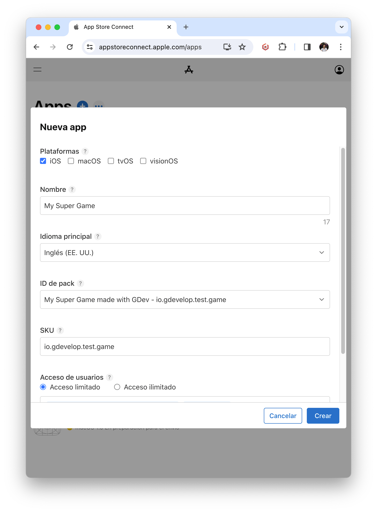
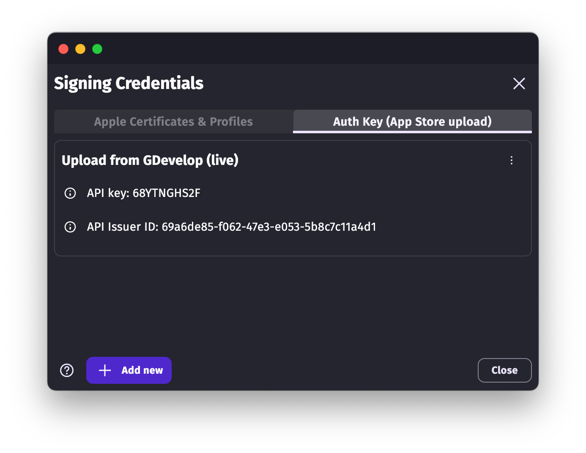
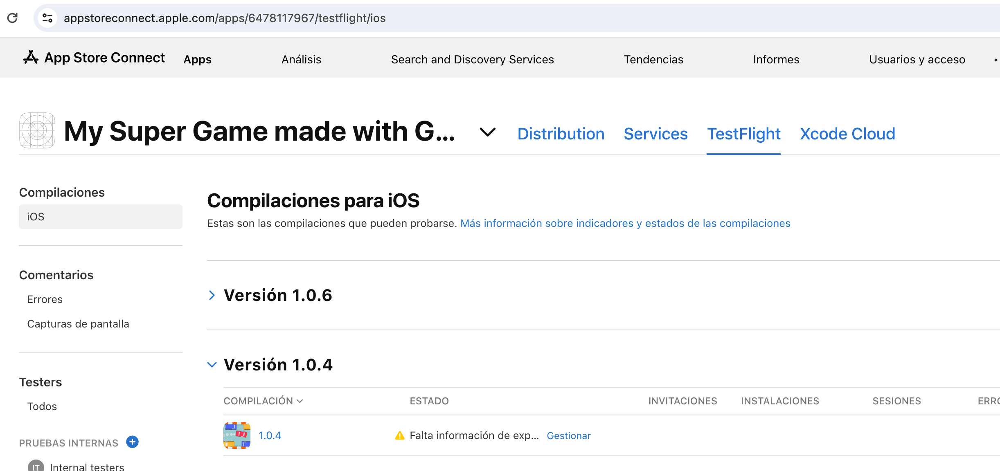

# Publish your game on the App Store

After building your game for iOS (either using the [one-click build for iOS](/gdevelop5/publishing/ios) or [the manual process with Cordova for advanced users](/gdevelop5/publishing/android_and_ios_with_cordova)), you can publish it on the App Store.

## Declare your game on the App Store

To publish your game on the App Store, you need to declare it on the App Store Connect website. You can do this by following these steps.

First, you need to create an App ID. Go to the [Apple Developer "Register a new identifier" page](https://developer.apple.com/account/resources/identifiers/add/bundleId) and choose **App IDs**. Choose then **App**.

Finally, enter the name of your game and choose the App ID, which is the same as the "package name" in GDevelop: it's a "reverse URL" that looks like this: `com.yourcompany.yourgame`.

Then, click on **Continue**.

!!! warning

    Make sure, once you create your App ID, that you enter it in the "package name" field of your game in GDevelop, in the [project properties](/gdevelop5/interface/project-manager/properties). This should be exactly the same.

Once you have the App ID created, you can declare your game on the App Store Connect website.

1. Go to the [App Store Connect apps page](https://appstoreconnect.apple.com/apps).
3. Click on the **+** button to add a new app.
4. Check iOS, enter the name of your game and then choose the App ID you created. Also write it in the "SKU" field.

     

Finish by clicking on **Create**.

The app is now declared on the App Store Connect website. You can fill the various informations about your game, like the description, screenshots, etc... Note that this is not required if you just want to use TestFlight to test your game.

## Test your game on the App Store with TestFlight

To test your game before sending it for review on the App Store, you can use TestFlight and the automated upload of your game to the App Store from GDevelop using an *Authentication Key*.

### Create an Authentication Key and upload it in GDevelop

In GDevelop, click on **Add/edit** button next to the certifcate/provisioning profile selector when you are in the iOS build page. Click on the **Auth Keys** tab.

- Click on **Add new**.
- In your browser, open the [App Store Connect API page](https://appstoreconnect.apple.com/access/integrations/api).
- CLick on the **+** button to add a new API key.
- Enter a name for your key and choose **Administrator** access. Click on **Generate**.

  !!!! warning

       The automatic upload won't work if you don't have an Authentication Key or if you have not chosen "Administrator" access.

- Download the key that was generated thanks to the *Download* button on the right of the row showing the key.
- Copy and paste in GDevelop the **Key ID** (in the row showing the key) and the **Issuer ID** (shown at the top of the page).
- Finally, choose in GDevelop the key file you just downloaded. Click on **Send**.

### Create a new build in GDevelop for the App Store

Once you have an authentication key ready, you can create a new iOS build in GDevelop. Choose **App Store**. Make sure you've created a [Distribution certificate and a provisioning profile for it before](..).

Launch the packaging. GDevelop will build your game and then use Apple development tools and your authentiction key to upload it to the App Store.

### Try your game with TestFlight

On your iOS device, download [TestFlight](https://apps.apple.com/fr/app/testflight/id899247664). It's the official app from Apple to try apps and games before submitting them to the App Store.

To have your game available on TestFlight, make sure it's ready by going to **the TestFlight tab in the App Store Connect page for your app**:

When the build is finished in GDevelop, it will appear here. It takes a few minutes to be available on TestFlight.

!!! note

    If the build does not appear, make sure you have an authentication key ready and that you've created a new build in GDevelop for the App Store. Make sure the package name is properly entered. Make sure you have used a version number (like 1.0.1) that is higher than the one you used for the previous build (for example, if you already sent 1.0.1, you must send 1.0.2 or 1.0.3, etc...).

If there is a warning icon next to the version number, click on it to answer to any form or question required from you by Apple.

Once the build is available on TestFlight, you can download it and install it on your device using the TestFlight app. For this, you need to add your account, or other Apple ID accounts, as tester.

### Add testers in TestFlight

On the left side of the TestFlight tab, click on the **+** button next to "Internal testers".
Choose here your Apple account. You can also invite other testers by [adding them to your team in App Store Connect first](https://appstoreconnect.apple.com/access/users).

## Send your game for review on the App Store

When you want your game to be reviewed by Apple, you can do it from the App Store Connect website.

Apple will ask you to fill all the informtion on the **Distribution** tab of your app: description of your game, screenshots, etc...

You can find various resources on the web explaining how to best do this.