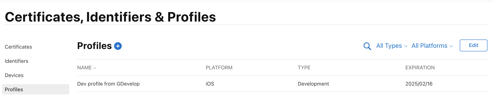

# Publish your game to iOS

GDevelop can automatically package your game for iOS so that you can test it on your iPhone. GDevelop is also able to automatically send it to the App Store Connect, the website where you can publish your game on the App Store and send it to your iPhone or to other testers using _TestFlight_.

!!! note

    GDevelop cloud builds, which includes automatic packaging for Android, iOS and desktop, are part of GDevelop memberships. Check the [GDevelop website](https://gdevelop.io/pricing) to compare the different plans and which one will work best for you.

## Making sure that your game is ready for packaging

It is important to verify that your game is ready to be exported for iOS:

- In the game properties that are accessible from the [Project Manager](/gdevelop5/interface)), make sure to enter a valid _package name_. A package name is an identifier like this: `com.yourname.gamename`. It's like the address of a website but reversed. You can choose any package name provided that:
  - It is not used by another game or application on iOS or Android.
  - It is written with only letters, numbers, and dots. Only put one dot between words (for example, `com..mygame` or `..mygame` are not valid). _Limit this identifier to 2-5 words maximum._
  - You properly registered it on the [App Store Connect website](./app-store), if you want to publish it on the App Store.
- Also check that you've included the required icons.

## Create your Apple Developer account

Open your Apple Developer account on [Apple Developer website](https://developer.apple.com/account/). If you want to distribute your app on the App Store, this page explains how to [enroll your Apple ID in the Apple Developer Program](https://developer.apple.com/support/enrollment) and pay the annual fee to Apple.

## Launch export

Click on the **Share** button in the GDevelop toolbar, then choose **iOS** and **One-click packaging**.

Choose if you want to package the game for testing it on an iPhone or an iPad, that was registered on your Apple Developer account, or if you want to publish it to App Store Connect - so it can be tested using _TestFlight_ and then reviewed and published on the App Store.

### Create a new certificate

To make sure that your game can be run on an iPhone or iPad, you need to create a certificate (one for development and one for distribution on the App Store). GDevelop will guide you through the process:

In the page to do the one-click packaging for iOS, click on **Add new**.

- You first need to create a Certificate Signing Request (CSR). Enter your full name (or organisation name), country and press **Create request**. Then, click on the button to **download** the CSR.
- Go to the [Apple Developer certificate page](https://developer.apple.com/account/resources/certificates/list) and click on the **+** button.

  - Choose either **Apple Development** (for testing on your iPhone/iPad) or **Apple Distribution** (for the App Store/TestFlight) and then **Continue**.

    

  - Upload the **CSR file** you downloaded in the previous step.
  - Finally, **download the certificate** (.cer file) that was generated by Apple.

- Go back in GDevelop and upload the certificate you just downloaded.

Your certificate is now ready to be used by GDevelop. You now need to create a provisioning profile that will allow your game to be run on your iPhone or iPad (in case you created a _Apple Development_ certificate), or sent to the App Store (in case you created a _Apple Distribution_ certificate).

### Register your device (for testing on your iPhone/iPad)

!!! note

    You can skip this step if you want to publish your game on the App Store only or if you're willing to test your game on your iPhone/iPad via TestFlight only. This being said, being able to test on your device via a "Development" build can be faster than waiting for TestFlight to process your game.

Before creating a provisioning profile, you need to register your device. You can do this by going to the [Apple Developer devices page](https://developer.apple.com/account/resources/devices/list) and clicking on the **+** button.

- Enter your device name of your choice (for example "My iPhone").
- Enter the Device ID (UDID). You can find here using a few methods:

  - If you have a mac, connect the iPhone to your computer and open it using Finder. See [this page for more information](https://medium.com/@igor_marques/how-to-find-an-iphones-udid-2d157f1cf2b9).
  - Otherwise, install iTunes and connect your iPhone to your computer (Windows or macOS). See [this page explaining how to find the UDID on iTunes](<https://www.wikihow.com/Obtain-the-Identifier-Number-(UDID)-for-an-iPhone,-iPod-or-iPad>).

Once you have the UDID, copy and paste it in the field and click **Continue**.

### Create a provisioning profile

To create a provisioning profile, go to the [Apple Developer provisioning profile page](https://developer.apple.com/account/resources/profiles/list) and click on the **+** button.

- Choose either **iOS App Development** (for testing on your iPhone/iPad) or **App Store Connect** (for the App Store/TestFlight) and then **Continue**.

  

- Choose _XCode iOS Wildcard App ID_ and then **Continue**.
- Choose the certificate you created previously. If you don't see any certificate, you probably have mismatched the kind of certificate you created (development or distribution).
- For a profile used for _testing on your devices_, you'll be asked for checking the devices that you want to test on.
- Finally, click on **Continue** to create the provisioning profile. Download it.
- Go back to GDevelop and upload the provisioning profile you just downloaded.

You can now close the window to create the certificate/provisioning profile. Your certificate and provisioning profile should be listed. You can close the window and start packaging your game for iOS.

## Testing your game on your iPhone/iPad after the build is finished.

Once a build is finished, an IPA file is generated.
The way to use it is different according to whether you want to test it on your iPhone/iPad or on the App Store.

If you want to test it on your iPhone/iPad, you need to install the IPA file on your device. You can do this using Finder on your macOS computer or iTunes on Windows or macOS. Read below to learn how to do it.

!!! note

    If you want to test it on the App Store, you need to upload the IPA file to the App Store Connect website. This can [only be done with a macOS computer using the Transporter app](https://apps.apple.com/es/app/transporter/id1450874784). Instead, it's easier to configure the app first on the App Store Connect website and then set up an authentication key to automatically send your game to the App Store Connect website. See the next section for more information.

Connect your iPhone/iPad to your computer using a USB cable.

- On a macOS computer, open Finder on your computer and navigate to the folder where the IPA file is located. Drag'n'drop the IPA file on the iPhone/iPad icon in the Finder window.
- On a Windows computer, open iTunes and connect your iPhone/iPad to your computer. Then, navigate to the folder where the IPA file is located. Click the "Apps" tab in the left sidebar menu. If the left sidebar is not visible, click the "View" tab in the top navigation menu, then click "Show Sidebar." Drag'n'drop the IPA file on the iPhone/iPad icon in the iTunes window. Connect your iPhone/iPad to your computer and click "Sync" in the iTunes window.

## Publish to the App Store

To automatically publish your game on the App Store, you can set up an authentication key, enabling GDevelop to automatically send your game to the App Store Connect website. You will be able to set up the app and testers, including yourself, to test your game through the TestFlight app.

Read this page about [testing and publishing your game on the App Store](./app-store).
