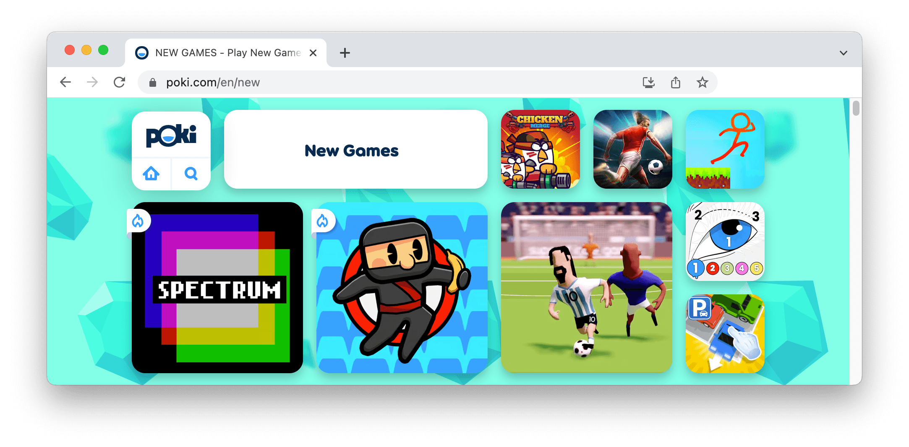

# Publish your GDevelop game on Poki

Games made with GDevelop can be published on [Poki](https://poki.com/). With over **[50 million monthly users](https://gdevelop.io/page/poki)**, it's a perfect place to find a great audience. Read more about it on [GDevelop website](https://gdevelop.io/page/poki).

Some games made with GDevelop that have been published on Poki:

- [Spectrum](https://poki.com/en/g/spectrum)
- [Spent Shells](https://poki.com/en/g/spent-shells)

!!! tip

    You're welcome to contribute by adding a step-by-step explanation of the process.
