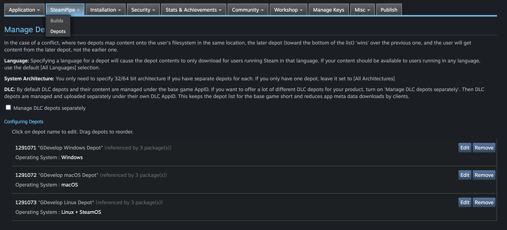
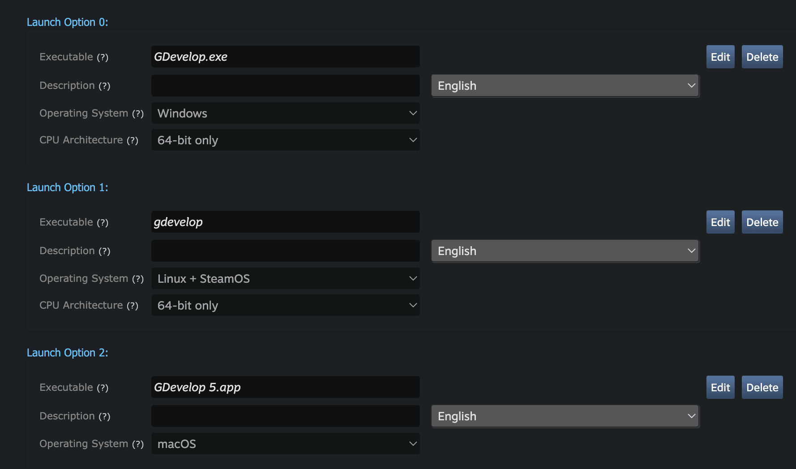

# Publishing a game to Steam

## Open an account on Steamworks and prepare your product page.

Register on [Steamworks](https://partner.steamgames.com/) using your Steam account (or create a new account if necessary).

After registering and paying the fee for a single app/game, you will be able to create a new product and start setting up the product page.

## Integrate Steamworks with your game

!!! tip

    While not strictly required to publish to Steam, it is strongly recommended to integrate your game with Steam and add Steam achievements to your game.

[Follow this guide](/gdevelop5/all-features/steamworks/) to connect your Steamworks App ID to your game, integrate your game further with Steam's platform, and optionally enable Steam DRM.

## Preparing your game for Steam

To start the publishing process, export your game for desktop:

- For Windows, export as a ZIP file.
- For macOS, export as a ZIP file too.
- For Linux, build as an AppImage and extract it - or build manually as a zip file.

## Upload your zip files in "depots"

In Steam, you must create a "depot" for each platform (Windows, macOS, Linux). Each "depot" is a place where you can upload the zip containing your game for the given platform.



You then configure a "Build" that is using the "depots". You can use the web interface to upload the zip files for each depot:


### Issue when uploading a macOS build: how to properly upload your macOS game

There is an issue making the macOS application not working after uploading the macOS zip file (this is because [the Steam web uploader breaks the symlinks](https://github.com/electron-userland/electron-builder/issues/5767#issuecomment-813920169)). This results in a broken app that does not launch and crashes immediately with a message related to `Electron Framework.framework`.
Instead, you must use the **steamcmd** command line tool to upload your macOS files.

- Start by extracting the macOS zip file somewhere. Use Linux or macOS `unzip` command line tool - Windows will break the "symlinks" when extracting the zip file. Extract the files in a folder called `mac`. You should have a single folder, "Your Game.app" inside this `mac` folder.

    !!! danger

        Windows, and some archiver softwares on Linux, will break the "symlinks" when extracting the zip file - making it impossible to run the app. Use `unzip` on macOS or Linux.

- Create a [Build Config file](https://partner.steamgames.com/doc/sdk/uploading) called `steam-upload-config.vdf`. Put it next to the folder called `mac`. This is an example:

```
"AppBuild"
{
	"AppID" "1234560" // your AppID
	"Desc" "Script to upload files" // internal description for this build

	"ContentRoot" "." // root content folder, relative to location of this file
	"BuildOutput" "./output" // build output folder for build logs and build cache files

	"Depots"
	{
		"1234562" // macOS DepotID
		{
			"FileMapping"
			{
				"LocalPath" "mac/*" // all files from contentroot folder
				"DepotPath" "." // mapped into the root of the depot
				"recursive" "1" // include all subfolders
			}
		}
	}
}
```

- Install [steamcmd](https://developer.valvesoftware.com/wiki/SteamCMD#Downloading_SteamCMD).
- Using a command line, run steamcmd: `steamcmd +login <username> <yourpassword> +run_app_build ./steam-upload-config.vdf +quit`

The **steamcmd** utility will upload the macOS app that you extracted in the `mac` folder, and it will now work correctly when you install it on a mac from the Steam client. You still need to configure the Launch Options - see the next section.

## Configure "Launch Options"

In **Installation > General Installation** menu, you can configure the "Launch Options". The executable are:

- "YourGame.exe" for Windows (replace _YourGame_ by the executable name - check in the zip file if necessary)
- "yourgame" for Linux (replace _yourgame_ by the executable name - check in the zip file if necessary)
- "Your Game.app" for macOS (replace _Your Game.app_ by the folder name - check in the zip file if necessary)
- If you need the Steam Overlay to work, you will need to add `--in-process-gpu --disable-direct-composition` in the "Arguments" section of each launch option.



## Publish the game

Your game should now be ready for publication. Check again that all metadata has been correctly set, that there are no typos anywhere, that you have uploaded all the promotional art, etc.

Once you are ready, all that is left to do is:

1. Click the tab called “Publish”
2. Click “Prepare for publishing”
3. Click “Publish to Steam”
4. Enter the secret confirmation code “STEAMWORKS”
5. Click “Really Publish”

You should see a message similar to “Congrats! Your changes are now live.”.
With that, your game should be published on Steam for you to play.
