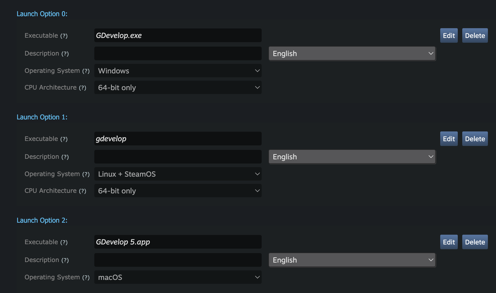

## Preparing your game for Steam

Start by export your game for desktop:

* For Windows, export as a ZIP file.
* For macOS, export as a ZIP file too.
* For Linux, build as an AppImage and extract it - or build manually as a zip file.

## Open an account on Steamworks and prepare your product page.

Register on [Steamworks](https://partner.steamgames.com/) using your Steam account (or create a new account if necessary).

After registering and paying the fee for a single app/game, you will be able to create a new product and start setting up the product page.

## Upload your zip files in "depots"

In Steam, you must create a "depot" for each platform (Windows, macOS, Linux). Each "depot" is a place where you can upload the zip containing your game for the given platform.


You then configure a "Build" that is using the "depots". You can use the web interface to upload the zip files for each depot:


### Issue when uploading a macOS build

There is an issue making the macOS application not working after uploading the macOS zip file (this is because [the Steam web uploader breaks the symlinks](https://github.com/electron-userland/electron-builder/issues/5767#issuecomment-813920169)).
Instead, you must use the **steamcmd** command line tool to upload your macOS files.

- Start by extracting the macOS zip file somewhere. Use Linux or macOS - Windows will break the "symlinks" when extracting the zip file. Extract the files in a folder called `mac`. You should have a single folder, "Your Game.app" inside this `mac` folder.
- Create a [Build Config file](https://partner.steamgames.com/doc/sdk/uploading) called `steam-upload-config.vdf`. Put it next to the folder called `mac`. This is an example:

```text
"AppBuild"
{
	"AppID" "1234560" // your AppID
	"Desc" "Script to upload files" // internal description for this build

	"ContentRoot" "." // root content folder, relative to location of this file
	"BuildOutput" "./output" // build output folder for build logs and build cache files

	"Depots"
	{
		"1234562" // macOS DepotID
		{
			"FileMapping"
			{
				"LocalPath" "mac/*" // all files from contentroot folder
				"DepotPath" "." // mapped into the root of the depot
				"recursive" "1" // include all subfolders
			}
		}
	}
}
```

- Install [steamcmd](https://developer.valvesoftware.com/wiki/SteamCMD#Downloading_SteamCMD).
- Using a command line, run steamcmd: `steamcmd +login <username> <yourpassword> +run_app_build ./steam-upload-config.vdf +quit`

The **steamcdm** utility will upload the macOS app that you extracted in the `mac` folder, and it will now work correctly when you install it on a mac from the Steam client. You still need to configure the Launch Options - see the next section.

## Configure "Launch Options"

In **Installation > General Installation** menu, you can configure the "Launch Options". The executable are:

- "YourGame.exe" for Windows (replace *YourGame* by the executable name - check in the zip file if necessary)
- "yourgame" for Linux (replace *yourgame* by the executable name - check in the zip file if necessary)
- "Your Game.app" for macOS (replace *Your Game.app* by the folder name - check in the zip file if necessary)


