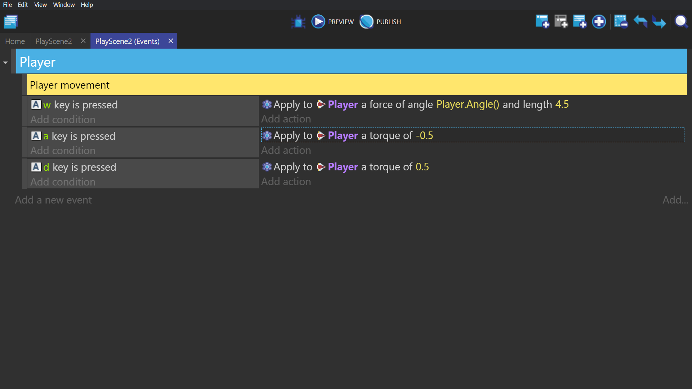

# Asteroids

## Series

1. [Getting Started](/gdevelop5/tutorials/asteroids)
2. [Ship and Movement Controls](/gdevelop5/tutorials/asteroids/ship_and_movement_controls)
3. [Firing Mechanic](/gdevelop5/tutorials/asteroids/firing_bullet)
4. [Setting Scene](/gdevelop5/tutorials/asteroids/setting_scene)
5. [Splitting Asteroids](/gdevelop5/tutorials/asteroids/splitting_asteroids)
6. [Screen Wrap](/gdevelop5/tutorials/asteroids/screen_wrap)
7. [Fail State](/gdevelop5/tutorials/asteroids/fail_state)
8. [End Result](/gdevelop5/tutorials/asteroids/end_result)

## Creating player object

Create a sprite object, give it a single ship animation, and name it Player.

## Physics behavior

Double click the Player sprite object. Give that object the Physics 2.0 behavior, and change the gravity value to 0.

Change the Player object's physics 2.0 behavior values to match the values in the image below.

## Align image and points

Open the Player object and edit the animation through Piskel. Click to rotate the image until the nose of the ship is facing to the right. We do this because the base setting for 0 degrees within the engine is to the right. This properly aligns the movement controls and the object for any force that is applied to the object. A great example of the rotation/alignment can be found in the full length video.

Next, edit the Player object's origin point from the Edit points screen. Drag the origin to the center of the object, so that when we apply a force to the object it will be applied at this point.

## Moving forward

Go to the event sheet and create an event with the following conditions/actions:

Condition:
-"Key pressed" with W selected.

Action:
 -"Apply force (angle)" where the angle is the Player object's angle, the length is 4.5, and the applying X/Y position are those of the Player object.
 - **Note:** For X/Y position, use the MassCenterX and MassCenterY expressions to avoid any rotation, i.e., `Player.Physics2::MassCenterX()` and `Player.Physics2::MassCenterY()`.

This force will be applied to the origin point.

## Turning

Create 2 more events, with the A/D keys being pressed as their conditions, but this time the action will be "Apply torque (rotational force)" and give them -0.5 or 0.5 based on the direction you would like them to go when either A or D is pressed.

