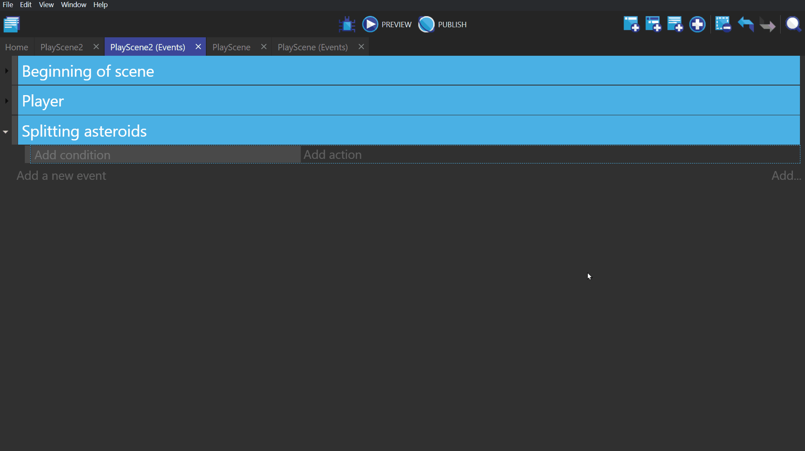
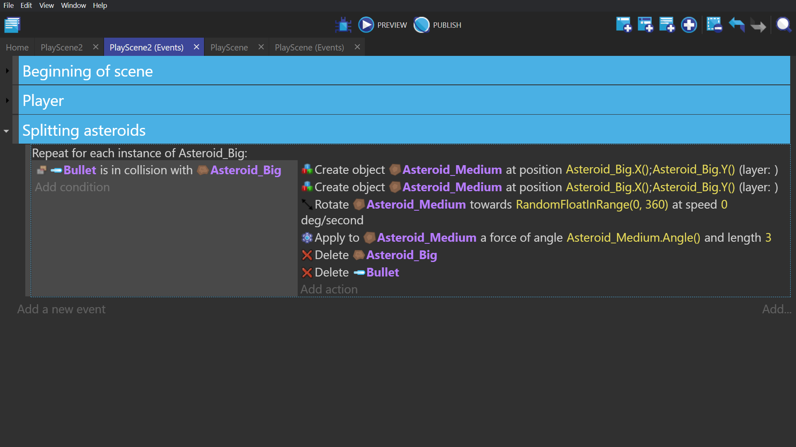
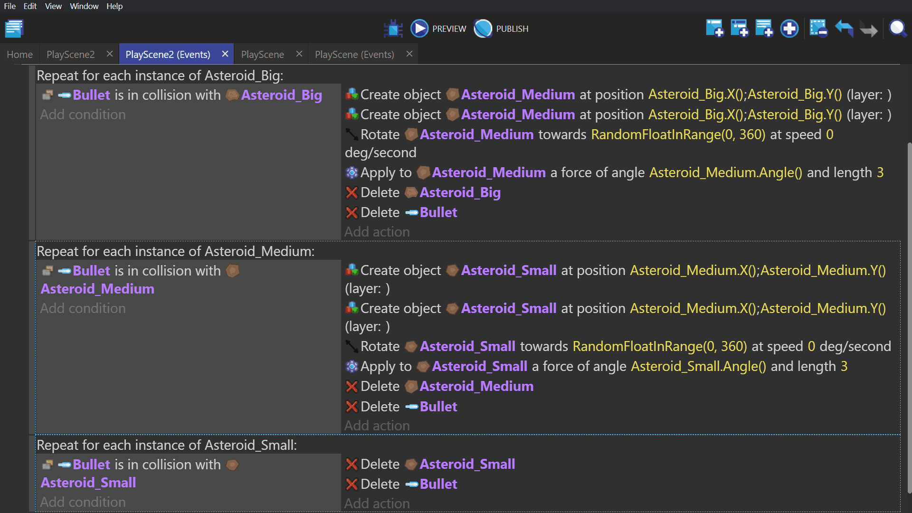

# Asteroids

## Series

1. [Getting Started](/gdevelop5/tutorials/asteroids)
2. [Ship and Movement Controls](/gdevelop5/tutorials/asteroids/ship_and_movement_controls)
3. [Firing Mechanic](/gdevelop5/tutorials/asteroids/firing_bullet)
4. [Setting Scene](/gdevelop5/tutorials/asteroids/setting_scene)
5. [Splitting Asteroids](/gdevelop5/tutorials/asteroids/splitting_asteroids)
6. [Screen Wrap](/gdevelop5/tutorials/asteroids/screen_wrap)
7. [Fail State](/gdevelop5/tutorials/asteroids/fail_state)
8. [End Result](/gdevelop5/tutorials/asteroids/end_result)

## For each object event

Go to your event sheet, and create a group called "Asteroids".

Right click on a blank event in that group, hover over "Add Other", and select "For each object". Which will create a new event.

Click the bar on the top of this event and select your big asteroid. This will check the event for every big asteroid in the scene every frame.

## Splitting the big asteroid

Add the following conditions/actions to this "For each object" event:

Condition:
-"Collision"(Common Action, not Physics Engine) and select Bullet as the first object and Asteroid_Big as the second.

Action:
-"Create an object" and select Asteroid_Medium. Set this to create at the X and Y coordinates of Asteroid_Big.
-Copy and paste that "Create an object" action in to the same event, so a second medium asteroid is created when the big asteroid is destroyed.
-"Rotate toward angle" setting RandomFloatInRange(0, 360) as the angle to rotate towards, with an angular speed of 0.
-"Apply force (angle)" (Physics Engine) setting the angle to be the angle of the medium asteroids. With a length of 3.
-"Delete the object" and select the big asteroid.
-"Delete the object" and select the bullet.

## Other asteroids

For the medium asteroids, create the same event, but put the medium asteroid wherever the big asteroid was, and the small asteroid wherever the medium asteroid was.

For the small asteroid, create the same event as above, but leave out the create, rotate, and apply force actions so that it just gets deleted.

