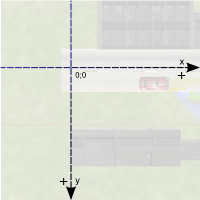
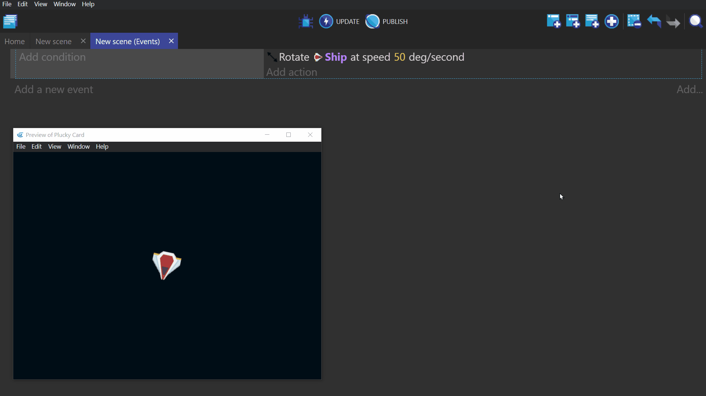
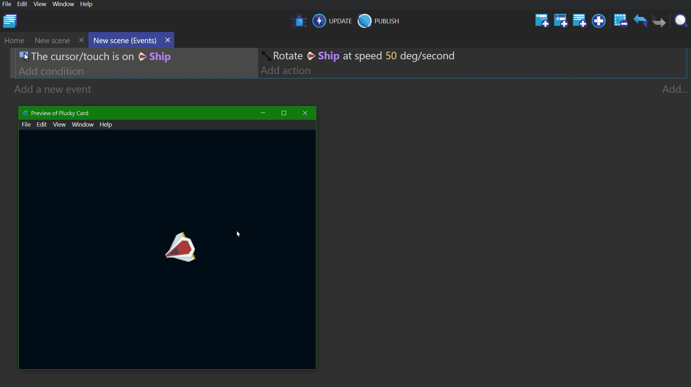
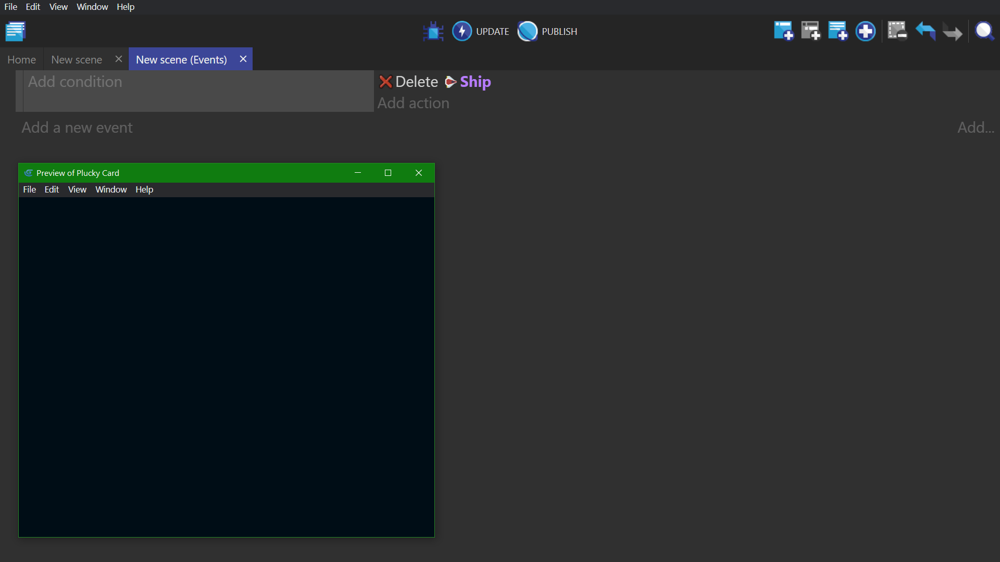
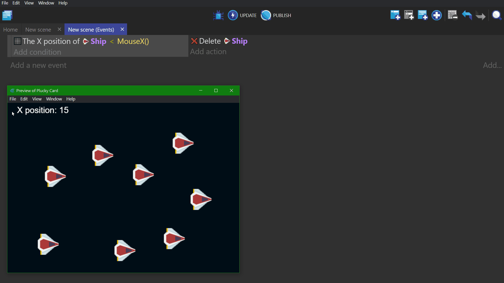
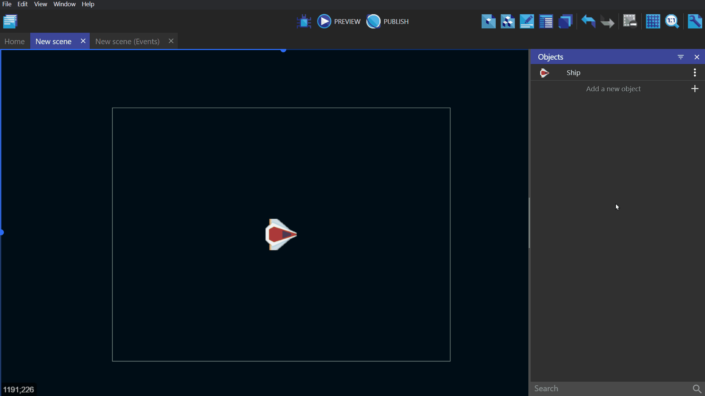
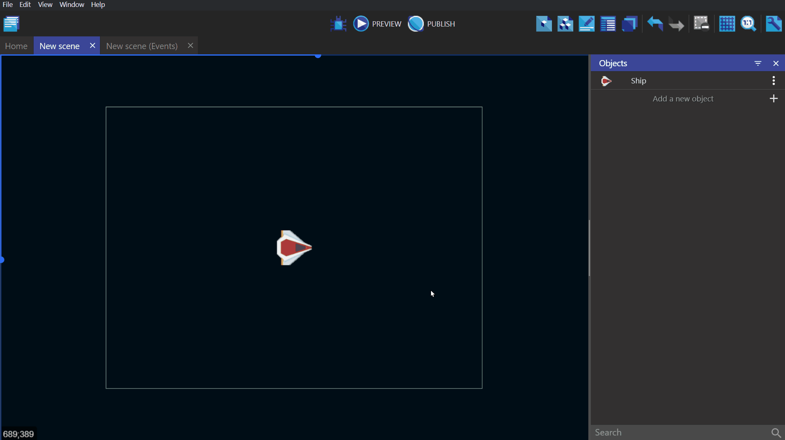

# Basic game making concepts: What you need to know to start with GDevelop

The basic concepts of GDevelop are simple. Read the following information to get started with the software. If you don't have GDevelop, [download the latest version here](https://gdevelop.io/download).

## Showing things on the screen: Objects

Everything that is *displayed on the screen* is called an **"Object"**. Different kinds of objects can be used to display different game elements on the screen. For example, most game graphics are "Sprite" objects, text can be displayed with "Text" objects, and special effects like fire or explosions can be created with "Particle Emitters".

Read more about  [Objects](https://wiki.gdevelop.io/gdevelop5/objects#objects).

## Positioning Objects in the world: Coordinates

Objects on the GDevelop screen/scene have **X and Y coordinates**. These coordinates correspond to the horizontal position (X-axis) and the vertical position (Y-axis) on the _Cartesian plane_.

The X-coordinate _decreases_ as you go to the left and _increases_ as you go to the right. The Y-coordinate _increases_ as you go down and _decreases_ as you go up.

!!! tip

    The top-left corner of your game's screen starts at X=0 and Y=0, but this will change if the camera is moved.

## Angles

In order to move or rotate objects, you will need to specify the desired angle in degrees. The illustration below demonstrates how GDevelop understands the angle of rotation:

!!! tip

    Angles can be negative too. For example, -90 degrees is equal to 270 degrees.

## Demonstration of position and angle

The video below shows both of these concepts inside GDevelop.  The position of the ship is changed by modifying the X and Y values, and then the ship is rotated by changing the angle of the object.

## Events

Events are used to create the logic of your game. They are composed of conditions and actions. Conditions can be thought of as "if" statements and actions can be thought of as "then" statements. "If" the conditions are true/met, "then" the actions will happen. Most conditions and actions refer to objects:

* Conditions run a **test** on the objects.
* Actions **affect** the objects that matched the conditions. They can change the object's position, appearance, etc...

An event without any conditions will always perform the actions. In the video below, the ship object will continuously rotate at the speed set in the **Rotate Ship** action.

If a condition is added to the event, the actions will only be performed when the condition is true.

In this example, a condition for **The cursor/touch is on Ship** is added.  Now the **Rotate Ship** action will only happen "if" the mouse cursor is on the ship object.

Read more about [Events](https://wiki.gdevelop.io/gdevelop5/events#events).

## How objects are selected

If an event has no conditions, the actions will apply to all objects listed in the action.
For example, this event has no conditions so it will delete all objects called "Ship".

Once a condition has been added that mentions an object, all following actions will affect only objects that matched the previous conditions.

The event below has a condition that checks the horizontal (X) position of the Ship.  The action will delete **only** the "Ship" objects with an X position that is less than (to the left of) the mouse cursor.

!!! tip

        The list of objects that match conditions is also used by all subevents.
    Read more about [Object Picking](https://wiki.gdevelop.io/gdevelop5/events/object-picking).

!!! tip

    **See it in action!** 🎮 [Open this example online](https://editor.gdevelop.io/?project=example://object-selection).

## Order of events

The order of [events](/gdevelop5/events) **is very important**!

Events are processed from the top down. so events at the top are executed first.  The following examples are **not** equivalent:

* In the top example, the first event creates a "Ship" object at coordinates X: 100. Y: 200 (100;200) on the base layer. Then the next event deletes that created ship immediately. This pair of events **will not** display a ship on the screen, because the ship is deleted right after being created.
* In the bottom example, the first event deletes all the "Ship" objects from the scene/screen. It then creates one "Ship" at the coordinates X: 100, Y: 200 (100;200) on the base layer.  This pair of events **will** display a single ship on the screen.
(Behind the scenes, the ship is being deleted and recreated on every frame, which is not something you would want to do in a real game.)

!!! tip

        Events are processed about 60 times per second.
    Each iteration through the events is called a **frame**, **tick**, or **game loop**.

## Behaviors: Game logic for objects

**Behaviors** enhance an object with some *pre-defined logic*. They can be used to automate simple tasks, but they also have the power to perform much more advanced tasks. For example:

* A behavior can be used to *automatically* remove an object from the game when it *goes out of the screen* (limiting the game memory usage).
* Another behavior can be used to *move objects on the screen with the keyboard arrows*.
* Yet another behavior can be used to allow the object to be *dragged on screen* with the mouse or by touching the object.
* The *Physics* behavior is an example of an advanced behavior which make your objects move in a realistic way, following the laws of physics.

**Behaviors** will often come with their own variables that can be changed to customize the task it performs, but they can also be manipulated using events that are specific to that behavior.

The wiki page associated with behaviors can be found [here](https://wiki.gdevelop.io/gdevelop5/behaviors#behaviors).

!!! tip

    You can create *custom behaviors* for your objects. We recommend this as your game grows. It allows you to put logic about what your objects are doing in the custom behaviors, rather than bloating the scene's events sheet. You [read more in this article](/gdevelop5/tutorials/how-to-make-behavior).

## Move objects with Forces

Moving objects can be achieved with **forces**. Forces are used to "push" objects.

You can specify:

* The speed of movement on both the X (horizontal) and Y (vertical) axis, in pixels per second
* The angle to move towards and the speed, in pixels per second
* An instant force will only move the object for one frame
* A permanent force will move the object every frame until it is stopped

### Example

Below is an example that moves a ship object back and forth between the left and right sides of the screen.

To move the ship left, add a permanent force with an angle of 180° (left) and a length (speed) of 50 pixels per second. This force is applied on every frame when the X position of the ship is greater than 600.

To move the ship to the right, add a permanent force with a speed of 50 pixels per second on the X-axis and 0 for the Y-axis.  This force is applied on every frame when the X position of the ship is less than 200.

!!! note

    This example applies permanent forces over multiple frames, which causes the ship to accelerate and decelerate when changing directions.

### Other ways to move objects

Some "behaviors", like the Physics engine or Pathfinding, may move the objects by themselves. In this case, it is better not to use the built-in forces system and instead rely only on actions provided by these behaviors.

!!! tip

    **See it in action!** 🎮 [Open this example online](https://editor.gdevelop.io/?project=example://move-object-with-physics).

!!! note

    These other ways of moving objects are explained in [this how-to page](/gdevelop5/tutorials/how-to-move-objects).

## Variables: Storing information

Variables are used to store **data** in the format of a **number** or **text**.  This data can represent almost anything in your game. For example, it could be used to record the number of lives remaining, a player's name, a high score, the number of bullets left, or the number of enemies killed.  Variables are useful because they allow you to set the value in one place and then read that value in multiple places in your game.

!!! tip

    Conditions are used to **check** the value of a variable.

    Actions are used to **change** the value of a variable.

#### Where are variables stored? (variable "scope")

The _scope_ of a variable determines the place a variable can be accessed. In GDevelop, there are three variable scopes are available:

* **Global** variables are accessible from all the game scenes. For instance, they can be used to store the player's score across different levels/scenes.
* **Scene** variables are only accessible from the scene they are created in. They can be used for data that only concerns one scene. A Scene variable would be able to access the time remaining to complete the level/scene.
* **Object** variables only concern one object. For example, a hero can have a "Health" or "Ammo" variable.

The wiki page associated with variables can be found [here](https://wiki.gdevelop.io/gdevelop5/all-features/variables).

To further expand on how variables can be used in a game, see [expressions](https://wiki.gdevelop.io/gdevelop5/all-features/expressions#expressions).

## TimeDelta: "Time elapsed" since the previous frame

GDevelop processes events and redraws the screen (called a "frame") around 60 times per second.  The exact number of frames per second depends on the computer resources and the demands of the game.  A slow computer might only render 25 frames per second, while a fast computer could render 60 frames per second.  In order for a game to feel the same on every device, it is important to take into account the time elapsed between frames.

This can be accomplished by using //[TimeDelta()](/gdevelop5/all-features/expressions)//, which returns the time in seconds since the last frame.

For example, don't do this:

But do this instead:

The first event is adding 20 to the variable on every frame. This means that the rate of increase of the variable may not be the same from computer to computer.  We need to compensate for this variation in frame rates.

The second event is **correct and reliable** : The number 300 is multiplied by TimeDelta(). Thus, the variable will be increased at the same rate on all computers. Because _TimeDelta()_ returns a time in seconds, it allows you to quantify exactly how much the variable will change over time.  In our case, the variable will grow at 300 units/second. Thus, we can predict that life will increase by 3000 units in 10 seconds, regardless of the number of frames processed during this time.

**Rule of Thumb:**  Use _TimeDelta()_ when you want to continually apply a change to a value. If your action only runs once (for example, during a collision where you then delete the object), you don't need to use _TimeDelta()_.

!!! danger

    You don't need to use _TimeDelta()_ if the action expects values in "units per second" (such as moving an object with forces).  In these cases, GDevelop automatically accounts for differences in frame rates.

## And... that's almost all you need to know

➡️ You can continue to read **[the tutorials](/gdevelop5/tutorials)** to know more about creating real games with GDevelop!