# How to Make a Breakout Game

!!! danger

    This tutorial is being reworked/updated. Some of the info might be outdated and issues might be present👷‍♂️

!!! warning

    Before starting this tutorial, you should read both [Getting Started](/gdevelop5/getting_started) and [Basic Game Making Concepts](/gdevelop5/tutorials/basic-game-making-concepts) to get an overview of GDevelop and an understanding of the main concepts.

With this tutorial, you will learn some basic tasks in GDevelop while creating a fun game. Like the classic arcade game Breakout, you will create an array of bricks that can be broken by a bouncing ball. The player controls the ball with a paddle - once the ball drops, it's game over.

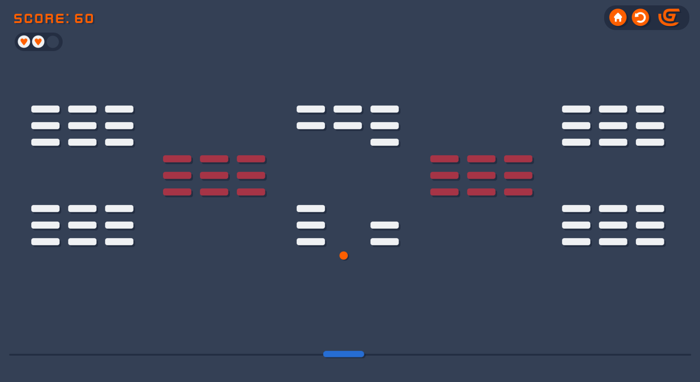

----

!!! tip

        The game made in this tutorial can be found in Gdevelop 5 as an example.

    See it in action:

    https://editor.gdevelop.io/?project=https://resources.gdevelop-app.com/examples/breakout/breakout.json

## Create a new game

Click **Create a new project** on the start page. Scroll down and choose a folder for your project, then select **Empty game**.

## Add game assets

!!! tip

    You will encounter the term “assets” a lot as you work with GDevelop. In computer game development language, _assets_ are the files that make up the game content – things like characters, platforms, audio files, etc.

For a breakout game, you will need the following assets:

  * Image file of a ball
  * Image file of a paddle
  * Image file of a barrier
  * Image files of different bricks
  * images of Power-ups (optional)

Or you can download the assets used in the tutorial,
[breakout assets.zip](breakout-assets.zip)

----

## Add a new scene

_Scenes_ are the screens of your game. For example, different levels of a game are often created as different scenes, as are start menus or pause menus.

Scenes contain _objects_ displayed on screen as game content. Each object you place on a scene is called an _instance_. Your breakout game will have several instances of the brick object on a game level scene. Scenes also contain _events_ - actions that happen under specific conditions - to animate the scene.

To add a new scene:

  - On the **Project** panel on the left, click **+** to add a scene.

  - A new scene is added to the list. Click **NewScene** to open it.

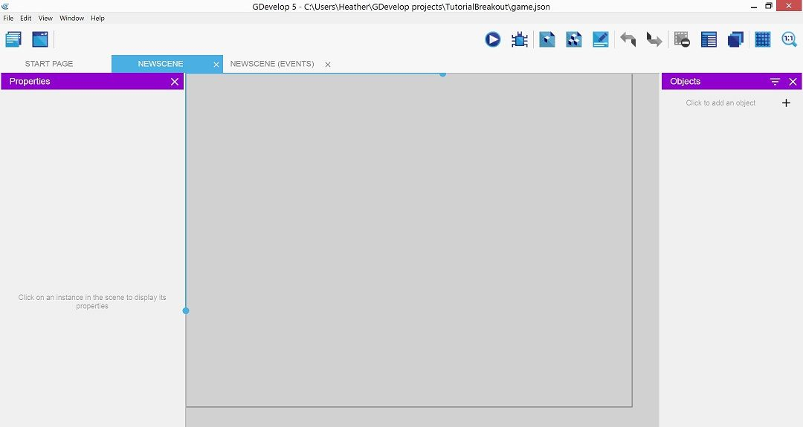

----

## Create the paddle object
Start by adding the paddle to the scene. The player moves this paddle left and right in a straight line in order to bounce the ball and prevent it from dropping out of play.

  - On the **Objects** panel on the right, click **+** to add an object.

A window will appear displaying different types of objects you can add. Each type of object has its own set of features.

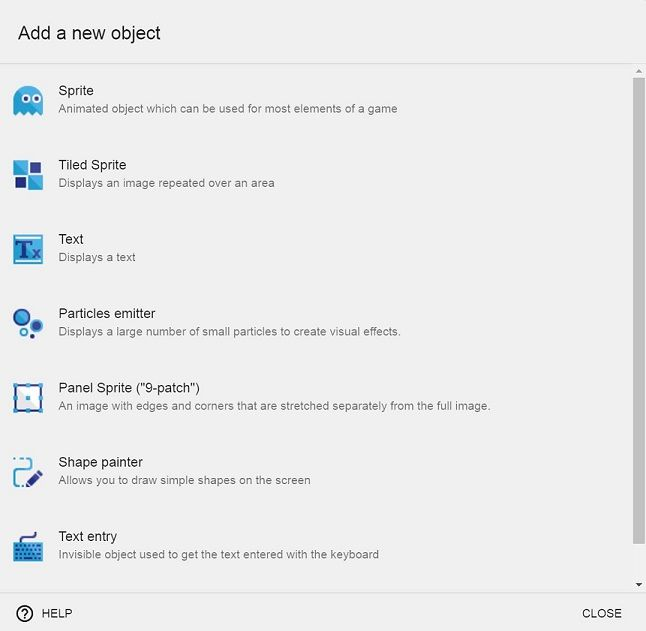

  - For the paddle, you need the Sprite object type. Click **Sprite**.
!!! tip

    _Sprites_ are animated objects that are used for many common game elements (players, platforms, enemies, bricks, etc.).

The new object is added to your scene and the Object Editor dialog box is opened.

Right now, your sprite object has no animations, or associated images.

  - Click **+** to add an animation.
  - Click **+** in the blank thumbnail to add an image to the animation.
  - Select the image called "paddle.png" in your project folder and click **Open**. The image is added to the object.

  - In the **Object Name** field, type **Paddle** to rename your object.

  - Click **Apply** to save and close the editor.

!!! warning

    Object names are case sensitive, as are other elements in GDevelop. Be consistent in your naming to avoid easy mistakes like typing "Paddle" when you mean "paddle". Same goes for animation names like "Run" or "run" - it doesn't matter what naming convention you use as long as you're consistent.

----

### Add the paddle object to the scene

To display the paddle in your game, you need to add it to your scene. Because only one paddle is needed, it is called a _unique_ instance. Other objects like bricks will have multiple instances in your scene.

  - To add the paddle to the scene, click and drag it from the **Objects** panel to the scene. Place it near the bottom.

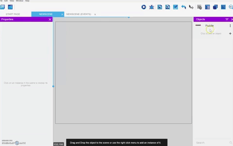

----

## Create the barrier object

Next, you will add a visual barrier that appears to stop the ball from bouncing off the screen. The barrier will be made with a tiled sprite. _Tiled sprites_ are repeatable, scalable objects useful for creating platforms, walls and other inanimate objects.

To create the barrier object:

  - On the **Objects** panel on the right, click **+** to add an object.
  - Click **Tiled Sprite**.
  - In the **Object Editor** dialog box, click **+** to add an animation.
  - Click **+** in the blank thumbnail to add an image.
  - Select "barrier.jpg" in your project folder and click **Open**.
  - In the **Object Name** field, rename your object "Barrier".
  - Click **Apply** to save and close the Object Editor.

----

### Add the barrier object to the scene

You will need to add three instances of your barrier object to your scene - a left, right, and top barrier. The default game window size is 800 x 600 pixels, which is the grey outline in your scene view. Create your barrier slightly within these boundaries.

!!! tip

        Move and resize objects with precision by using the **Properties panel** that opens when you click on an object instance.

  - Drag and drop the first instance of the barrier onto the scene.
  - Click the barrier. Resize it to 15 x 585 with the Properties panel or by dragging the handle on the bottom right. Place it on the left side of the screen at (15, 15).
  - Create a matching barrier on the right side and position it at (770,15).
  - Add a final barrier at the top to connect the two. Resize it to 770 x 15, and position it at (15, 15).

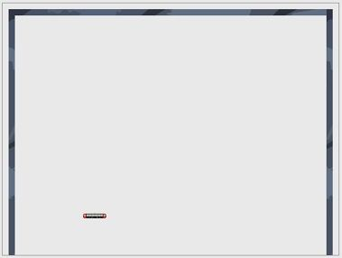

----

## Set the paddle movement

The player will control the paddle using the left and right arrows on the keyboard. You can create these controls using _events_ (actions that occur if conditions are true).

Create an event where if the player presses the left arrow on the keyboard, the paddle moves left:

  - Click the **NewScene (Events)** tab to open the **Events Editor**.
  - Click **Add a new empty event** .
  - Click **Add condition**.

  - Click **Keyboard > Key pressed**.
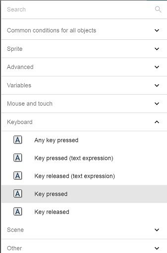

  - In the **Key** field, type **Left** and click **OK**. This condition is true if the player presses the left arrow on the keyboard.

Now you need to add a corresponding action to the condition. The paddle should move left on a horizontal axis if the condition is met.

!!! tip

        To move objects with an applied force, you will need to specify an angle. The picture below illustrates how GDevelop understands the angle of rotation.
    On a horizontal axis, left is 180°, right is 0°.
    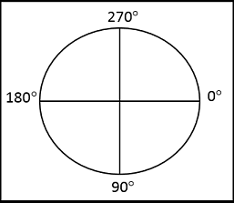

  - Click **Add action**.

  - Click **Common actions for all objects > Movement > Add a force (angle).**

  - Select **Paddle** in the **Object** field.

  - In the **Angle** field, type **180**.

  - In the **Speed (in pixels per second)** field, type **300**.

  - Click **Instant**.

  - Click **OK**.

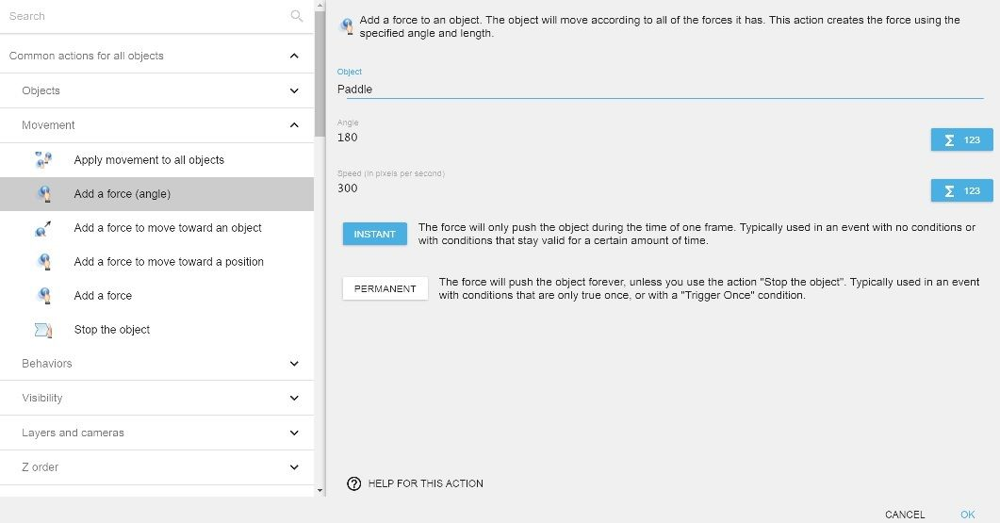

!!! warning

    The [top-down movement](/gdevelop5/behaviors/topdown) behavior is a better fit to move the paddle.

!!! tip

    It is a good time to save your work. Get in the habit of frequent saving. You can hit **Ctrl+S** to save your game, or use your mouse and go to **File>Save**.

----

Use the preview feature to verify your work. Click the **Launch a preview of the scene** button.

Press your left arrow to move the paddle. You will find the paddle doesn't stop when it reaches the barrier - it just continues off screen. You can fix this by closing the preview window and adding another condition to the paddle movement.

To add another condition to stop the paddle:

  - In the same event, below your first condition, click **Add condition**.

  - Click **Common conditions for all objects > Position > Compare X position of an object**.

  - In the **Object** field, select **Paddle**.

  - In the **Sign of the test** field, select **> (greater than)**.

  - In the **X position** field, type the X coordinate of the right side of the left barrier. In this example, it is 30.

  - Click **OK**.

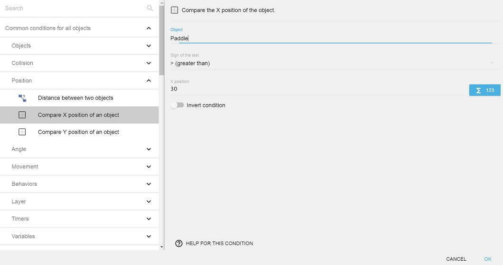

Preview your game again. The paddle should stop upon hitting the left barrier.

You now need to create the same event for the right side. Try it yourself before reading the process below.

  * Click **Add a new empty event**.
  * Click **Add condition**.
  * Click **Keyboard > Key pressed**.
  * In the **Key** field, type **Right**.
  * Click **OK**.
----

  * Click **Add action**.
  * Click **Common actions for all objects > Movement > Add a force (angle).**
  * In the **Object** field, select **Paddle**.
  * In the **Angle** field, type **0**.
  * In the **Speed (in pixels per second)** field, type **300**.
  * Click **OK**.
----

  * Click **Add condition**.
  * Click **Common conditions for all objects > Position > Compare X position of an object**.
  * In the **Object** field, select **Paddle**.
  * In the **Sign of the test** field, select **< (less than)**.
  * In the **X position** field, type the X coordinate of the left side of the right barrier. In this example, it is 770.
  * Click **OK**.

Preview your game to make sure it works.

!!! tip

     Do you find your paddle is still passing the barrier on the right? That is because GDevelop uses the upper-leftmost point of an object when comparing X positions. An easy way to solve this problem is to subtract the width of the paddle from your barrier X coordinate. In our example, the paddle is 58 px wide, so the new X position to stop the paddle on the right side should be **< 712** (770 - 58). Change it now.

----

## Add comments to the Events Editor
As you work in your Events Editor, it is a good practice to add comments for each set of events. You will be able to quickly find and understand your events as your game grows if you catalogue them as you work.

  - To add a comment line, click **Add a comment**. 

  - Enter your comment text and use the blue bar on the left of the comment to drag and drop your comment where you want it.

----

## Move the ball - Part 1

Next step will be to add the ball object to the scene. As you did with the paddle, add the ball object as a sprite using ball-1.png as the animation. Drag and drop the ball right above the paddle in the scene.

When you think about the game, the ball will need to do four things:

  * Move when the player starts the game
  * Bounce when it collides with the paddle or with the barrier
  * Break bricks and bounce when it collides with bricks
  * End the game when it falls off-screen below the paddle

### Start the ball in motion

To make the ball move when the player presses the space bar to start:

   * From the **NewScene (Events)** tab, click **Add a new empty event**.

   * Click **Add condition**.

   * Click **Keyboard > Key pressed**.

   * In the **Key** field, type **Space** and click **OK**.

----

  * Click **Add action**.
  * Click **Common actions for all objects > Movement > Add a force (angle)**.
  * In the **Object** field, select **Ball**.
  * In the **Angle** field, type **-45+RandomInRange(-5, 5)**. This will launch the ball at a -45 degree angle, with an additional random variation of 5 degrees either way to add challenge for the player.

!!! tip

     You don't need to memorize all the expressions. You can open the **Expression Editor** to help you populate fields.  In this case, you could type **-45** in the **Angle** field then click **Expression Editor** and search by **Random**. The expression **Random integer in range** with a minimum value of -5 and a maximum value of 5 will generate RandomInRange(-5, 5) in your field. You can use it in your speed calculation as you'd like.

  * In the **Speed (in pixels per second)** field, type **300**. Adjust this as you wish; the higher the number, the faster the object.
  * Click **Permanent**, since you want the ball to continue to move throughout the game.
  * Click **OK**.

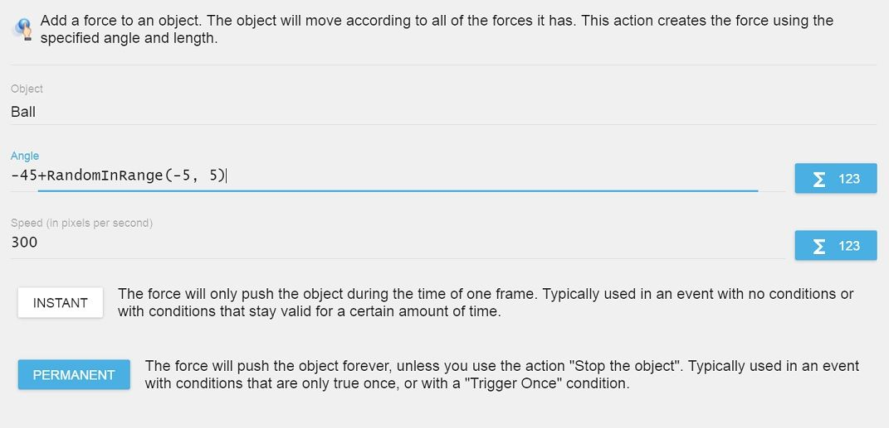

This is a good time to add a comment, save and preview your game. The ball should move when the spacebar is pressed.

----

### Bounce the ball off the barrier and the paddle

For good gameplay, your ball needs to bounce realistically whenever it collides with the barrier, the paddle, or a brick. GDevelop has an easy bounce behavior that you can apply to any object to simulate real bouncing.

#### Add a bounce behavior

To add a bounce behavior to your ball object:

  * From the **NewScene** tab, click **⋮** next to your "Ball" object and click **Edit object**.
  * Click the **Behaviors** tab.
  * Click **+** to add a new behavior to the object.
  * The Bounce behavior is not an installed behavior, so you need to find it. Click the** Search New Behaviors** tab.
  * From the list at the bottom, select **Bounce** and click **Install in project**.
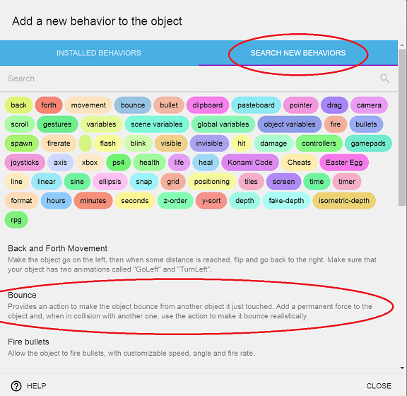

  * You can now add the new behavior to the object. Scroll down, select **Bounce**, and click **Apply**.

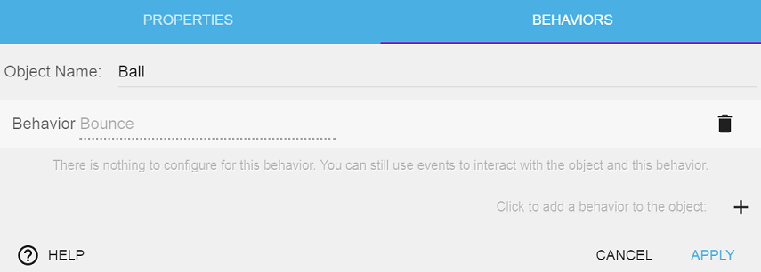

Your ball is now ready to bounce!

----

#### Add the collision events

Next, add events to make the ball bounce off the barrier and the paddle. It is time for a condition you will use a lot in game creation: a _collision_ condition.

To create a collision condition between the ball and the barrier:

  * From the **NewScene (Events)** tab, click **Add a new empty event**.
  * Click **Add condition**.
  * Click **Common conditions for all objects > Collision > Collision**.
  * In the first **Object** field, select **Ball**. In the second **Object** field, select **Barrier**.
  * Click **OK**.

----

To add the action causing the ball to bounce off the barrier upon collision:

  * Click **Add action**.
  * Click **Bounce > Bounce > Bounce off another object**.
  * In the **Object** field, select **Ball**.
  * In the **Objects to bounce on** field, select **Barrier**.
  * Click **OK**.

----

You now need to do the exact same thing to make the ball bounce off the paddle. Create a new event, set your collision condition, and add the action to bounce the ball.

!!! tip

     You can right-click and copy a previous condition or action, and then right-click to paste it into a new event. It is an easy way to save time and effort, especially when you're dealing with similar events!

Save and preview your game. It's starting to get fun...

----

## Add the bricks

Your ball has to break something! Next step will be to add bricks to the scene. To learn about external layouts, this tutorial will have the bricks appear in different layouts.

To add your bricks:

  * Click on the **NewScene** tab to get to the Scene Editor.
  * On the **Object** panel, click **+** to add a new object.
  * Name this object **Brick**. Give it three separate animations using the brick-green.png, brick-red.png and brick-yellow.png files from your project folder. Name the animations accordingly.
  * Click **Apply**.

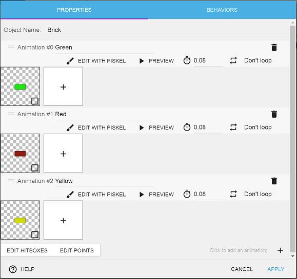

----

### Create external layouts

You can use external layouts to create some different levels with different brick formations.
 An _external layout_ is a layer of objects that is created outside of a scene, but that can be dynamically inserted at any point.

To create an external layout:

  * Click on the **Project manager** button on the top left. 
  * Click **External layouts** and **+** to add an external layout.
  * Click **⋮** next to your new layout and rename it **Layout1**.

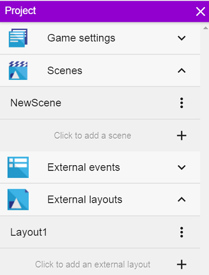

  * Click **Layout1**. You will be asked to choose the scene in which it will be included. Choose **NewScene** - that is the scene where all the game play happens. A new tab will open that looks like your existing NewScene.
  * Add bricks in whatever configuration you choose. Have fun with this part - be creative!

!!! tip

        To speed things up, click or select objects then hold Ctrl down, click and drag to replicate instances on the screen. Holding Ctrl+Shift keeps the new instances on the same X or Y axis.

    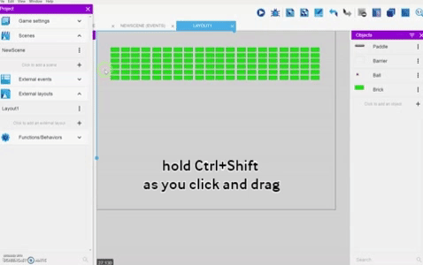

  * Create two or more new layouts and name them Layout1, Layout2, etc.

!!! warning

    Follow the naming convention Layout1, Layout2, etc. It will be tied to a variable shortly.

----

### Make a random brick layout appear

To make a random layout appear at the beginning of each scene, first add your condition:

  * Click the **NewScene (Events)** tab to go back into your Events Editor.
  * Click the **Add a new empty event** button.
  * Click **Add condition**.
  * Click **Scene > At the beginning of the scene**.

 ----

Rather than attach actions to this condition, you will now create sub-events that happen at the beginning of the scene.

To start, create a new scene variable called Random_layout:

  * Click on a blank space within the event you just created and click the **Add a sub-event to the selected event** button.
  * In the new sub-event, click **Add action**.
  * Click **Variables > Value of a scene variable**.
  * In the **Variable** field, type **Random_layout** to create a new scene variable.
  * In the **Modification's sign** field, select **= (set to)**.
  * In the **Value** field, type **Random(2)+1**.
  * Click **OK**.

!!! tip

        Try using the Expression Editor to create your expressions. 

    The more you play with expressions, the more you will understand the logic behind them. Don't be afraid to experiment!

----

Now you will string your variable number to the external layout name Layout. This name will determine which layout appears on screen. (This is why it was important to be consistent when naming them earlier!)

To add a random layout of bricks to the beginning of the scene:

  * Add another new sub-event for the beginning of the scene, then click **Add action**.
  * Click **External layouts > Create objects from an external layout**.
  * In the **Name of the external layout** field, type **"Layout" + ToString(Variable(Random_layout))**. This will randomly add one of the external layouts to the scene.
  * Click **OK**.

----

You can add interest by making the brick colour random at the start of each scene.

To choose a random brick colour:

  * Add another new sub-event for the beginning of the scene, then click **Add action**.
  * Click **Variables > Value of a scene variable**.
  * In the **Variable** field, type **Brick_colour**.
  * In the **Modification's sign** field, select **= (set to)**.
  * In the **Value** field, type **Random(2)**.
  * Click **OK**.

----

  * Add one last new sub-event for the beginning of the scene, then click **Add action**.
  * Click **Sprite > Animations and images > Change the animation**.
  * In the **Object** field, select **Brick**.
  * In the **Modification's sign** field, select **= (set to)**.
  * In the **Value** field, type **Variable(Brick_colour)**.
  * Click **OK**.

Save and preview your game. A player will now see a randomly-selected external layout with bricks in a random colour whenever the game is started.

----

## Move the ball - Part 2

### Bounce the ball off the bricks

Now that you have bricks on the scene, you want the ball to bounce away from the bricks when it hits them. Exactly as you did with the paddle and the barrier, you will need to:

  - Create a new event.
  - Add a collision condition between the ball and the brick.
  - Bounce your ball away from the bricks.

!!! tip

    Don't forget you can cut and paste conditions and actions from existing events!

----

## Destroy the bricks

As the ball bounces off bricks, it should destroy them. Destroying an object in GDevelop is easy.

  * In the same collision event, click **Add action**.
  * Click **Common actions for all objects > Objects > Delete an object**.
  * In the Object field, select **Brick**.
  * Click **OK**.

Save and preview your game. You should be able to bounce the ball off the paddle and destroy the bricks. This is a good time to check your speed again - do you want the ball or the paddle to be faster or slower? If so, play with your speed values until you're happy with the gameplay.

----

## Win or lose the game

If the player clears all the bricks, the game should congratulate the player with the option of playing again. If the player misses the ball with the paddle, it should tell the player they've lost with the option of playing again.

### Create a congratulations message

You want the congratulations message to be hidden, only to appear when all the bricks are gone.

To add a text object to the scene:

  * Click the **NewScene** tab.
  * In the **Objects** panel, click **+** to add a new object and select **Text**.
  * In the **Object Name** field, type **Congratulations**.
  * In the **Text** field, type a congratulatory message (e.g. Congratulations! You cleared all the blocks!). Also include a line telling the player "Press Enter to play again."
  * Click **Apply**.

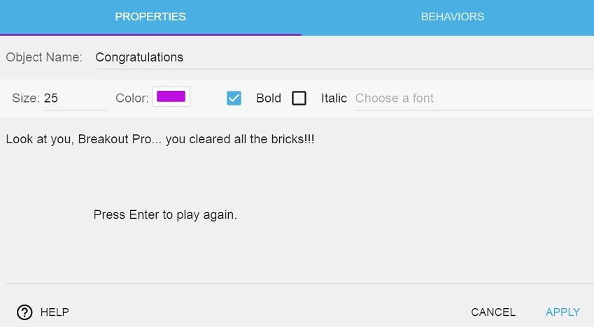

  * Drag and drop your Congratulations object into the middle of the scene.

----

To hide your text object at the start of the scene:

  * Click on **NewScene (Events)**.
  * Go to the existing event containing the condition "At the beginning of the scene" and click **Add action**.
  * Click **Common actions for all objects > Visibility > Hide**.
  * In the **Object** field, select **Congratulations**.
  * Click **OK**.

----

To make your text object appear when all the bricks are destroyed:

  * Click the **Add a new empty event** button.
  * Click **Add condition**.
  * Click **Common conditions for all objects > Objects > Number of objects**.
  * In the **Object** field, select **Brick**.
  * In the **Sign of the test** field, select **= (equal to)**.
  * In the **Value** field, type **0**.
  * Click **OK**.

----

If there are 0 bricks, the ball should be deleted and the congratulations object should be made visible.
Both of the actions are common actions for all objects. Add them now.

----

You also want to give the player the option of starting a new game:

  * Create a new sub-event  to the event you just created where the number of brick objects is =0.
  * Click **Add Condition**.
  * Click **Keyboard > Key pressed**.
  * In the **Key** field, type **Return**. (Remember the congratulations message tells the player to hit Enter to start again.)
  * Click **OK**.

----

Add an action to go back to the first scene:

  * Click **Add action**.
  * Click **Scene > Change the scene**.
  * In the **Name of the new scene** field, type **"NewScene"**. Don't forget the quotation marks!
  * Click **OK**.

Now when the player clears all the bricks, they will get a congratulatory message and the option of starting again!

----

### Create a game over message

If the player misses the ball, it's game over. Just like if a player wins, this will involve making a message visible at the appropriate time and giving the player an option to play again.

First, add a text object to the scene that will remain hidden unless the player misses the ball.

Follow the same steps you did to create the Congratulations object on screen, but change the message to Game Over. Include the line about starting again. Call this text object **GameOver**.

Drag and drop your GameOver object into the middle of the scene. It's OK if it's on top of the Congratulations object.

----

Next, go to the Events Editor to hide your GameOver object at the start of the scene.

Follow the same steps to hide the GameOver object as you did for the Congratulations object. Add it as a second action to the event.

----

The next step will be to make the message reappear if the player misses the ball. To do this, you need a condition that checks if the Y position of the ball is outside of the game window.

To add a condition to check if the player has missed the ball:

  * Click the **Add a new empty event** button.
  * Click **Add condition**.
  * Click **Common conditions for all objects > Position > Compare Y position of an object**.
  * In the **Object** field, select **Ball**.
  * In the **Sign of the test** field, select **> (greater than)**.
  * In the **Value** field, type **600**. (600 is the default game window height, so that means the ball is off-screen.)
  * Click **OK**.

Add a corresponding action to make the GameOver object visible. You should also add a sub-event that causes the ball to be deleted and the game to restart if the player presses Enter. Add them now.

Save and preview your game.

----

#### That's it! You've finished your first basic breakout game.

Now that you have the basics down, try changing speeds, brick layouts, etc. to make it more challenging. You may want to add a scoring system where points go up with each brick destroyed, or you may want to make the ball increase in speed with each scene. Because the bounce behavior bounces according to the angle and speed of force applied, you could also have fun playing with the shape of the paddle, adding more challenging barriers, etc.

It would also be a good exercise to add instructions at the start of the scene that disappear when gameplay starts (see the very first image in this tutorial).

**More tutorials are coming soon but, in the meantime, experiment and play!**