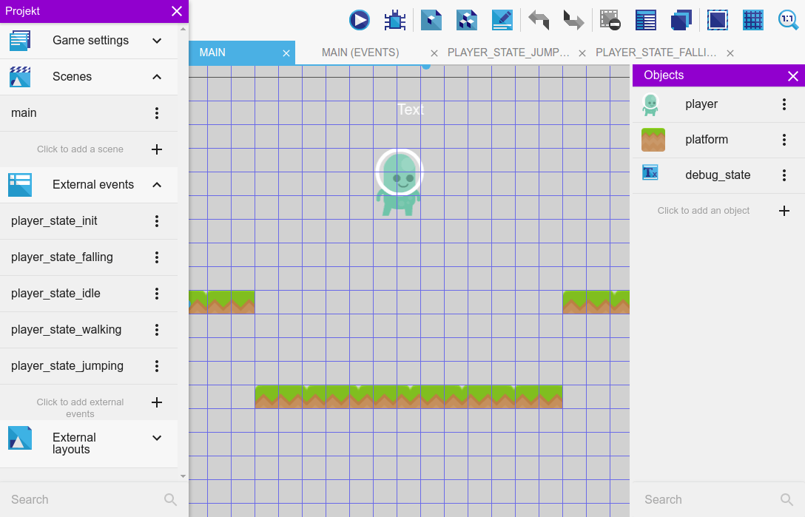
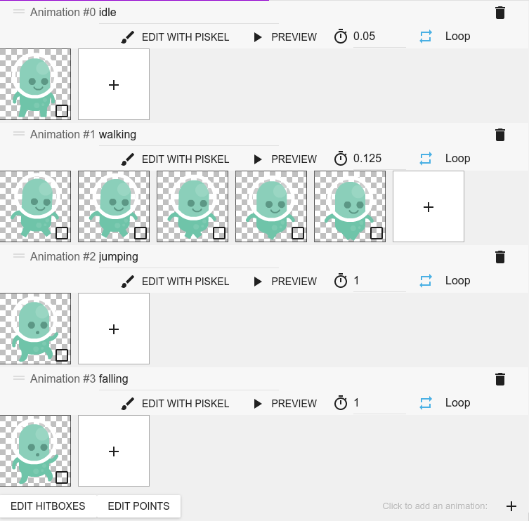
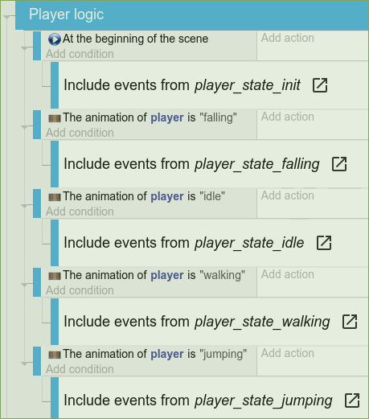
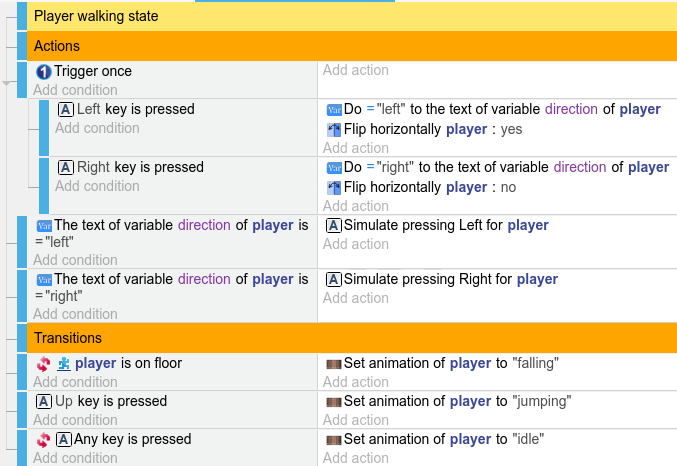

# How to handle complex logic – The finite state machine (FSM)

You probably followed some of the beginner tutorials and decided to create your own project based on the game mechanics you have learned. But as soon as you added more complex actions you quickly got lost in a jungle of nested conditions that lead to bugs which were hard to find. In the end, you probably quit the project.

Most tutorials you find on the internet (independent from the game engine) just try to show you a way to achieve the goal of that specific tutorial with least distraction possible. Unfortunately, this usually results in code that doesn't care about extensibility.

This tutorial will show you how to structure your project in a way that encapsulates the logic of your player (enemies or other dynamic objects).

## What is a state machine?

A state machine divides an object's logic into a fixed set of well-defined states, which operate independently from each other. Each State only contains the logic that is applicable to it. For example, when the player is in a “falling" state, you don't have to check the buttons for left and right movement, nor the jump button, because there is no ground under your feet. When specific conditions are met, the player state is switched to a different one.

So imagine that the player is in a “falling” state. While in the air, it should not be able to perform any action. It is just passively pulled downwards by gravity. In order to transit into another state, certain conditions have to be met. In the case of a "falling" state, this condition would be "in collision with the ground". When this happens, the game would then change the state from “falling” to “idle”. Now, in “idle” state, the game constantly checking if a movement button is pressed, which in turn changes the player state from "idle" to “walking”. In the "walking" state, the player keeps moving until some other event happens (e.g. movement button is released). Do you get the picture?

## Getting started

So let's get started by downloading the assets from the “” tutorial. Create a player as a “platformer object” and some platforms (“platform” behavior) to walk and jump on as described in the above-mentioned tutorial.  Open the properties of the player object and create the animations “idle”, "walking","jumping" and "falling". Then create a string variable on the player object and call it “direction” with the value “right”.  Switch to the event editor (“main” scene) and create these external events “playerstateinit”, “playerstatefalling”, “playerstateidle”, “playerstatewalking”, “playerstatejumping”. In the events of your main scene create a new event group from the drop-down menu on the right-hand side. Name it “Player logic”. Now add a "At the beginning of the scene" condition. Add a sub-event to the condition and link in the external event sheet “playerstateinit” via the “add”/”other” button. Do the same for all the other player states.

!!! note

    Instead of the animation, we could have created here a dedicated [Scene Variable](/gdevelop5/all-features/variables#declare_variables_using_the_editors) "state" to control the player state. This is more advanced but allows for better flexibility. However, the approach presented here has the benefit of bundling the logic with the corresponding animation, allowing for clarity and simplicity in the event sheet. Furthermore, you have access to the frames of the current animation/state and can trigger some logic at a certain frame inside the animation.

## Debugging information

In order to know in which state the player currently is during gameplay, create a text object and call it “debug_state”. Add it to the main scene and create the actions as below (with an empty condition), in order to display the current player state right above its head. Whenever something doesn't function the way it should, we will know which state we have to investigate to find the error.

## Our first state “init”

Open the external state “playerstateinit”. This state is used for initializing our player object when the game starts. In the field “edit as if events were included to scene” choose the “main” scene.

Since we already set the condition about when to execute the code of the init state in the main scene events sheet we can leave out the condition here and just add actions.

First of all we need to disable the default controls of the platformer behavior because these would get in the way when using a state machine.

Next we set the animation of the player's sprite to “falling”. So in the next iteration of the game loop the events from the “falling” state will be executed. We choose the falling state here because the player was placed in the air and will eventually fall to the ground where we can transit into the idle state.

You could also use this state to (re)set the players hit points, ammo or other things. If you decide to restart the level, you can always transit back into the “init” state to reset the player attributes. 

## The “falling” state

Falling is the most universal state of all. Whenever you are unsure which state to transit into “falling” state is usually a good choice because it will eventually lead into a sensible other state as soon as the player collides with an object. While falling the player won't be able to perform any active actions. He will only be passively affected by the forces that were applied to him before he has entered the falling state. For example if you enter the falling state after performing a jump, you will still passively move in the direction you were jumping but you can't adjust the direction anymore. (see the exercises section at the bottom of this tutorial to change this behavior). So all we are doing in this state is to check if the player collides with the floor. If so we transit the player into the “idle” state. 

## The “idle” state

The idle state gets triggered whenever the person in front of the computer doesn't do anything. In other words no keys are pressed and the player object is just standing still. Like in the “falling” state there aren't any active actions to be performed. We just check for conditions that make us leave the “idle” state. So first of all we check if the player is on the floor. If not we transit into the falling state. Next we check if the player pressed the left or right arrow keys. If so we transit into the walking state. Last but not least the up arrow key is checked and if pressed we switch the player to the jumping state. Sounds logical doesn't it? 

## The “walking” state

In the walking state we finally get to integrate some active actions for our player to perform. Since we use just one state for walking to the left and for walking to the right we first have to determine the direction the player has to move. So we check again which key was pressed and set the direction variable of the player accordingly once when entering the walking state. After that we will make the player move in that direction as long as it is in the walking state.

Now that the player is able to walk we'll again get to the conditions that make him leave the current state. So what could happen while we are walking? The most obvious thing would be that the walking key is released. In that case we will transit into the “idle” state. If we walk over the edge of the current platform, we transit into the “falling” state. And if the jump key is pressed, we switch into the jumping state. 

## The “jumping” state

As you may have guessed, the first thing we will do is triggering the jump action once we enter the state. The force will be applied passively, so we don't have to worry about it anymore once we performed the jump. As always the last thing we need to do is find conditions that make us transit into another state. In this case we will check if the player is either not jumping or falling. If this is the case, the player gets transferred into the “falling” state. 

And that's about it.

## Conclusion

We have now split up the player logic into five different states which only handle the logic that is applicable to them and nothing more. If you want your player to gain additional abilities like flying, diving, dying or getting smashed against a wall just create a new state and handle the logic there.

You can download the whole project here. 

## Exercises

1\) As you may have already noticed the player is currently acting a little different while in the air than with the default controls activated. This is because we currently have no active input in the “falling” state. So your task is to enable the player to move while he is in the falling state. Check if the movement keys are pressed and apply half of the usual movement force to the player.
