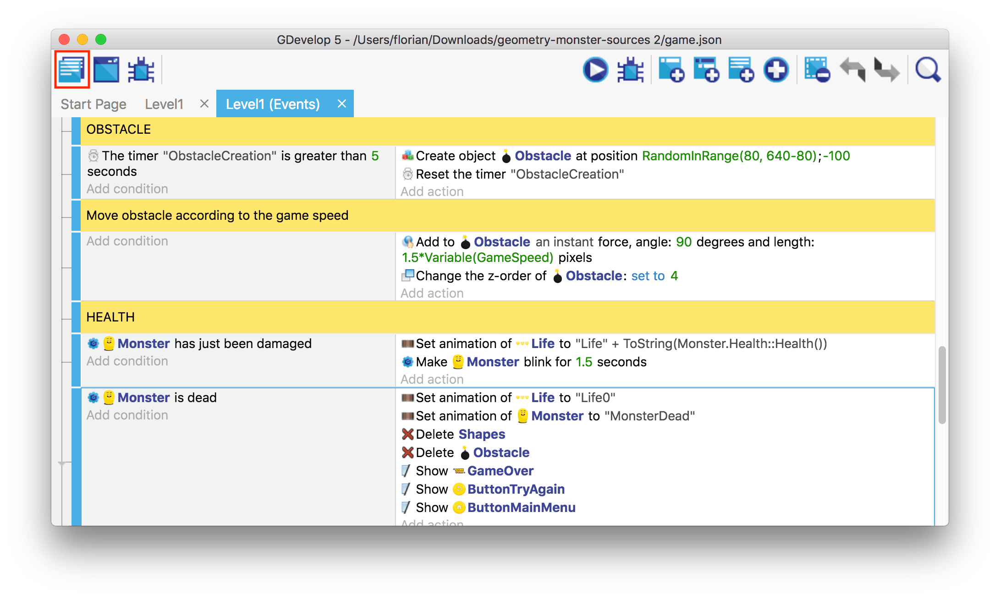
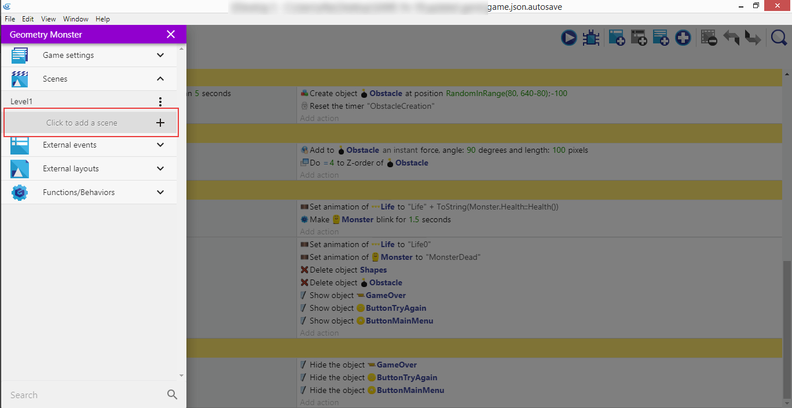
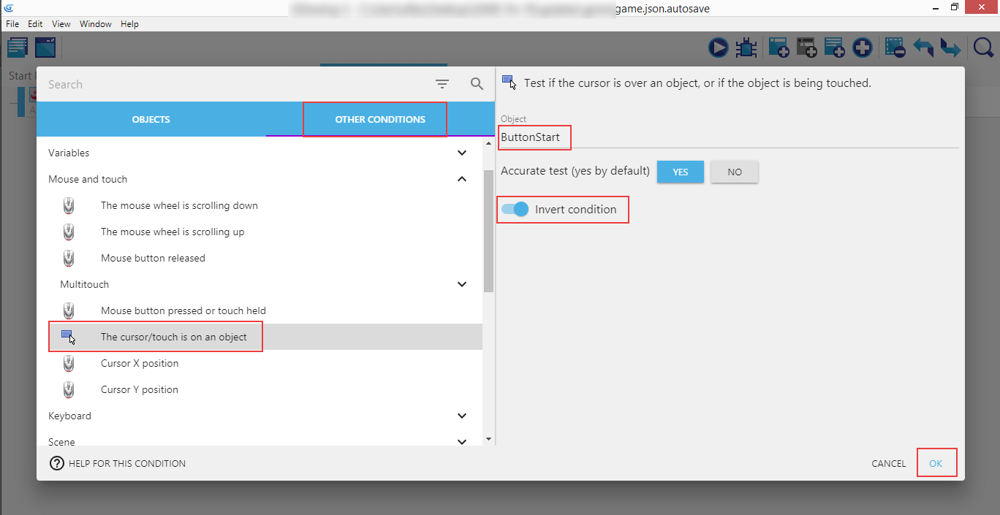
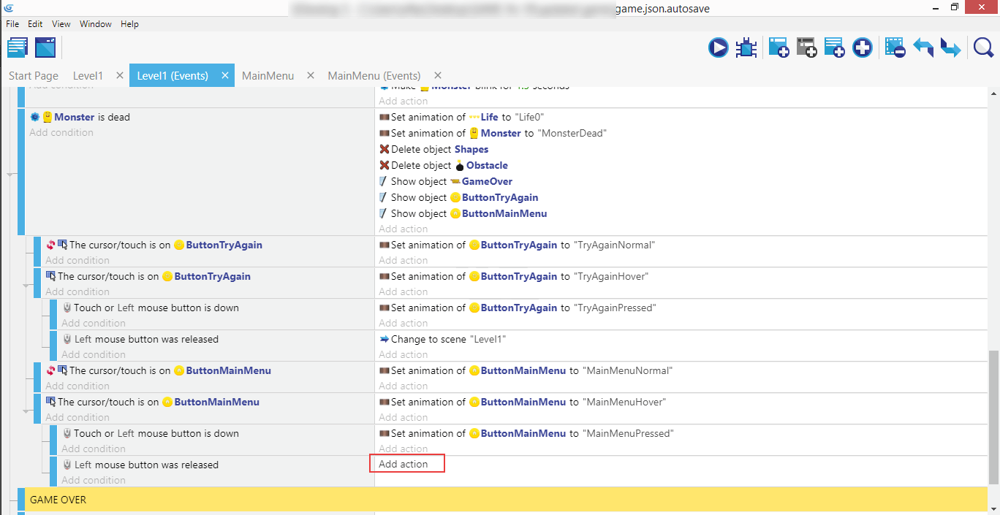
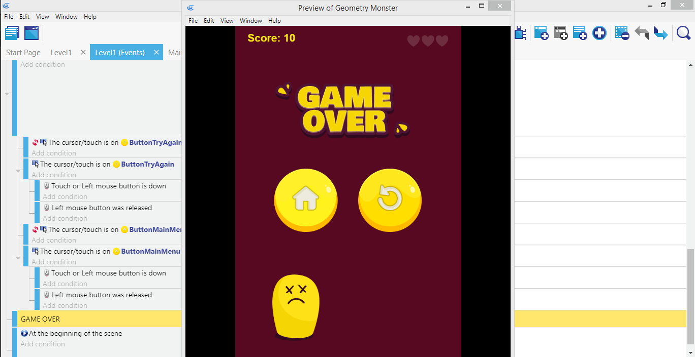

⬅️ **[Previous part: 11. Game over](/gdevelop5/tutorials/geometry-monster/11-game-over)** ➡️ **[Next part: 13. Juice it!](/gdevelop5/tutorials/geometry-monster/13-juice-it)**

# 12. Main menu

To make the gaming experience complete, we should be able to have at least Main Menu and Gameplay screens. If you can make more than one scene, then having separate ones for settings, credits, or anything else shouldn't be a problem. Let's create a separate Main Menu scene then.

Click on the "Project manager" to open up the left panel.

Then under the "Scenes" section, where "Level1" exists, look for the "Click to add a scene" under it which will do exactly that.

The default name is "NewScene", but you can right click on the three vertical dots to open the context menu and select "Rename".

Name our new scene "MainMenu".

Click on the "MainMenu" tab, then right click on the scene, and select "Scene properties".

Change the color using the color picker - in our case it's `#560921`.

It should look like this. Click on the right panel to add a new object, and select "Sprite".

Object's name is "GameTitle", and the animation "GeometryMonster". Add the title image, and click on the "Behaviors".

Click on the "Add a behavior to the object" button.

Then search through the new behaviors list.

And find "movement". We will use the "Ellipse movement" to animate the title image, so it's not a static one and the whole main menu will look better.

It works the same as the extensions we used already - install it into the project.

Go through the list of behaviors and click on the new "Ellipse movement".

Configure it: set the name to "GameTitle", "Radius on the X axis of the movement" to `20`, "Radius on the Y axis of the movement" to `10`, and the "Loop duration" to `6` seconds, then click "Apply".

Now it's time to add the Start button. "New object", "Sprite". "ButtonStart" for the name, "StartNormal" for the animation, and the actual image of the button itself.

Add another two animations with their respective images: "StartHover" and "StartPressed".

Drag the title onto the scene, and do the same with the button.

Go to "MainMenu (Events)", and click on the new event.

Add a new condition: "Other conditions", then "The cursor/touch is on an object", and assign this to "ButtonStart". Don't forget to select "Invert condition" to make this work as we want it.

Let's add the animations to that button. Select it in the left panel, click "Change the animation (by name)" in the middle one, and enter "StartNormal" in the right panel.

Add a new condition.

Select your "ButtonStart" object then pick the condition "The cursor/touch is on an object" and confirm.

Repeat the steps to "Change the animation (by name)" to "StartHover".

...and connect it with "Mouse button pressed or touch held", "Left (primary)".

Now "ButtonStart", "Change the animation (by name)", "StartPressed"...

...and "Mouse button released", "Left (primary)".

!!! warning

    The [Button animation](/gdevelop5/extensions/button-states/) behavior can do all of this for you.

The action this button is going to perform is changing the scene to the actual game. Search for "Change the scene", then select "Level1".

Launch the game and see if the Main Menu behaves like expected (hovering title, working Start button), and the actual gameplay is launched after clicking the button.

Since we now know how to switch between scenes, let's do this for the Try Again button we've created earlier on, but haven't implemented the actual action yet. Click on the "Level1 (Events)" tab, and "Add a condition".

"Other conditions", "The cursor/touch is on an object", then "ButtonTryAgain", "Invert condition", "Ok".

Now an action: "ButtonTryAgain", "Change the animation", "TryAgainNormal".

Repeat for "TryAgainHover".

"Other conditions", "Mouse button pressed or touch held", "Left (primary)".

Repeat the action: "ButtonTryAgain", "Change the animation", "TryAgainPressed".

Another action: "Change the scene", and set it to "Level1", so the button to try again the game will restart the actual gameplay.

Now, to leave a little bit to yourself, given what you learned so far, try to add interactivity to the "ButtonMainMenu", so it will change its animation to hover when hovered over, detect left button press, change the animation to "MainMenuPressed", detect the button release, and change the scene to "MainMenu".

At the end, it should look like on this screenshot above.

It works! The next chapter will be all about adding the final touch to the game: [juiciness](/gdevelop5/tutorials/geometry-monster/13-juice-it).

⬅️ **[Previous part: 11. Game over](/gdevelop5/tutorials/geometry-monster/11-game-over)** ➡️ **[Next part: 13. Juice it!](/gdevelop5/tutorials/geometry-monster/13-juice-it)**
