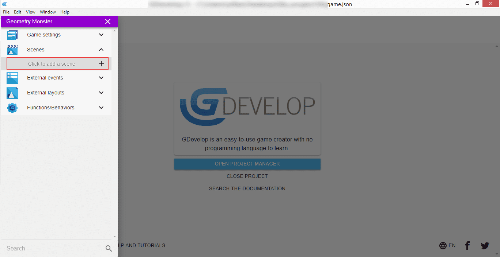
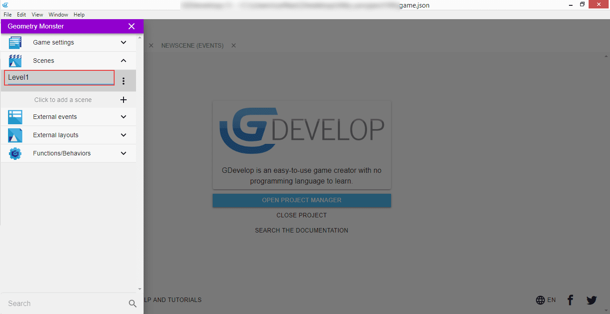
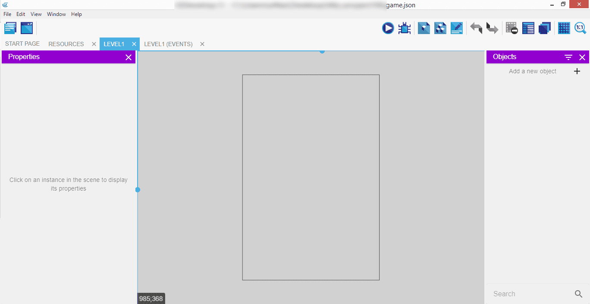

⬅️ **[Previous part: 1. Install and setup](/gdevelop5/tutorials/geometry-monster/1-install-and-setup)** ➡️ **[Next part: 3. Introducing main character](/gdevelop5/tutorials/geometry-monster/3-introducing-main-character)**

# 2. Creating the first scene

!!! note

    It is *strongly recommended* to read through the [Basic Game Making Concepts](/gdevelop5/tutorials/basic-game-making-concepts) guide before proceeding further to understand some of the basic functions of how GDevelop works

Now when we have [installed the GDevelop editor](/gdevelop5/tutorials/geometry-monster/1-install-and-setup) and the basic configuration is in place, we can start creating. To add components to our game we have to start with a scene - it will work like a basket holding various items and showing them on screen.

To add a new scene, click on the "Scenes" section in the left panel and when the contents are expanded, you will be presented with the "Click to add a scene" button, which is self explanatory.

Let's call our first scene "Level1".

After successfully creating a scene, we will be taken directly to it. Notice the tabs at the top of the editor that you can select - there's "Level1", and "Level1 (Events)" separately. In the left panel you can manipulate the properties of any of the selected instances, the actual scene contents are visible in the middle (with the gameplay area being in the portrait mode already), and an "Objects" list on the right panel.

⬅️ **[Previous part: 1. Install and setup](/gdevelop5/tutorials/geometry-monster/1-install-and-setup)** ➡️ **[Next part: 3. Introducing main character](/gdevelop5/tutorials/geometry-monster/3-introducing-main-character)**
