⬅️ **[Previous part: 2. Creating the first scene](/gdevelop5/tutorials/geometry-monster/2-creating-first-scene)** ➡️ **[Next part: 4. Desktop and mobile controls](/gdevelop5/tutorials/geometry-monster/4-desktop-and-mobile-controls)**

# 3. Introducing the main character

Now when the scene itself is ready, it looks kind of empty - let's add something to it!

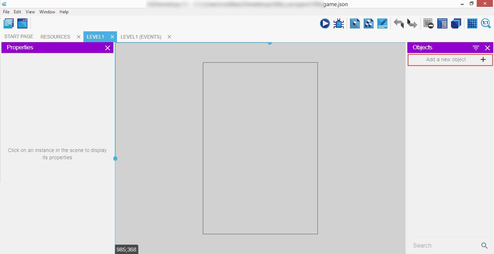

We will be able to do that by clicking on the "Add a new object" button in the "Objects" panel on the right.

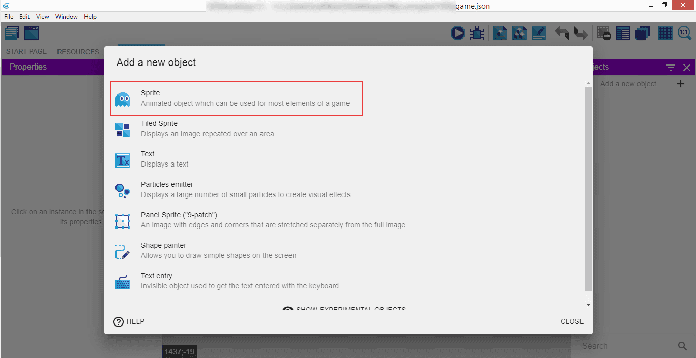

It will open a popup where a list of available options is showed. Those vary from sprites, through text, to particle emitters, shape painters, and text inputs. Select the "Sprite", which is explained as the animated object which can be used for most elements of a game.

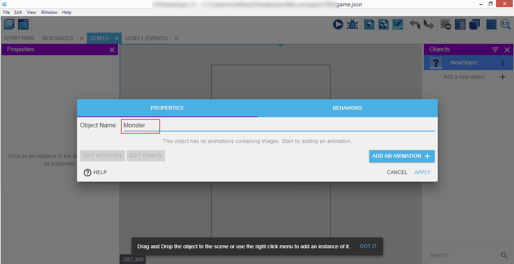

Another popup will appear, but now with the options to customize our new object. We will call him "Monster", and he will be our main character in the game: collecting items and being cute at the same time.

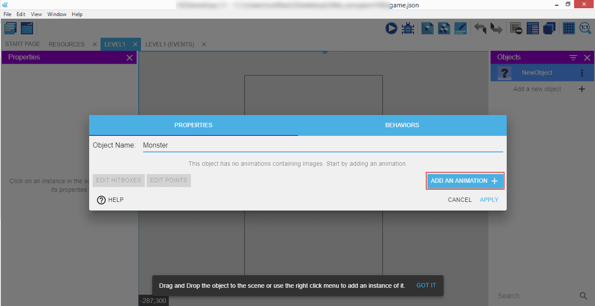

After giving him his new name, let's add some images that will represent him on the scene and in the game. Click on the "Add an animation" button to open a file select window.

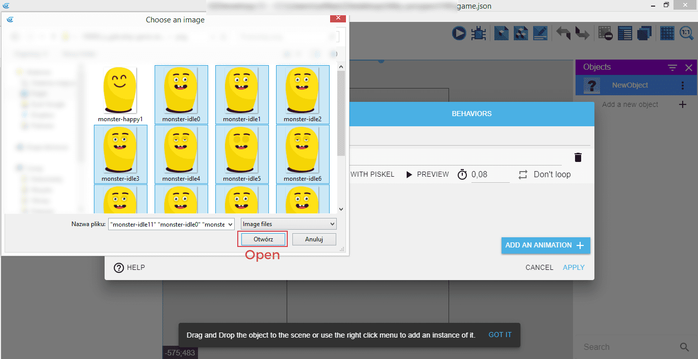

Navigate to the folder where the images are (you can download them from ), select all that you want to add, and then click "Open".

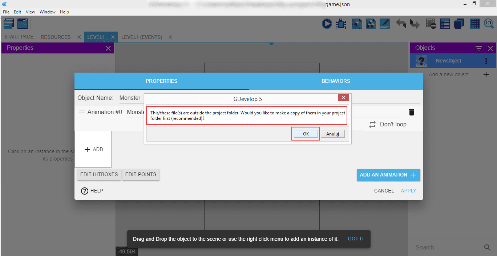

GDevelop will show the message saying those files are outside of the project folder, so the recommended next step is to allow copying them onto the project folder first before we do anything with them. Click "Ok" to do that.

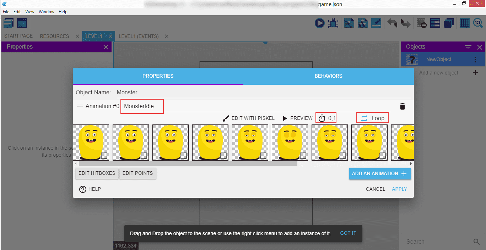

All the images we just imported will serve as the idle animation - one that is played when nothing is happening. The animation is looped, so it will look like the Monster is closing and opening his eyes every once in a while indefinitely.

We will name this animation "MonsterIdle", and every new frame will be rendered after a tenth of a second.

!!! note

    Remember to select the "Loop" option so the animation is repeated.

You can also edit images in Piskel or preview the animation itself if you want to.

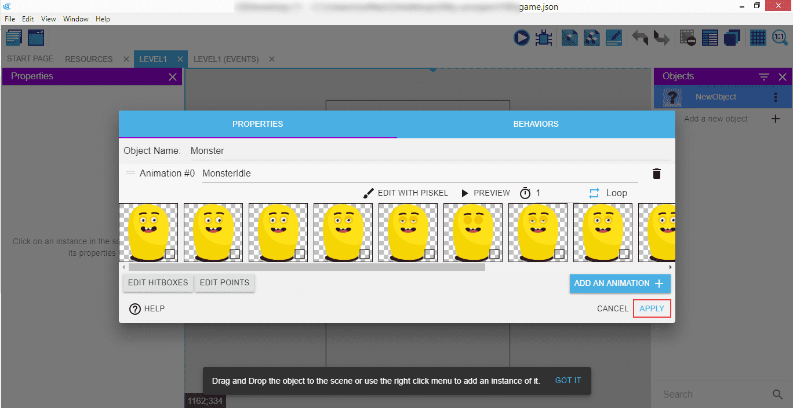

When everything is done, click on "Apply" to save the changes.

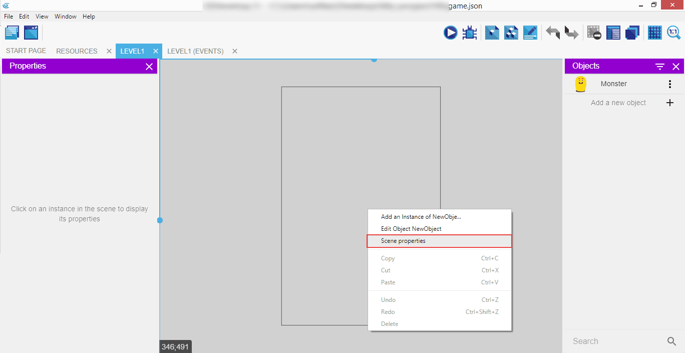

Now you can see our little Monster's icon in the right panel, under the "Objects" list. Isn't he cute?

To make the scene look a little bit more interesting we will add a background color to it. Right click on the scene, and select "Scene properties" from the context menu. It will open a popup with some options - we are interested in setting the "Scene background color" to something on which the Monster will look stylish.

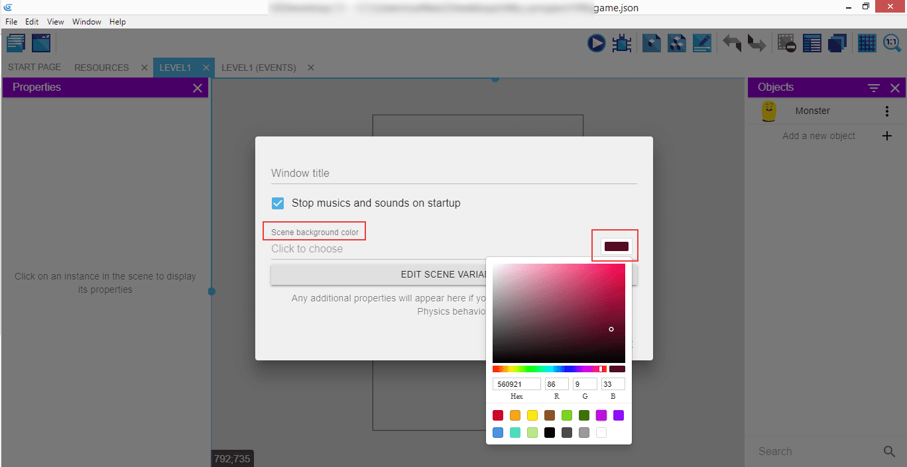

Click on the color picker on the right and chose a color - ours is `#560921`.

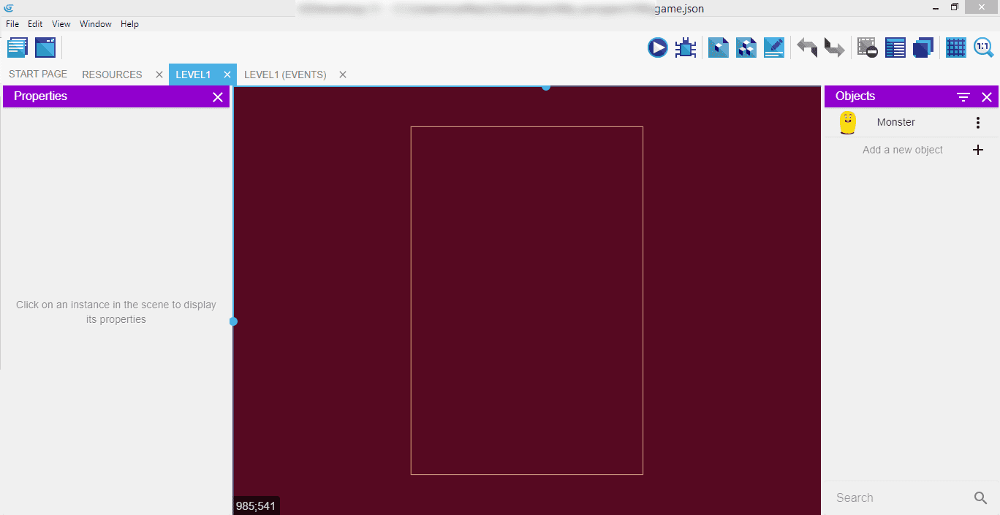

After confirming, the scene's background color will change to what was selected - success!

⬅️ **[Previous part: 2. Creating the first scene](/gdevelop5/tutorials/geometry-monster/2-creating-first-scene)** ➡️ **[Next part: 4. Desktop and mobile controls](/gdevelop5/tutorials/geometry-monster/4-desktop-and-mobile-controls)**
