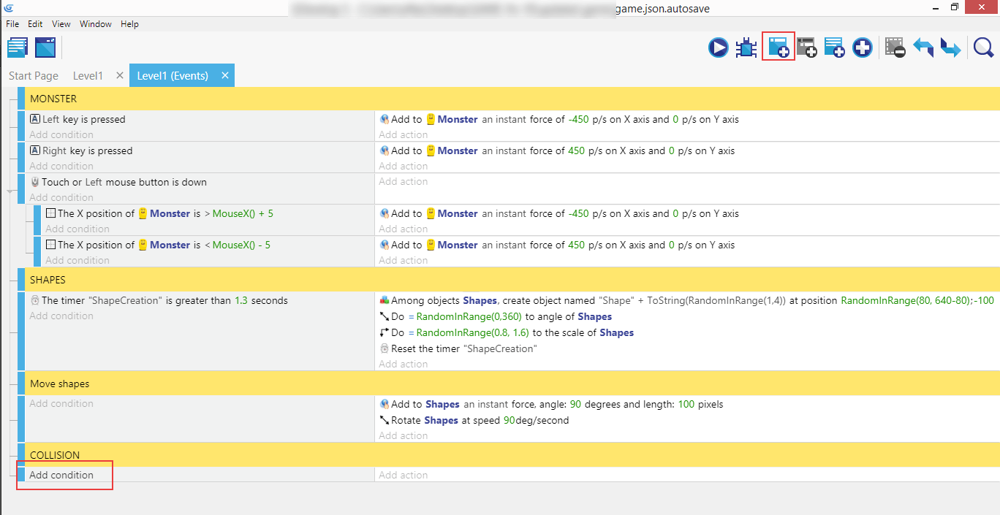

⬅️ **[Previous part: 5. Adding and moving shapes](/gdevelop5/tutorials/geometry-monster/5-adding-and-moving-shapes)** ➡️ **[Next part: 7. Sounds fun](/gdevelop5/tutorials/geometry-monster/7-sounds-fun)**

# 6. Collision detection

The shapes are falling down, but they do not interact with the Monster. We'd like to be able to control the Monster and allow him to collect the falling shapes - that's what **collision detection** is for.

Add a new comment and call it "Collision".

Then, add a new condition.

As always, make sure "Shapes" are selected, then look for "Collision" (which will test the collision between two objects). In the right panel enter the "Monster" and click "Ok".

We have the condition, now's the time to add an action.

"Shapes", then look for "Delete an object", and "Ok".

That was quick! Collision detection on its own is simple, but the power of it will come in the next chapters, where we'll add lots of actions to the collision condition that was created above.

⬅️ **[Previous part: 5. Adding and moving shapes](/gdevelop5/tutorials/geometry-monster/5-adding-and-moving-shapes)** ➡️ **[Next part: 7. Sounds fun](/gdevelop5/tutorials/geometry-monster/7-sounds-fun)**
