⬅️ **[Previous part: 7. Sounds fun](/gdevelop5/tutorials/geometry-monster/7-sounds-fun)** ➡️ **[Next part: 9. Adding bombs](/gdevelop5/tutorials/geometry-monster/9-adding-bombs)**

# 8. Tracking the score

It's great to have [sound](/gdevelop5/tutorials/geometry-monster/7-sounds-fun) already, but the more important part is actually counting the number of shapes that the Monster was able to collect. We're gonna take the advantage of [collision detection](/gdevelop5/tutorials/geometry-monster/6-collision-detection) in a similar way - when the shape is collected, not only we're gonna play the sound, but also increase the **score**.

To start, let's add an action after the actions to delete a Shape and play a sound, that we've been adding in the previous chapters. Choose "Add an action" there.

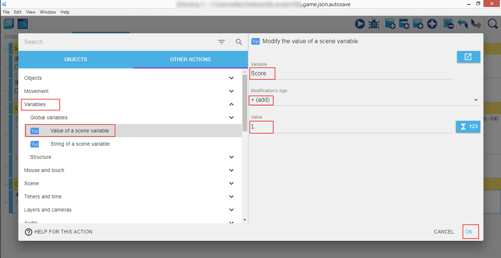

Click on the "Other actions", look for "Variables", and select "Value of a scene variable". Then in the right panel set the "Variable" name to "Score", "Modification's sign" to `+ (add)`, and the "Value" to `1`. This means whenever a shape is collected by the Monster, the shape will disappear and the player will get one point.

!!! note

    This is in fact a bit incomplete: in case we're collecting two shapes at the very same time, we'll only get one point! This is because the condition will be considered "true" for both shapes that are colliding with the monster, but the action is then only run once. We'll fix that in a few moments with a "For Each" event.

We now have the ability to track the score, but the player can't see it. To show the score, we will need a new text object.

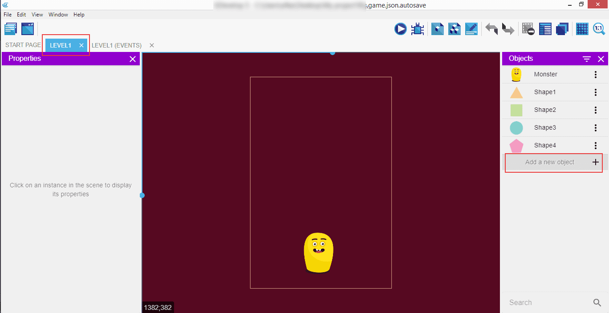

Click on the "Level1" tab, then "Add a new object".

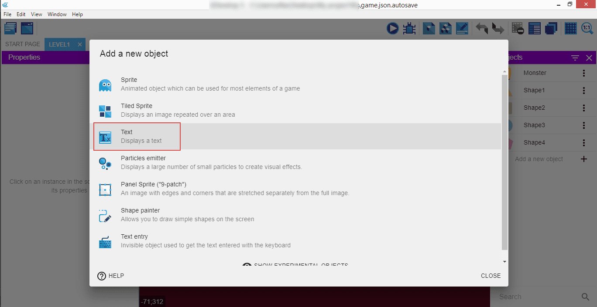

From the popup, select the "Text".

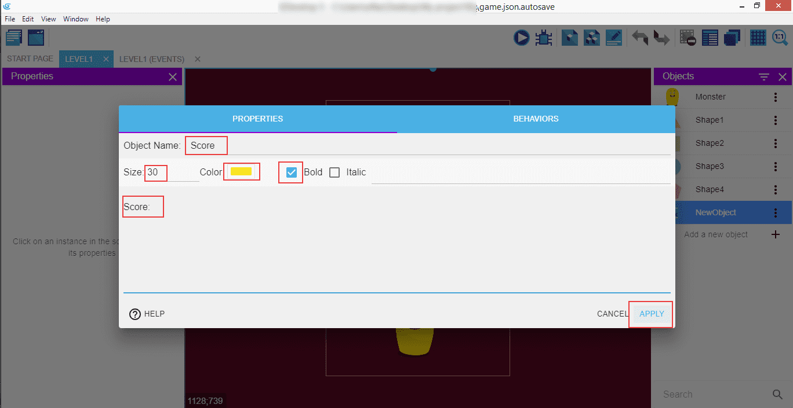

Now enter the properties: "Object Name" is "Score", and we also set the size of the text to `30`, color to `yellow`, and we're making it "bold". The text itself is "Score: ".

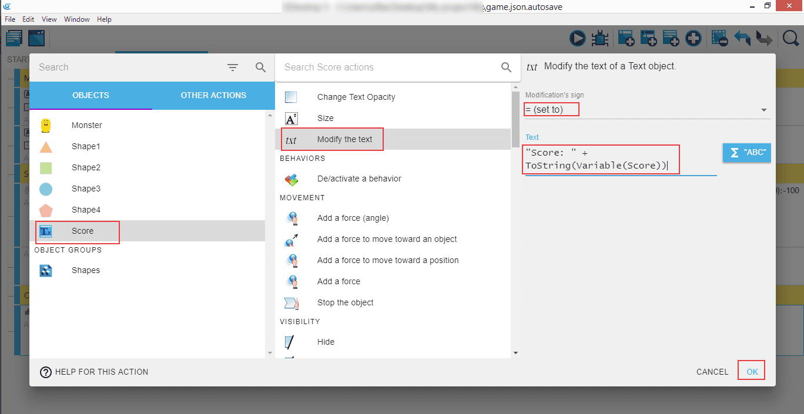

Go to the "Level1 (Events)" tab, click "Add an action", and in the popup select our new "Score" variable, look for "Modify the text", and in the right panel select "Modification's sign" to `= (set to)`, with the text `"Score: " + ToString(Variable(Score))`.

It will update the "Score" text with the current variable value whenever a shape collides with the Monster.

!!! note

    As mentioned earlier, this is somewhat incomplete because if the monster collides with two objects at the very same moment, the event actions will be run only once, so only one point will be added to the score. We need to tell GDevelop to run the actions for each and every shape that was in collision at any given point. Let's do that!

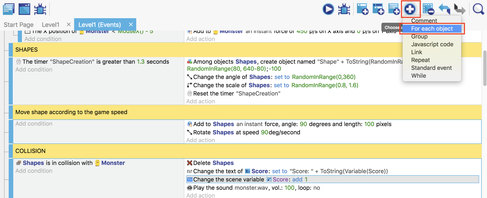

Now click on the "Choose and add an event", and then "For each object".

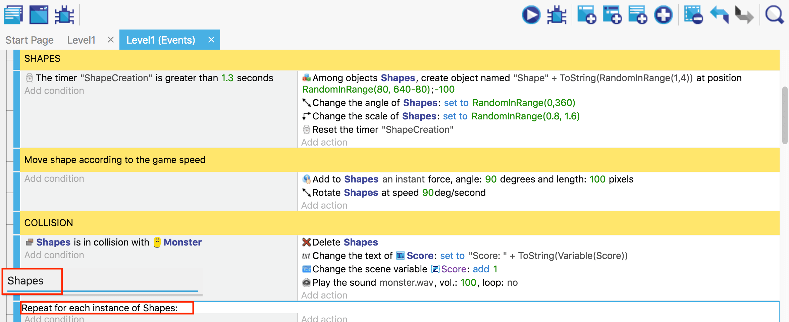

Enter the name of the object, which in our case will be a group called "Shapes".

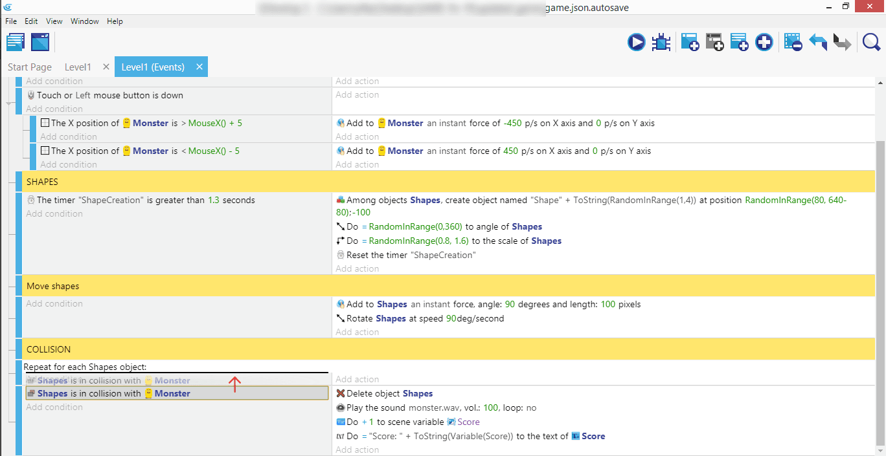

Be sure to drag the "Shapes" in collision with Monster there so it's repeated for every "Shape" object.

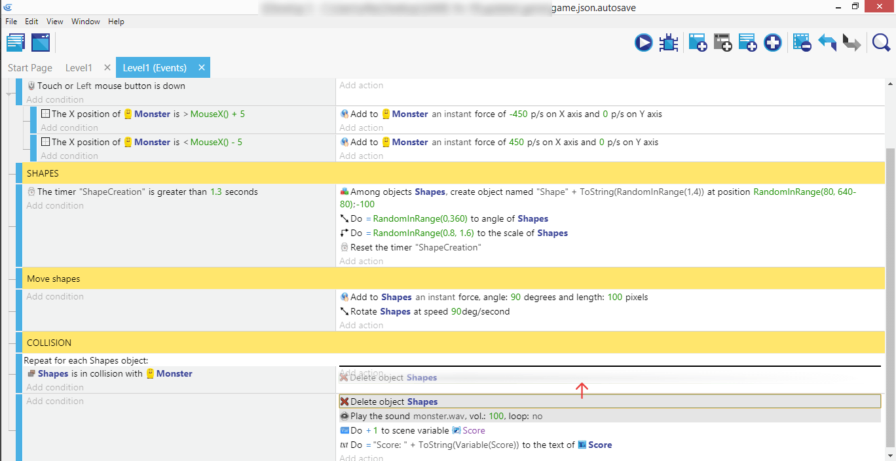

Finally, drag all the actions into the new "For Each" event.

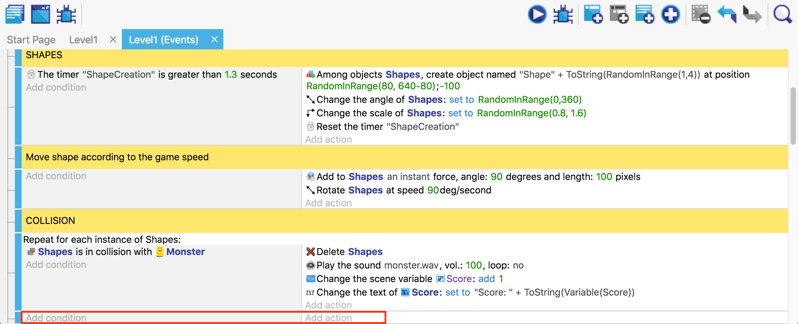

You can remove the empty event afterwards.

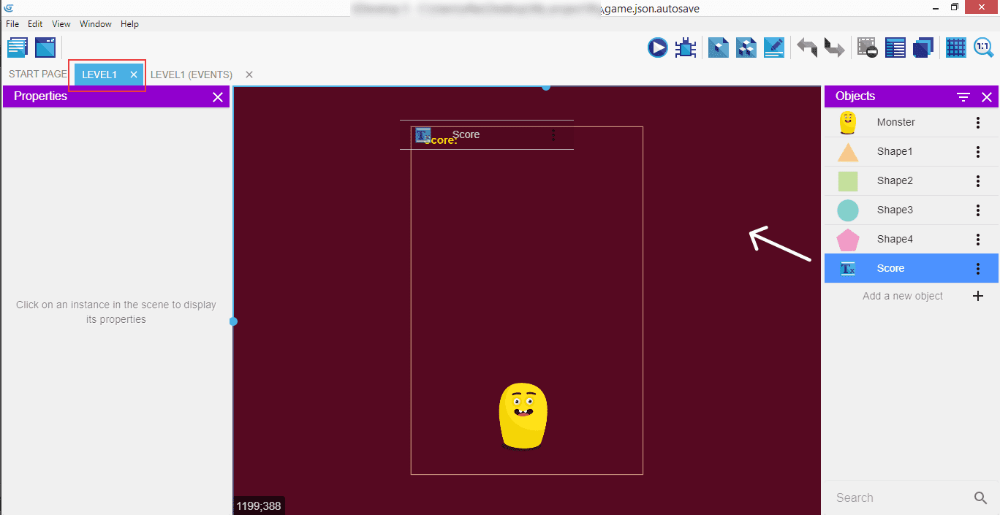

Now switch to the "Level1" tab, find the "Score" object in the right panel, and drag it onto the scene.

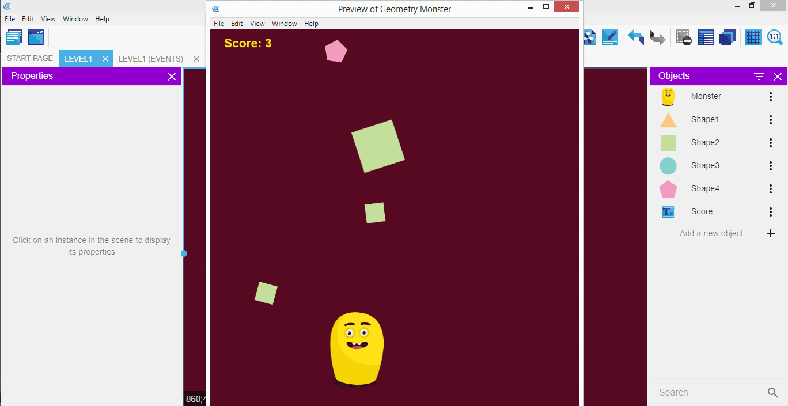

Launch the game to test if counting the score and showing the updated info works as expected.

⬅️ **[Previous part: 7. Sounds fun](/gdevelop5/tutorials/geometry-monster/7-sounds-fun)** ➡️ **[Next part: 9. Adding bombs](/gdevelop5/tutorials/geometry-monster/9-adding-bombs)**
