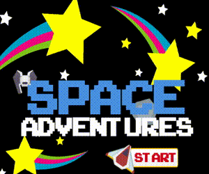
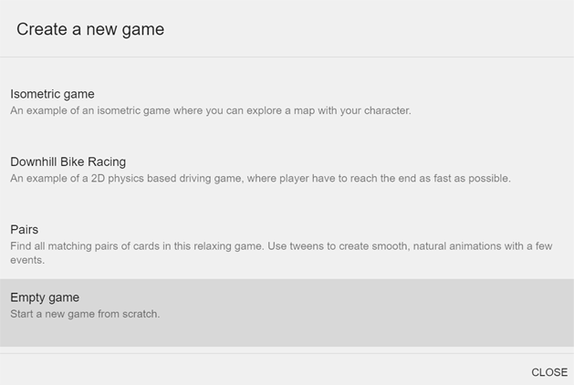
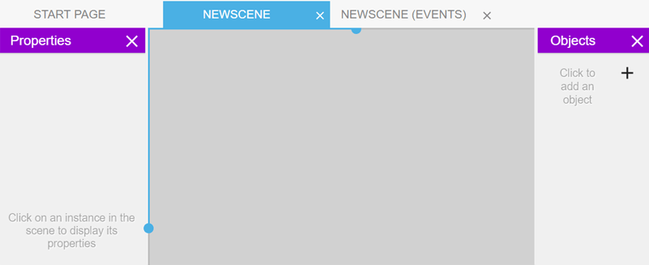
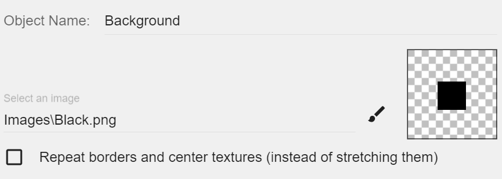
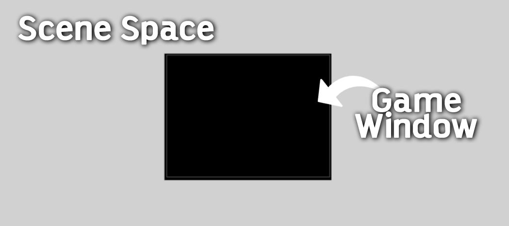
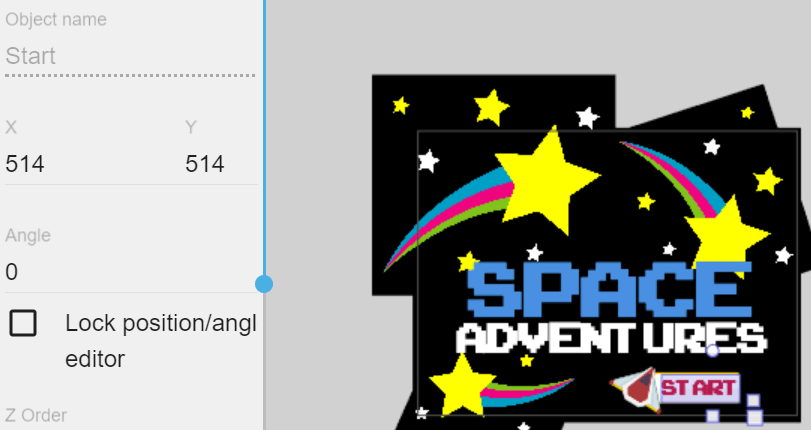

# A Beginner's Tutorial to a Space Shooter Game

 This tutorial will help you to get familiar with the way GDevelop works. In this tutorial, we are going to create a very basic space shooter game where the **enemies are generated randomly** and the player has to destroy them in order to get a higher score. There will be a target score for each level, which on being reached will take you to the next level.

To know the basics of how the software works, you can refer  for more information. In this tutorial, we will use separate scenes to build a start screen and the level scene. *The first part of this tutorial aims at creating the **Game Menu**. *

## Download GDevelop

If you do not have GDevelop, download it from the official website : [GDevelop App](http://gdevelop-app.com). It is advised to always check the page for the latest versions of GDevelop and keep the software updated at all times.

## Main Game Elements

#### ☆Player Sprite

 This is the main character/object that we, the user, will be controlling. The Player Sprite or Player Ship can only **move sideways** to avoid the enemies or to aim at them. It can **launch projectiles** to damage the enemies to get a higher score.

#### ☆Enemies

 These will be the randomly generated **enemy ships** and **asteroids**. They need to be destroyed by the Player ship to get a higher score. These enemies also damage the Player on colliding with it.

#### ☆Score Display

This block of text updates and displays the score when an enemy is successfully destroyed by the Player. This also indicates if the level is cleared, since we want to set a target score for each level.

#### ☆Moving Background

Since our player only moves sideways, we need to **move** the background instead which gives a feeling that the player ship is moving forwards.

> === Download the Resources === For making the game, you will need assets that you can use to make the player sprite, enemies and backgrounds. Find all the resources you need for this game right .

## Step 1: Creating a New Project

Once on the Start screen, click on the "Create a New Project" button. On doing so, a "Create a New Game" dialog box appears. Next, scroll down and find the "Empty Game" tab. Click on it to open a new project.

 You can also choose to customize your Project location to store the project at a location of your choice. Click on **Choose Folder** Option to choose a storage location you want. Game configuration files (with an extension .json) will be stored at this location.

## Step 2: Creating a New Scene

 A game relies on scenes for different scenarios of gameplay. We can make and use multiple scenes, but for this tutorial, we will be working with **2 Scenes**. Let's get started and create the scenes required for this game.

Click on the area where it says "Click to add a Scene" to create your first empty scene.

You can customize the name of your scene by clicking on the **three dots** next to the created scene and clicking on **Rename**. Make sure to create **2** scenes. If you haven't renamed them, they will appear as **NewScene** and **NewScene2**.

>  Every game needs assets or resources to be used in the game. For this game, the **Resources** are already provided to you in the source file mentioned above.tip

## Step 3: Getting Started with the Scene

In this part of the tutorial, we are going to create a Staring Menu for our game. Click on the first scene you made in the previous step to open the **Scene Editor**, where we will be making the game elements.

You should see the **Object** tab and the **Properties** tab.   If by any chance, you cannot see those tabs, click on the icon shown on the left to open the "Objects" tab. Similarly, click on the icon on the right to open the "Properties" tab.

>  The game menu we are going to create, will have some **text objects** to display the name of the game, and a **button** to start the game. tip

## Step 4: Creating the Game Menu

First of all let's add a basic design to our Menu Scene. We will now use the assets that were provided to you earlier in this tutorial. Let's add our first **Object**.

Click on the **Click to add an Object** area on the Objects tab to create your first object. The dialog box which opens shows the various types of objects. For our first object, let's choose a background. We use a [Panel Sprite](/gdevelop5/objects/panel_sprite) type of object for our background. A **Panel Sprite** type object can be stretched as required.

Upon clicking the **Panel Sprite** option a dialog box, to change the properties of this object, appears. When you first add a new object, it will given a default name such as **NewObject**. You can rename this to better organize your Object space. Notice that I have changed my object's name to **Background**. Choose the black background from the assets provided and click on **Apply**.

------------------------------------------------------------------------

Now, simply drag and drop the Background object to the **Scene Space**. You will notice that there is a greyish black border in the scene space. That is the **Game Window**. Objects outside of this window exist but cannot be seen while playing the game. Resize/Rescale the Panel Sprite object to fill the entire Game Window. The scene editor will look something like the image shown below.

 In a similar way, add more image assets and design your Game menu screen. Design involves creativity and imagination, so keep trying variations of designs to see which looks the best for your game. You will notice I added two **Text Objects** for displaying **Space Adventures**. To add Text objects, click on add a new object and choose type **Text**. You can customize it as you like. After you are done editing the text, click Apply. Then simply drag and drop the text object to the scene space.

------------------------------------------------------------------------

We will now add a **Button** which when clicked will **start** the game. In technical sense, it will take the player to the gameplay scene. The scene, being referred to, is **NewScene2** which we created earlier.

First off, we create a button using the same **Panel Sprite** object we used earlier. It's a part of UI (User Interface) which is very important as it makes the game look better. Add another **text object** which displays "Start" and place it on the button UI. It will look something like this.

Now, it's time to make the button functional. We will now start working with events.

Events are what we use to create the rules of any games in GDevelop. This is what makes GDevelop special compared to traditional game engines. Events in GDevelop allow you to visually program your game without any programming knowledge or experience, so people with any background will be able to create the actual game-play and allow players to interact with the game.

 That being said, let's make our first event. Move on to **NewScene(Events)** tab by clicking on the mentioned tab. Then click on the icon shown on the left to create an empty **Event**.

------------------------------------------------------------------------

For our first condition, we want to detect whether the cursor is over the Start button. To do that, we need to add a condition. Click on **Add a condition** and search for the **Mouse and Touch** category. Choose **The cursor/touch is on an object** condition and select the object this condition corresponds to. It's the **Start** object, in this case.

Similarly, add another condition to detect a mouse button press. Click on **Add a condition** and search for the **Mouse and Touch** category. Choose the **Mouse button pressed or touch held** option and select the **Left(primary)** button to test.

The two conditions combined checks for the **left mouse button press** on the **Start** object. Now, we need to add an action which changes the current scene to the game-play scene.

To add this action, search and click on **Scene**→**Change the Scene**. Then type in the name of the next scene, which is **NewScene2**, in our case. Make sure to write scene names within quotes("").

The event now looks something like this:

 It's now time to see how the created event actually works. Click on the `Play` button to **Preview** the Project. A preview window opens up, where we can test the various functions in our game. The preview window shows us exactly how the game looks and performs while in action.

You will notice that when you click on the Start button, it takes you to the new empty scene.

... And there we have it: our basic game start menu. In the next part of the tutorial, we are going to work on the main game scene. Check out the next part of this tutorial **here**.
