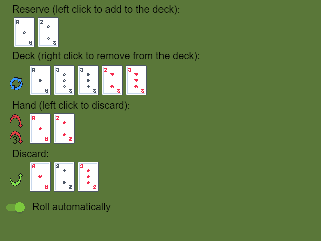

# How to work with randomness?

## Pick a random number

Random numbers can be generated using the [expressions](/gdevelop5/all-features/expressions/): `Random`, `RandomFloat`, `RandomFloatInRange`, `RandomInRange` and `RandomWithStep`.

## Create a random object

Random objects can be created according to a random number.

<!---
TODO screenshot of events and small example link.
-->

## Roll dice

Rolling one die is the same as picking a random number between 1 an 6 using the expression `RandomInRange(1, 6)`. But, rolling 2 dice is not the same as picking a number between 2 and 12. Indeed, there is only one way to make a 2 with:

- 1 and 1

whereas there are 6 ways to make a 7:

- 1 and 6
- 2 and 5
- 3 and 4
- 4 and 3
- 5 and 2
- 6 and 1

Rolling 2 dice is actually the same as picking 2 numbers between 1 and 6 and adding them together using this expression `RandomInRange(1, 6) + RandomInRange(1, 6)`.

<!---
TODO Create an example that compares visually different way of doing randomness.
Add a side by side comparison between `RandomInRange(1, 6) + RandomInRange(1, 6)` and `RandomInRange(2, 12)` and add a link to the example.
-->

!!! tip

    Using a roll of several dice to pick a random number can be a good tool for [fairness](#make-randomness-feel-fair) as it's more likely to give a value closer to the middle.

## Pick cards from a deck

The [Array tools](/gdevelop5/extensions/array-tools/) extension can be used to shuffle arrays.

<!---
TODO Add a screenshot of the instruction editor showing the shuffle action.
-->

The [Object stack](/gdevelop5/extensions/object-stack/) extension can be used to shuffle objects.

<!---
TODO Add a screenshot of the instruction editor showing the shuffle action.
-->

!!! tip

    Even if a game is not about cards, using a deck can be a good tool for [fairness](#make-randomness-feel-fair) as it gives more control over what happens in a time frame.

**Card system example**

[Open in GDevelop](https://editor.gdevelop.io/?project=example://card-system){ .md-button .md-button--primary }

[{ width="300" }](https://editor.gdevelop.io/?project=example://card-system)

## Make randomness feel fair

Randomness is actually more than just picking random numbers. Finding a suitable level of randomness for a game is part of game design.

### Chose better random sequences

A Tetris run where a player never gets an "I" piece doesn't sound fair nor fun. However, this could happen if a 7-sided die is rolled to choose the next piece. Indeed, there is a 6/7 chance not to roll an "I" each time.

To ensure that every type of piece is given to players regularly. The next 14 pieces can be decided in advance. For instance, it can be decided to give 2 pieces of each type. To still give some randomness, the order can be shuffled like a deck of cards.

<!---
TODO Create an example that compares visually different way of doing randomness.
Add a side by side comparison and a link to the example.
-->

!!! tip

    Learn [how to shuffle a deck](#pick-cards-from-a-deck).

### Make something more or less rare

One way to make something rarer than another is to choose a probability for each thing to happen. For instance, 10% chance for a rare item, a 25% chance for an uncommon item and 65% for a common item.

Defining the probability of each quality level is fine when there are only a few of them, but some games like Pokemon can have hundreds of quality levels. In this case, it's faster to calculate the quality rather than listing every case.

Bell-shaped functions are often used to show how many people have a given characteristic, a person's IQ for instance. Most peoples are in the center where the curve is high and the curve goes down as it becomes rarer and rarer to find people. Most of these curves have complicated formulas, but rolling several dice gives similar results.

!!! tip

    Learn [how to roll dice](#roll-dice).

